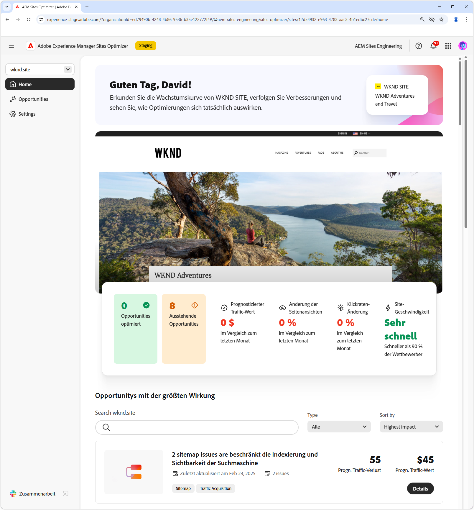
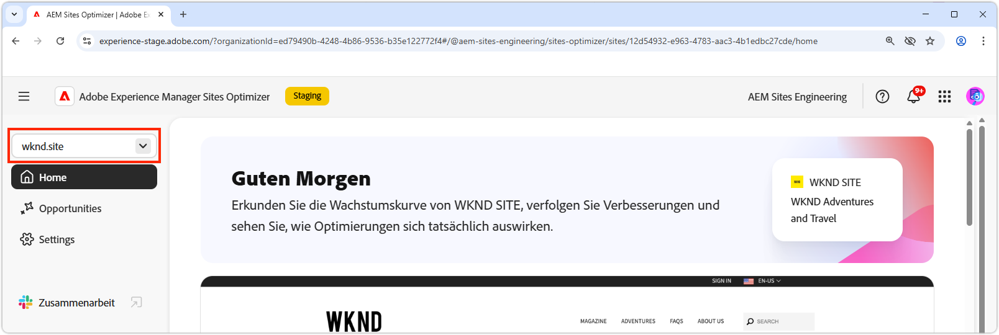
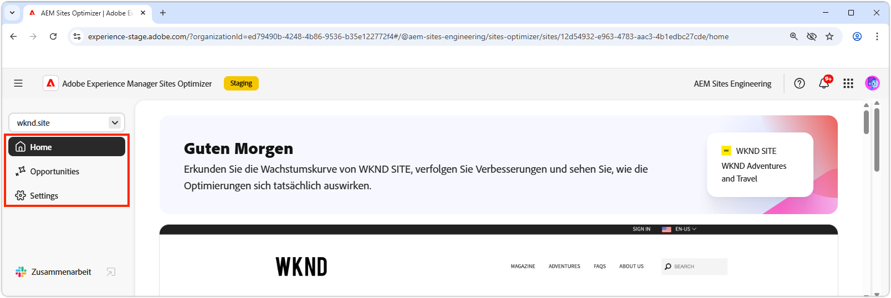
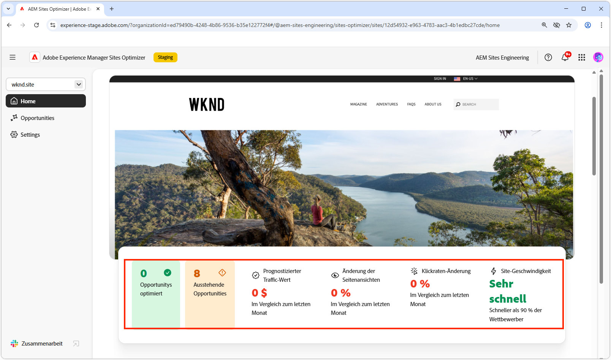
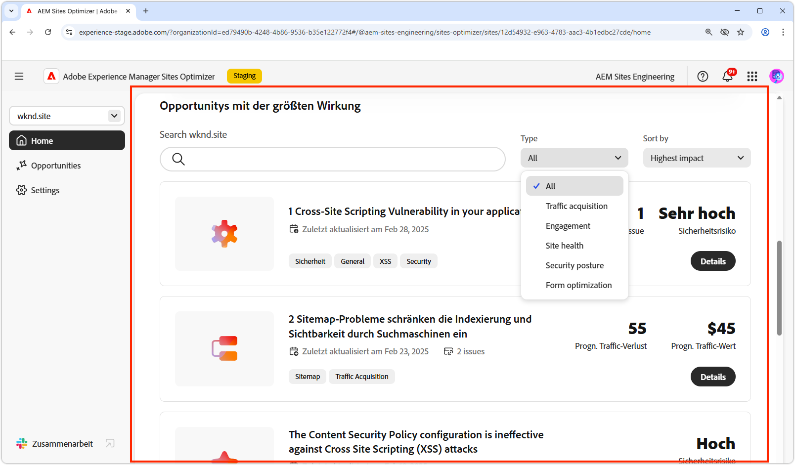
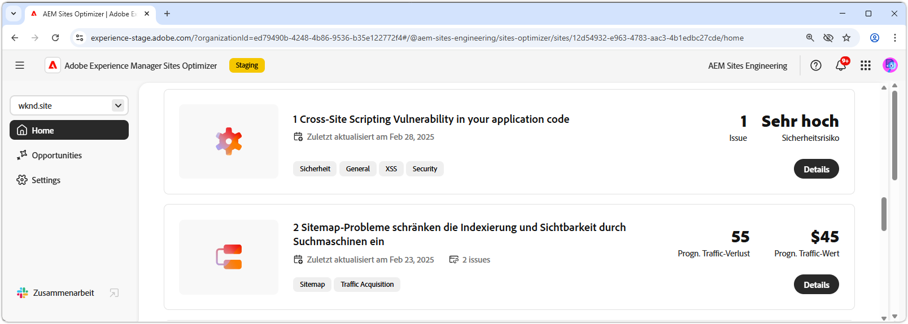

# Grundlagen zu Sites Optimizer

{align="center"}

Das Sites Optimizer-Dashboard bietet einen allgemeinen Überblick über die Leistung und die Verbesserungsmöglichkeiten Ihrer Site.

## Domain-Manager

{align="center"}

Im Kontextmenü des Domain-Managers können Sie die AEM-Site nach Domain auswählen, die Sie bewerten und optimieren möchten. Sites Optimizer bietet eine Liste aller in [Cloud Manager registrierten AEM-Produktions-Sites](https://experienceleague.adobe.com/en/docs/experience-manager-cloud-service/content/implementing/using-cloud-manager/edge-delivery-sites/add-edge-delivery-site).

## Navigation

{align="center"}

Der Navigationsbereich bietet von überall in Sites Optimizer aus schnellen und dauerhaften Zugriff auf wichtige Bereiche der Sites Optimizer, darunter:

* **Startseite** - Das Haupt-Dashboard, das einen allgemeinen Überblick über die Leistung Ihrer Site und die Möglichkeiten zur Verbesserung bietet.
* **Opportunitys** - Anzeigen und Verwalten der von Sites Optimizer identifizierten Opportunitys, einschließlich der optimierten und der nicht optimierten.
* **Einstellungen** - Konfigurieren Sie Ihre Sites Optimizer-Einstellungen, einschließlich der überwachten Websites und der erhaltenen Benachrichtigungen.

## Site-Zusammenfassung

{align="center"}

Der Abschnitt Site-Zusammenfassung enthält eine Momentaufnahme der Leistung Ihrer Site, dazu, wie Sites Optimizer Ihre Site im Laufe der Zeit verbessert hat, und Möglichkeiten zur Verbesserung. Zu den Schlüsselmetriken gehören:

* **Opportunities optimiert** - Die Anzahl der identifizierten Opportunitys, die verbessert wurden, um die Geschäftsleistung zu verbessern.
* **Ausstehende Opportunities** - Die Anzahl der potenziellen Verbesserungen, die noch nicht optimiert wurden, stellt Bereiche dar, in denen Geschäftsgewinne erzielt werden können.
* **Wert des Projekt-Traffics** - Die Änderung des geschätzten Werts des Traffics Ihrer Website im Vergleich zum letzten Monat, wodurch der Beitrag von Site Optimizer zu Geschäftszielen gemessen werden kann.
* **Seitenansichten ändern** - Die prozentuale Veränderung der Häufigkeit, mit der Ihre Site angezeigt wird, was das Interesse der Benutzenden und die Effektivität des Inhalts widerspiegelt.
* **Änderung der Klickrate** - Die prozentuale Änderung der Klickfrequenz von Benutzern, was auf Veränderungen im Interaktions- und Konversionspotenzial hinweist.
* **Site-Geschwindigkeit** - Ein wichtiger Indikator für die Geschwindigkeit und Benutzerfreundlichkeit Ihrer Website, der sich auf das Benutzererlebnis und das Such-Ranking auswirkt.

## Opportunities mit hoher Wirkung

{align="center"}

Im Abschnitt mit den wirkungsvollen Opportunitys werden die wichtigsten ausstehenden Verbesserungsmöglichkeiten hervorgehoben, die auf ihrer potenziellen Auswirkung auf die Leistung Ihrer Site basieren. Diese Opportunitys sind nach Typ organisiert, sodass Sie Ihre Optimierungsbemühungen einfach priorisieren können.

Opportunities können nach Keywords, Tags oder URLs oder nach [Opportunity-Typ](../opportunity-types/overview.md) gefiltert werden, damit Sie sich auf die wichtigsten Bereiche der Verbesserung konzentrieren können.

### Opportunity-Details

{align="center"}

Jede Gelegenheit bietet eine kurze Beschreibung des Problems, seine potenziellen Auswirkungen auf Ihre Site und einen Link zu vollständigen Details. Sie können auch den Status sehen, der angibt, ob sie optimiert wurde oder noch aussteht.

* **Opportunity-Titel** - Eine kurze Beschreibung des Problems und seiner potenziellen Auswirkungen auf die Leistung Ihrer Site.
* **Zuletzt aktualisiert** - Das Datum, an dem die Opportunity zuletzt von Sites Optimizer mit neuen Daten aktualisiert wurde.
* **Anzahl der Probleme** - Die Anzahl der Instanzen des Problems, die auf Ihrer Site identifiziert wurden.
* **Opportunity-Typ(en)** - Die [Typen der Opportunity](../opportunity-types/overview.md) zu denen diese Opportunity gehört - z. B. Traffic-Akquise, Interaktion oder Site-Status.

Die Zusammenfassungsinformationen für jede Opportunity variieren je nach Typ und können Details zu Umsatzauswirkungen, Traffic, Benutzerinteraktion oder Sicherheitsbedrohungen enthalten.

Um die Details einer Opportunity anzuzeigen, klicken Sie auf die Schaltfläche **Details**.

Um eine Opportunity aus dem Sites Optimizer-Dashboard und den Berichten auszuschließen, klicken Sie auf die Schaltfläche **Ignorieren**.
