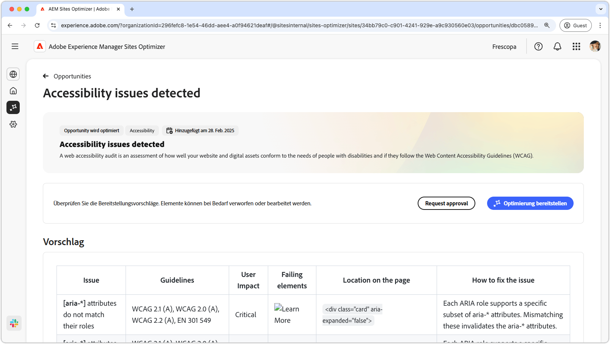
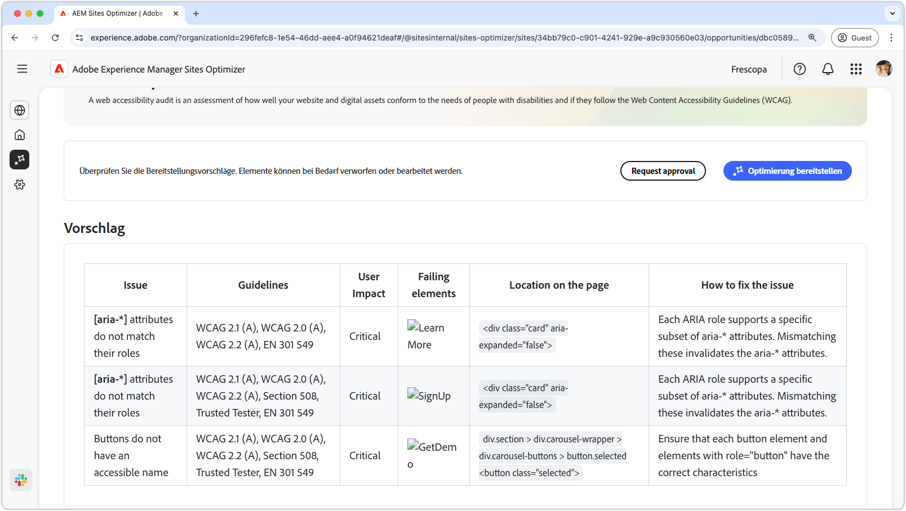

# Möglichkeit „Probleme mit der Barrierefreiheit“

{align="center"}

Die Möglichkeit „Probleme mit der Barrierefreiheit“ identifiziert, wie gut Ihre Website auf die Bedürfnisse von Menschen mit Behinderungen ausgerichtet ist und ob sie die [Web Content Accessibility Guidelines (WCAG)](https://www.w3.org/TR/WCAG21/) erfüllt. Indem Sie beurteilen, wie gut Ihre Site mit WCAG konform ist, helfen Sie bei der Erstellung eines inklusiven Online-Erlebnisses. Dadurch können Personen mit visuellen, auditiven, kognitiven und motorischen Beeinträchtigungen navigieren, mit Ihren Inhalten interagieren und von ihnen profitieren. Diese Funktion ist nicht nur aus ethischen Gründen unverzichtbar, sondern fördert auch die Einhaltung gesetzlicher Anforderungen, verbessert die SEO und kann die Reichweite Ihrer Zielgruppe erhöhen, wodurch sowohl das Anwendererlebnis als auch die Geschäftsleistung verbessert werden.

## Automatische Identifizierung

{align="center"}

Die **Möglichkeit „Probleme mit der Barrierefreiheit“** identifiziert Probleme mit der Barrierefreiheit auf Ihrer Website und listet Folgendes auf:

* **Probleme**: Das spezifische Problem mit der Barrierefreiheit, das gefunden wurde.
* **Richtlinien**: Die [ID der WCAG-Richtlinien](https://www.w3.org/TR/WCAG21/), gegen die das Problem verstößt.
* **Auswirkung auf Benutzende**: Eine Bewertung der Auswirkungen auf Benutzende mit Behinderungen.
* **Fehlgeschlagene Elemente**: Die HTML-Elemente auf der Web-Seite, die von dem Problem betroffen sind.
* **Position auf der Seite**: Das HTML-Snippet des Elements auf der Seite, die von dem Problem betroffen ist.

## Automatische Vorschläge

{align="center"}

Das automatische Vorschlagen bietet KI-generierte Empfehlungen im Feld **Fehlerbehebung**, die ausführliche Anleitungen zur Fehlerbehebung enthalten.

## Automatische Optimierung

[!BADGE Ultimate]{type=Positive tooltip="Ultimate"}

{align="center"}

Sites Optimizer Ultimate ermöglicht es, eine automatische Optimierung für die gefundenen Schwachstellen bereitzustellen.

>[!BEGINTABS]

>[!TAB Optimierung bereitstellen]

{{auto-optimize-deploy-optimization-slack}}

>[!TAB Genehmigung anfordern]

{{auto-optimize-request-approval}}

>[!ENDTABS]

## Siehe auch

[Opportunity aufgrund von Barrierefreiheitsproblemen in Forms](/help/documentation/opportunities/forms-accessibility-issues.md)