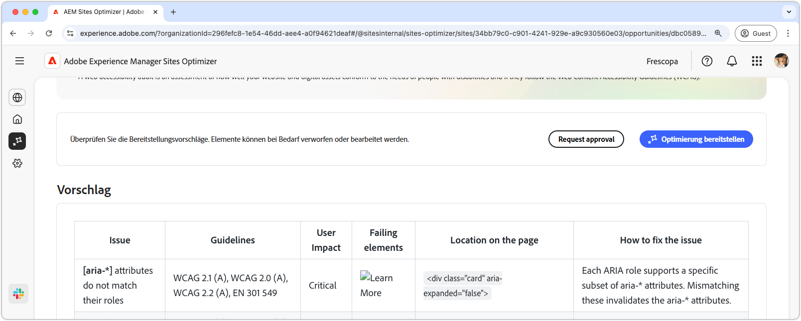

# Möglichkeit „Probleme mit der Barrierefreiheit“

{align="center"}

Die Möglichkeit „Probleme mit der Barrierefreiheit“ identifiziert, wie gut Ihre Website auf die Bedürfnisse von Menschen mit Behinderungen ausgerichtet ist und ob sie die [Web Content Accessibility Guidelines (WCAG)](https://www.w3.org/TR/WCAG21/) erfüllt. Durch die Beurteilung der Konformität Ihrer Site mit den WCAG tragen Sie dazu bei, ein inklusives Online-Erlebnis zu schaffen, das es Personen mit visuellen, auditiven, kognitiven und motorischen Beeinträchtigungen ermöglicht, in Ihren Inhalten zu navigieren, mit ihnen zu interagieren und von ihnen zu profitieren. Dies ist nicht nur aus ethischen Gründen wichtig, sondern fördert außerdem die Einhaltung der gesetzlichen Anforderungen, verbessert die SEO und kann das Erreichen Ihrer Zielgruppe stärken, was sowohl das Anwendererlebnis als auch die Geschäftsleistung optimiert.

## Automatische Identifizierung

{align="center"}

Die **Möglichkeit „Probleme mit der Barrierefreiheit“** identifiziert Probleme mit der Barrierefreiheit auf Ihrer Website und listet Folgendes auf:

* **Probleme** - Das spezifische Problem mit der Barrierefreiheit.
* **Richtlinien**: Die [ID der WCAG-Richtlinien](https://www.w3.org/TR/WCAG21/), gegen die das Problem verstößt.
* **Auswirkung auf Benutzende**: Eine Bewertung der Auswirkungen auf Benutzende mit Behinderungen.
* **Fehlgeschlagene Elemente**: Die HTML-Elemente auf der Web-Seite, die von dem Problem betroffen sind.
* **Position auf der Seite**: Das HTML-Snippet des Elements auf der Seite, die von dem Problem betroffen ist.

## Automatische Vorschläge

{align="center"}

Das automatische Vorschlagen bietet KI-generierte Empfehlungen im Feld **Fehlerbehebung**, die ausführliche Anleitungen zur Fehlerbehebung enthalten.

## Automatische Optimierung

[!BADGE Ultimate]{type=Positive tooltip="Ultimate"}

{align="center"}

Sites Optimizer Ultimate ermöglicht es, eine automatische Optimierung für die gefundenen Schwachstellen bereitzustellen.

>[!BEGINTABS]

>[!TAB Optimierung bereitstellen]

{{auto-optimize-deploy-optimization-slack}}

>[!TAB Genehmigung anfordern]

{{auto-optimize-request-approval}}

>[!ENDTABS]
