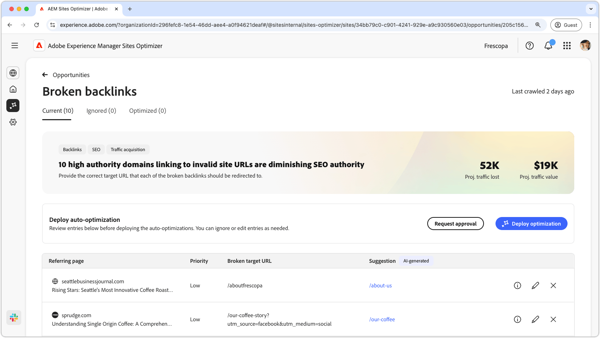
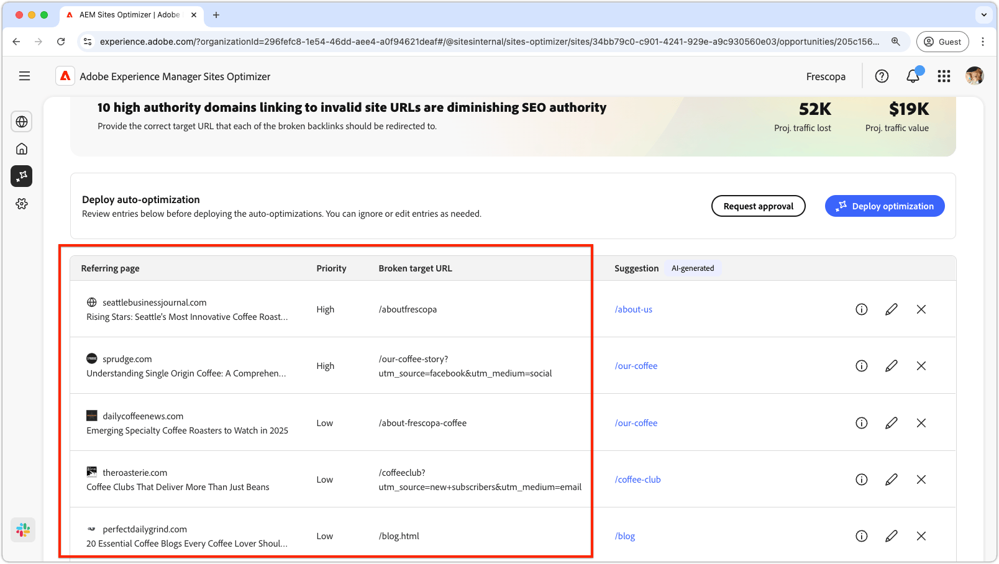
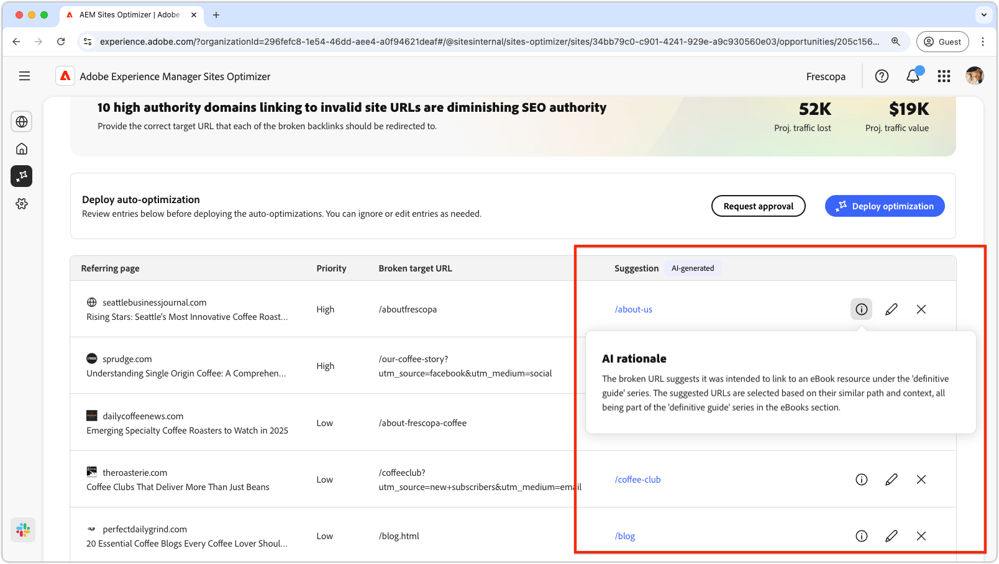
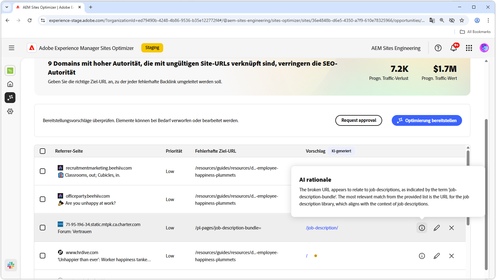
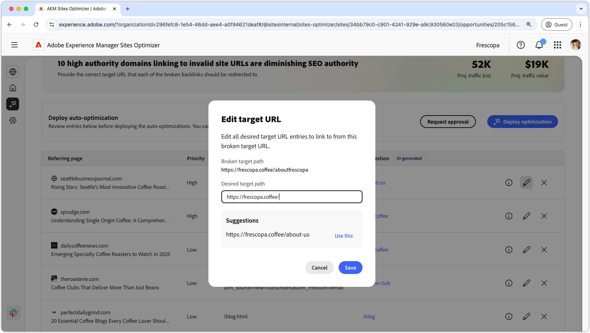
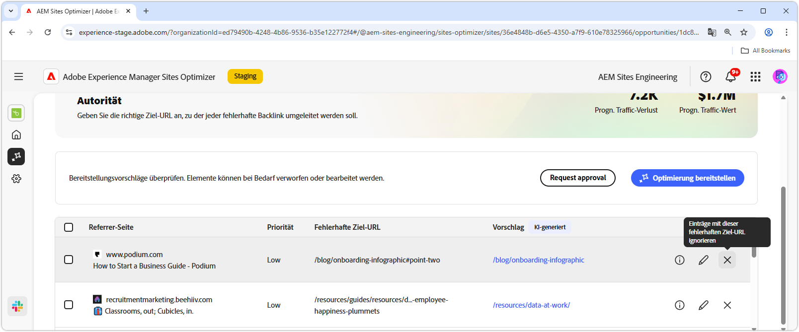

# Möglichkeit „Fehlerhafte Backlinks“

<!--{align="center"}-->

>[!VIDEO](https://video.tv.adobe.com/v/3483250/?learn=on&enablevpops)

Die Möglichkeit für fehlerhafte Backlinks identifiziert externe Links, die auf nicht vorhandene (404) Seiten Ihrer Site verweisen. Diese Links führen zu Referral-Traffic-Verlusten und geringerem SEO-Wert, da Suchmaschinen auf Backlinks angewiesen sind, um Relevanz und Autorität zu bewerten. Diese Probleme treten auf, wenn URLs geändert oder Inhalte entfernt werden oder Seiten nicht mehr verfügbar sind, ohne dass ordnungsgemäße Weiterleitungen vorhanden sind. AEM Sites Optimizer identifiziert alle fehlerhaften Backlinks, bietet spezifische KI-Empfehlungen und ermöglicht die Bereitstellung einer Korrektur mit einem Klick, und das alles in einer zentralen Ansicht.

## Automatische Identifizierung

<!--{align="center"}-->

AEM Sites Optimizer durchsucht kontinuierlich externe Datenquellen, um Backlinks zu erkennen, die auf nicht vorhandene 404-Seiten auf Ihrer Site verweisen. Die Daten werden aus verschiedenen Quellen aggregiert, einschließlich Google Search Console, [Operational Telemetry](https://experienceleague.adobe.com/de/docs/experience-manager-cloud-service/content/sites/operational-telemetry-for-aem-as-a-cloud-service) und SEO-Plattformen von Drittanbietern. Die Möglichkeit zur automatischen Identifizierung identifiziert externe Domains, die mit fehlerhaften URLs verknüpft sind, und priorisiert sie basierend auf den Auswirkungen, einschließlich Domain-Autorität und erwartetem Traffic sowie Verlusten des Link-Werts.

Diese Möglichkeit listet alle identifizierten Probleme auf, einschließlich der folgenden Details:

* **Referrer-Domain und -Seite** – Die externe Seite oder Domain, die den fehlerhaften Link enthält.
* **Priorität** – Hoch, Mittel oder Niedrig. Gibt die Auswirkungen des fehlerhaften Links auf den SEO-Prozess an.
* **Fehlerhafte Ziel-URL** – Die nicht vorhandene URL auf Ihrer Site, auf die verlinkt wird.

## Automatische Vorschläge

<!--{align="center"}-->

Für jeden identifizierten fehlerhaften Backlink empfiehlt AEM Sites Optimizer das am besten geeignete Ziel, um den Traffic und den SEO-Wert wiederherzustellen. Er ermittelt die Absicht des Backlinks durch Analyse folgender Elemente:

* URL-Struktur und Token
* Ankertext
* Titel und Kontext der verweisenden Seite

Diese Absicht wird mit vorhandenem Site-Inhalt abgeglichen, um die relevanteste Zielseite zu identifizieren. Jede fehlerhafte URL wird entweder einer exakten Ersatzseite oder der nächstgelegenen relevanten Seite zugeordnet. Wenn kein geeignetes Ziel ermittelt werden kann, wird das Problem zur manuellen Prüfung angezeigt.

>[!BEGINTABS]

>[!TAB KI-Begründung]

<!--{align="center"}-->

Wählen Sie das Symbol **Informationen** aus, um die KI-Begründung für die vorgeschlagene URL anzuzeigen. Die Begründung erklärt, warum die KI der Ansicht ist, dass die vorgeschlagene URL am besten für den fehlerhaften Link geeignet ist. Dies kann Ihnen dabei helfen, den Entscheidungsfindungsprozess der KI nachzuvollziehen und eine fundierte Entscheidung darüber zu treffen, ob Sie den Vorschlag akzeptieren oder ablehnen sollen.

>[!TAB Ziel-URL bearbeiten]

<!--{align="center"}-->

Wenn Sie mit dem KI-generierten Vorschlag nicht einverstanden sind, können Sie die vorgeschlagene URL bearbeiten, indem Sie das **Symbol „Bearbeiten“** auswählen. Beim Bearbeiten können Sie manuell die URL eingeben, die Ihrer Meinung nach für den fehlerhaften Link am besten geeignet ist. Sites Optimizer führt auch alle anderen URLs auf Ihrer Site auf, die für den fehlerhaften Link geeignet sein könnten.

>[!TAB Einträge ignorieren]

<!--{align="center"}-->

Sie können Einträge mit den anvisierten fehlerhaften URLs ignorieren. Durch Auswählen von  wird der fehlerhafte Backlink aus der Liste der Möglichkeiten entfernt. Ignorierte fehlerhafte Backlinks können über die Registerkarte **Ignoriert** oben auf der Seite der Möglichkeiten erneut aktiviert werden.

>[!ENDTABS]

## Automatische Optimierung

<!--[!BADGE Ultimate]{type=Positive tooltip="Ultimate"}-->

Sobald die Vorschläge geprüft und genehmigt wurden, können Sie auf **Optimierung bereitstellen** klicken. AEM Sites Optimizer wendet die Korrekturen dann in der Autorenumgebung an, je nachdem, wie Weiterleitungen innerhalb Ihrer Implementierung verwaltet werden. AEM-Autorinnen und -Autoren können dann die Änderungen über das Content Management System (CMS) veröffentlichen.

Abhängig von der Konfiguration werden Fehlerbehebungen entweder als Inhalts- oder als Code-Änderungen innerhalb der vorhandenen Bereitstellungs-Workflows angewendet. Der Optimierungsprozess umfasst die folgenden Schritte:

* **Validierung** – Stellt vor der Bereitstellung sicher, dass die Änderungen wie erwartet funktionieren und keine Regressionen einführen.
* **Bereitstellung** – Wendet Änderungen über bestehende Prozesse an, z. B. Inhaltsaktualisierungen in AEM oder Code-Bereitstellung über CI/CD-Pipelines.
* **Berechtigungsprüfung** – Prüft, ob die Person über die erforderlichen Berechtigungen zum Bereitstellen von Änderungen verfügt. Anderenfalls werden alternative Ausgaben wie herunterladbare Umleitungslisten oder Code-Patches bereitgestellt.

Dieser Prozess stellt sicher, dass Umleitungen korrekt implementiert, vor der Veröffentlichung validiert und mit bestehenden Konfigurationen und Governance-Prozessen abgestimmt werden.
