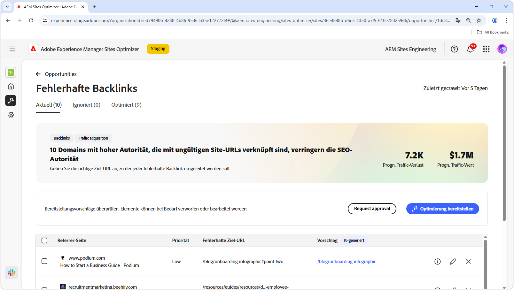

# Möglichkeit „Fehlerhafte Backlinks“

{align="center"}

Die Möglichkeit „Fehlerhafte Backlinks“ identifiziert Links auf anderen Websites zu Ihrer Site, die zu einem 404-Fehler führen. Da Suchmaschinen Backlinks zur Bestimmung der Suchrelevanz verwenden, können fehlerhafte Links die SEO und Auffindbarkeit Ihrer Site negativ beeinflussen. Diese Probleme können durch Faktoren wie Änderungen der URL oder das Entfernen der verlinkten Seite verursacht werden.

Die Möglichkeit „Fehlerhafte Backlinks“ zeigt oben auf der Seite eine Übersicht an, die eine Zusammenfassung des Problems und dessen Auswirkungen auf Ihre Site und Ihr Geschäft enthält.

* **Prognostizierter Traffic-Verlust**: Der geschätzte Traffic-Verlust aufgrund von fehlerhaften Backlinks.
* **Prognostizierter Traffic-Wert**: Der geschätzte Wert des verlorenen Traffics.

## Automatische Identifizierung

{align="center"}

Die Möglichkeit „Fehlerhafte Backlinks“ führt alle fehlerhaften Backlinks auf Ihrer Site auf, einschließlich:

* **Referrer-Seite**: Die Website-Domain, die den fehlerhaften Link enthält.
* **Priorität**: Hoch, Mittel oder Niedrig. Gibt die Auswirkungen des fehlerhaften Links auf die SEO auf der Grundlage von TODO an.
* **Fehlerhafte Ziel-URL**: Die nicht vorhandene URL auf Ihrer Site, auf die verlinkt wird.

## Automatische Vorschläge

{align="center"}

Die Möglichkeit „Fehlerhafte Backlinks“ bietet außerdem KI-generierte Vorschläge dazu, zu welcher Seite auf ihrer Website die fehlerhafte URL umleiten soll. Die Vorschläge basieren auf dem Text, der die fehlerhafte URL enthält, und dem Inhalt der vorgeschlagenen Seite.

>[!BEGINTABS]

>[!TAB KI-Begründung]

{align="center"}

Wählen Sie das Symbol **Informationen** aus, um die KI-Begründung für die vorgeschlagene URL anzuzeigen. Die Begründung erklärt, warum die KI der Ansicht ist, dass die vorgeschlagene URL am besten für den fehlerhaften Link geeignet ist. Dies kann Ihnen dabei helfen, den Entscheidungsfindungsprozess der KI nachzuvollziehen und eine fundierte Entscheidung darüber zu treffen, ob Sie den Vorschlag akzeptieren oder ablehnen sollen.

>[!TAB Ziel-URL bearbeiten]

{align="center"}

Wenn Sie mit dem KI-generierten Vorschlag nicht einverstanden sind, können Sie die vorgeschlagene URL bearbeiten, indem Sie das **Symbol „Bearbeiten“** auswählen. Auf diese Weise können Sie manuell die URL eingeben, die Ihrer Meinung nach am besten für den fehlerhaften Link geeignet ist. Sites Optimizer führt auch alle anderen URLs auf Ihrer Site auf, die es für den fehlerhaften Link für geeignet hält.

>[!TAB Einträge ignorieren]

{align="center"}

Sie können sich entscheiden, Einträge mit der fehlerhaften Ziel-URL zu ignorieren. Durch das Auswählen des **Symbols „Ignorieren“** wird der fehlerhafte Backlink aus der Liste der Möglichkeiten entfernt. Ignorierte fehlerhafte Backlinks können über die Registerkarte **Ignoriert** oben auf der Seite der Möglichkeiten erneut aktiviert werden.

>[!ENDTABS]

## Automatische Optimierung

[!BADGE Ultimate]{type=Positive tooltip="Ultimate"}

{align="center"}

Sites Optimizer Ultimate bietet jetzt die Möglichkeit, automatische Optimierungen von fehlerhaften Backlinks bereitzustellen. Durch das Auswählen der Schaltfläche **Automatisch optimieren** werden die Umleitungsregeln der AEM-Site automatisch aktualisiert, um die **fehlerhafte Ziel-URL** der **vorgeschlagenen URL** zuzuordnen. Dadurch wird sichergestellt, dass Besuchende der Website und Suchbots, die den fehlerhaften Links auf den **Referrer-Seiten** folgen, zur richtigen Seite auf Ihrer Site weitergeleitet werden, was die SEO und das Anwendererlebnis verbessert.

>[!BEGINTABS]

>[!TAB Optimierung bereitstellen]

{align="center"}

Durch das Auswählen der Schaltfläche **Optimierung bereitstellen** werden die Umleitungsregeln der AEM-Site automatisch aktualisiert, um die **fehlerhafte Ziel-URL** der **vorgeschlagenen URL** zuzuordnen. Dadurch wird sichergestellt, dass Besuchende der Website und Suchbots, die den fehlerhaften Links auf den **Referrer-Seiten** folgen, zur richtigen Seite auf Ihrer Site weitergeleitet werden, was die SEO und das Anwendererlebnis verbessert.

>[!TAB Genehmigung anfordern]

{align="center"}

{{auto-optimize-request-approval}}

>[!ENDTABS]
