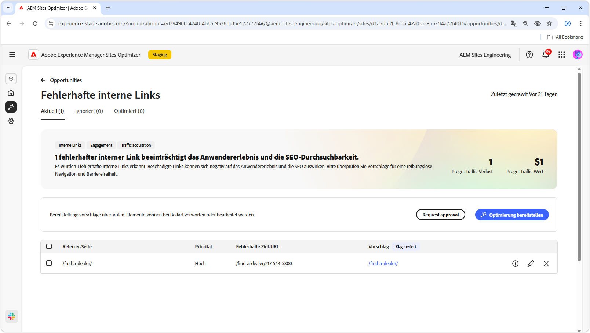

# Möglichkeit „Fehlerhafte interne Links“

{align="center"}

Fehlerhafte interne Links beeinträchtigen neben der Fähigkeit einer Suchmaschine, Ihre Site zu indizieren, auch das Anwendererlebnis sowie die Suchmaschinen-Optimierung. Um dieses Problem zu beheben, zeigt die Möglichkeit „Fehlerhafte interne Links“ fehlerhafte URLs auf und bietet Vorschläge für Aktualisierungen auf gültige Links. Die Behebung dieser Probleme kann die Benutzerinteraktion verbessern und eine reibungslose Navigation und Zugänglichkeit sicherstellen.

Die Möglichkeit „Fehlerhafte interne Links“ zeigt oben auf der Seite eine Übersicht an, die eine Zusammenfassung des Problems und dessen Auswirkungen auf Ihre Site und Ihr Geschäft enthält.

* **Prognostizierter Traffic-Verlust**: Der geschätzte Traffic-Verlust aufgrund von fehlerhaften internen Links.
* **Prognostizierter Traffic-Wert**: Der geschätzte Wert des verlorenen Traffics.

## Automatische Identifizierung

<!---{align="center"}-->

Die Möglichkeit „Fehlerhafte interne Links“ identifiziert automatisch alle fehlerhaften internen Links auf Ihren Seiten und listet sie auf, einschließlich:

* **Referrer-Seite**: Die Seite, die den fehlerhaften Link enthält.
* **Fehlerhafte Ziel-URL**: Der fehlerhafte Link.
* **Vorschlag**: Ein KI-generierter Vorschlag zum Aktualisieren des fehlerhaften Links. Weitere Informationen finden Sie im Abschnitt zu automatischen Vorschlägen.

## Automatische Vorschläge

<!--{align="center"}-->

Die Möglichkeit „Fehlerhafte interne Links“ bietet KI-generierte Vorschläge für die Aktualisierung der fehlerhaften Links. Diese Vorschläge basieren auf der anvisierten fehlerhaften URL und bieten einen geeigneten Ersatz. Die Auswahl  liefert eine von KI generierte Begründung für die vorgeschlagene Aktualisierung.

>[!BEGINTABS]

>[!TAB KI-Begründung]

<!--[AI rationale of broken internal links](./assets/broken-internal-links/auto-suggest-ai-rationale.png) -->

Wählen Sie  aus, um die KI-Begründung für die vorgeschlagene URL anzuzeigen. Die Begründung erklärt, warum die KI der Ansicht ist, dass die vorgeschlagene URL am besten für den fehlerhaften Link geeignet ist. Es kann Ihnen auch helfen, den Entscheidungsfindungsprozess der KI zu verstehen und eine fundierte Entscheidung darüber zu treffen, ob der Vorschlag akzeptiert oder abgelehnt wird.

>[!TAB Ziel-URL bearbeiten]

<!--{align="center"}-->

Wenn Sie mit dem KI-generierten Vorschlag nicht einverstanden sind, können Sie den vorgeschlagenen Link-Wert bearbeiten, indem Sie das **Symbol „Bearbeiten“** auswählen. Mit dieser Funktion können Sie den gewünschten Link manuell eingeben. Das Bearbeitungsfenster enthält den **fehlerhaften Zielpfad** des Links, den **gewünschten Zielpfad**, in dem Sie den Link manuell bearbeiten können, sowie ein Feld mit dem KI-generierten Vorschlag. Wenn Sie mit der Bearbeitung fertig sind, klicken auf **Speichern**, um den Eintrag für den fehlerhaften Link zu speichern. Ein gelber Punkt im Eintragsfeld zeigt an, dass der Link bearbeitet wurde.

>[!TAB Einträge ignorieren]

<!--{align="center"}-->

Sie können Einträge mit den anvisierten fehlerhaften URLs ignorieren. Wenn Sie  auswählen, wird der Eintrag aus der Opportunity-Liste entfernt. Ignorierte Einträge können über die Registerkarte **Ignoriert** oben auf der Seite der Möglichkeiten erneut aktiviert werden.

>[!ENDTABS]

## Automatische Optimierung

[!BADGE Ultimate]{type=Positive tooltip="Ultimate"}

<!---{align="center"}-->

Sites Optimizer Ultimate ermöglicht es, eine automatische Optimierung für die von der Möglichkeit gefundenen fehlerhaften Links bereitzustellen. <!--- TBD-need more in-depth and opportunity specific information here. What does the auto-optimization do?-->

>[!BEGINTABS]

>[!TAB Optimierung bereitstellen]

{{auto-optimize-deploy-optimization-slack}}

>[!TAB Genehmigung anfordern]

{{auto-optimize-request-approval}}

>[!ENDTABS]

