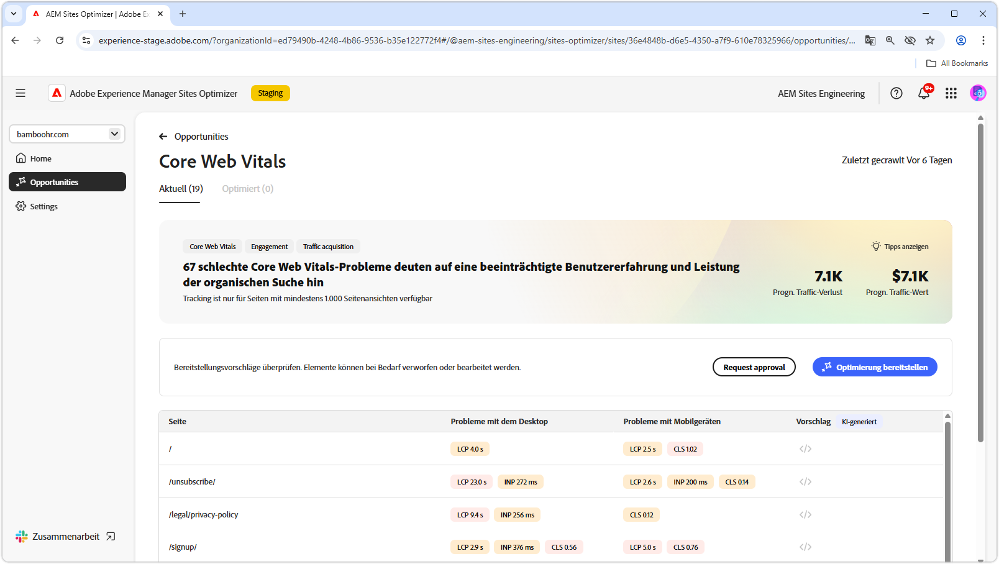
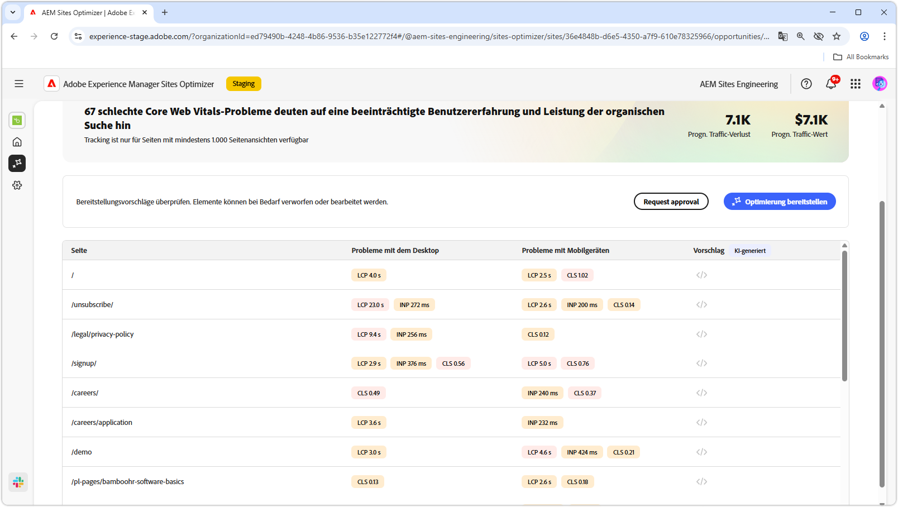
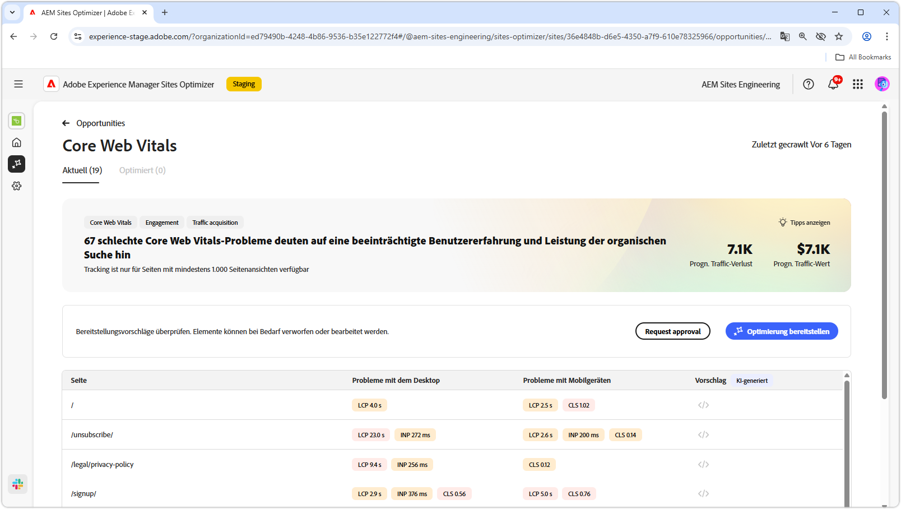

# Möglichkeit „Core Web Vitals“

{align="center"}

Die Möglichkeit „Core Web Vitals“ identifiziert Probleme, die das Anwendererlebnis Ihrer Web-Seiten und ihre Leistung bei der organischen Suche beeinträchtigen können. Diese Probleme ergeben sich aus einer Vielzahl von Faktoren wie: benutzerdefinierte Schriftarten, nicht optimierte JavaScript-Abhängigkeiten, Drittanbieterskripte usw. Die Möglichkeit „Core Web Vitals“ zeigt diese fehlerhaften Elemente auf und schlägt Fehlerbehebungen vor, die die Leistung Ihrer Web-Seite erhöhen können. Beachten Sie, dass nur Seiten mit mindestens 1000 Seitenansichten analysiert werden können.

Zunächst zeigt die Möglichkeit Core Web Vitals oben auf der Seite eine Übersicht an, die eine Zusammenfassung des Problems und dessen Auswirkungen auf Ihre Site und Ihr Geschäft enthält.

* **Prognostizierter Traffic-Verlust**: Der geschätzte Traffic-Verlust aufgrund von Core Web Vitals unterhalb der Leistungsschwellenwerte.
* **Prognostizierter Traffic-Wert**: Der geschätzte Wert des verlorenen Traffics.

## Automatische Identifizierung

{align="center"}

Im unteren Teil der Seite finden Sie eine Liste aller aktuellen Probleme, die nach Folgendem gruppiert sind:

* **Probleme mit Mobilgeräten**: Eine Liste von Problemen, die sich auf die mobile Version der Seite auswirken.
* **Probleme mit dem Desktop**: Eine Liste von Problemen, die sich auf die Desktop-Version der Seite auswirken.

Jedes Problem wird in einer Tabelle angezeigt, wobei die Spalte **Seite** den Eintrag auf der betroffenen Seite angibt.

Das System gruppiert diese Probleme anhand der Standardleistungsmetriken im Bericht „Core Web Vitals“:

* größte Inhaltsfarbe **LCP**
* Interaktion mit der nächsten Zeichnung **INP**
* Kumulative Layout-Verschiebung **CLS**

## Automatische Vorschläge

{align="center"}

Die Möglichkeit „Core Web Vitals“ bietet KI-generierte Vorschläge zur Fehlerbehebung. Wenn Sie auf die Schaltfläche „Vorschläge“ klicken, wird ein neues Fenster mit den Leistungsmetriken **LCP**, **INP** und **CLS** als Kategorien angezeigt. Sie können zwischen diesen Kategorien wechseln, um jeweils eine Liste mit spezifischen Problemen anzuzeigen.

Jede Kategorie kann mehrere Probleme enthalten. Scrollen Sie daher nach unten, um die vollständige Liste der Probleme und Empfehlungen anzuzeigen.  Darüber hinaus gibt es für jede Metrik zwei Leistungsmessungen, eine für Mobilgeräte und eine für Desktops.

## Automatische Optimierung

[!BADGE Ultimate]{type=Positive tooltip="Ultimate"}

{align="center"}

Sites Optimizer Ultimate ermöglicht es, eine automatische Optimierung für die von der Möglichkeit „Core Web Vitals“ gefundenen Probleme bereitzustellen. <!--- TBD-need more in-depth and opportunity specific information here. What does the auto-optimization do?-->

>[!BEGINTABS]

>[!TAB Optimierung bereitstellen]

{{auto-optimize-deploy-optimization-slack}}

>[!TAB Genehmigung anfordern]

{{auto-optimize-request-approval}}

>[!ENDTABS]

