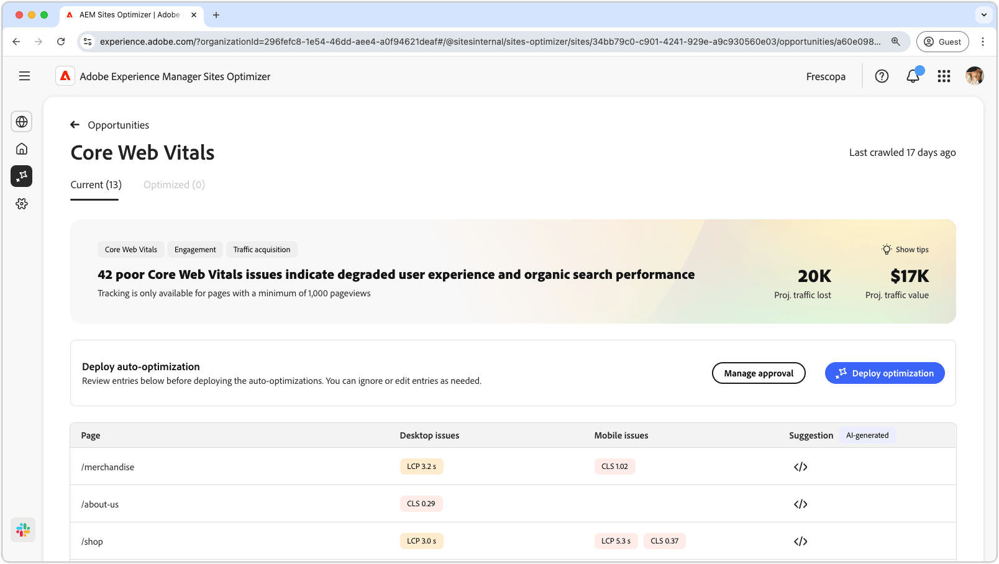
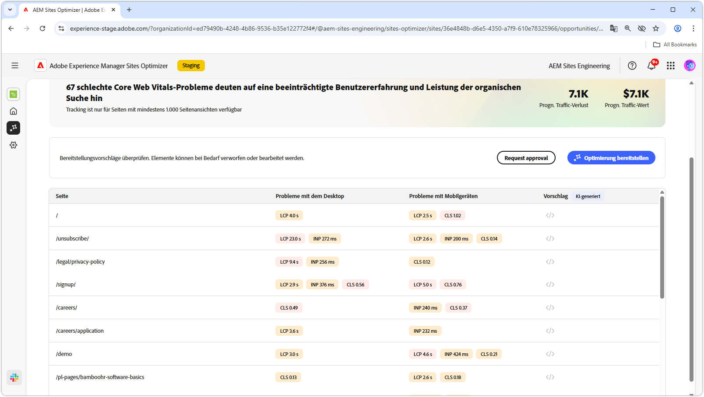
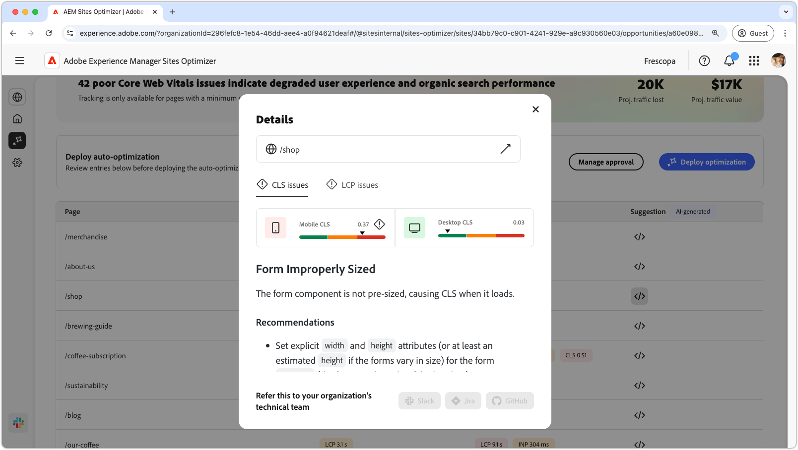

# Möglichkeit „Core Web Vitals“

<!--{align="center"}-->

>[!VIDEO](https://video.tv.adobe.com/v/3483380/?captions=ger&learn=on&enablevpops)

Die Core Web Vitals-Opportunity identifiziert Seiten auf Ihrer Website, deren Leistung das Benutzererlebnis und die organische Suchleistung unterschreitet. Diese Probleme können durch Faktoren wie benutzerdefinierte Schriftarten, nicht optimierte JavaScript-Abhängigkeiten und Drittanbieterskripte verursacht werden. Core Web Vitals misst, wie schnell Inhalte geladen werden, wie stabil das Seiten-Layout ist und wie responsiv die Seite auf Benutzerinteraktionen reagiert.

AEM Sites Optimizer erkennt von diesen Problemen betroffene Seiten, stellt spezifische KI-Empfehlungen auf Code-Ebene bereit und wendet Fehlerbehebungen über Ihre bestehenden Entwicklungs-Workflows an. Beachten Sie, dass nur Seiten mit mindestens 1000 Seitenansichten analysiert werden können.

## Automatische Identifizierung

<!--{align="center"}-->

AEM Sites Optimizer überwacht kontinuierlich die Site-Performance mithilfe [Operative Telemetrie](https://experienceleague.adobe.com/de/docs/experience-manager-cloud-service/content/sites/operational-telemetry-for-aem-as-a-cloud-service) um Regressionen in Core Web Vitals-Metriken wie Largest Contentful Paint (LCP), Cumulative Layout Shift (CLS) und Interaction to Next Paint (INP) zu erkennen. Es verwendet echte Benutzerdaten, um Leistungsregressionen zu identifizieren, und priorisiert Probleme basierend auf ihren Auswirkungen auf das Benutzererlebnis.

AEM Sites Optimizer zeigt eine Liste aller aktuellen Probleme an, die nach Mobilgerät und Desktop-Computer aufgeschlüsselt ist. Die Spalte **Seite** zeigt den betroffenen Seiteneintrag an und Probleme werden nach LCP, INP und CLS kategorisiert.

## Automatische Vorschläge

<!--{align="center"}-->

Für jedes identifizierte Problem generiert AEM Sites Optimizer präskriptive Empfehlungen auf Code-Ebene, um die Core Web Vitals-Leistung zu verbessern. Er bewertet die zugrunde liegende Implementierung durch Zugriff auf Ihr Code-Repository. Auf diese Weise kann das System analysieren, wie Komponenten, Skripte und Stile implementiert werden, und die Grundursache der Leistungsprobleme identifizieren. Basierend auf dieser Analyse stellt das System zielgerichtete Empfehlungen bereit und generiert Code-Patches, die die Änderungen angeben, die zur Verbesserung der Leistung erforderlich sind. Jede Empfehlung kann vor ihrer Anwendung überprüft werden.

Wenn Sie auf die Schaltfläche „Vorschlag“ klicken, wird ein neues Fenster angezeigt, das die Leistungsmetriken LCP, INP und CLS als Kategorien enthält. Sie können zwischen diesen Kategorien wechseln, um die Liste der spezifischen Probleme anzuzeigen. Jede Kategorie kann mehrere Probleme enthalten. Achten Sie daher darauf, nach unten zu scrollen, um die vollständige Liste der Probleme und Empfehlungen zu sehen. Darüber hinaus gibt es für jede Metrik zwei Leistungsmessungen für Mobilgeräte und Desktops.

## Automatische Optimierung

<!--[!BADGE Ultimate]{type=Positive tooltip="Ultimate"}-->

Sobald die Empfehlungen geprüft und genehmigt wurden, können Sie auf **Optimierung bereitstellen** klicken. AEM Sites Optimizer generiert Code-Patches basierend auf den identifizierten Problemen und stellt diese über Versionskontrollprozesse zur Verfügung. Der Optimierungsprozess umfasst die folgenden Schritte:

* **Problem-Erstellung** - Erstellt für jede Fehlerbehebung ein gekennzeichnetes GitHub-Problem, einschließlich einer klaren Beschreibung und einer betroffenen URL für die Sichtbarkeit.
* **Versand einer Pull-Anfrage** - Öffnet automatisch eine verknüpfte Pull-Anfrage mit der genauen Code-Fehlerbehebung, die für Überprüfung, Test und Zusammenführung bereit ist.
* **Status-Tracking** - Verfolgt jede Fehlerbehebung bis zum Abschluss und kennzeichnet partielle oder fehlgeschlagene Versuche für die Nachverfolgung.

Bevor diese Aktualisierungen verfügbar gemacht werden, führt AEM Sites Optimizer eine Validierung durch, um sicherzustellen, dass die Fehlerbehebungen das zugrunde liegende Problem beheben und keine Regressionen einführen. Alle Aktualisierungen entsprechen den üblichen Entwicklungspraktiken, die überprüft und genehmigt werden müssen, bevor sie in die Produktion übernommen werden können.

Dadurch wird sichergestellt, dass Leistungsoptimierungen präzise, validiert und in bestehende Entwicklungs- und Governance-Prozesse integriert werden.
