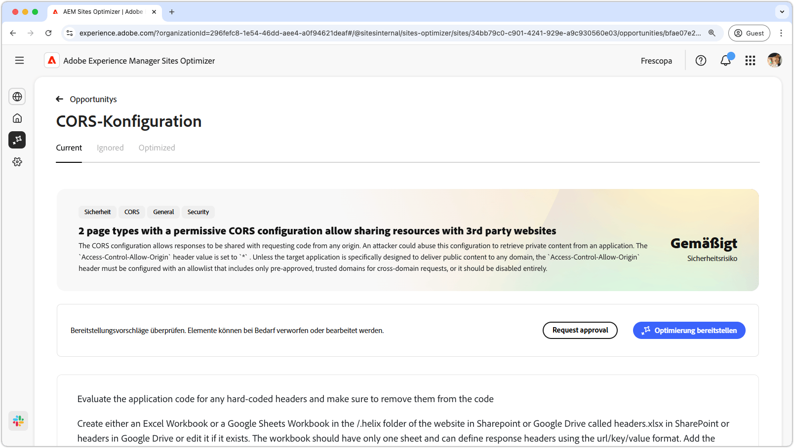
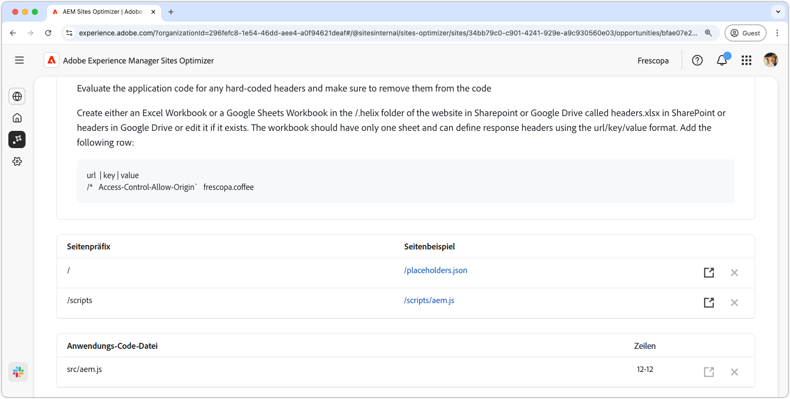

# CORS-Konfigurationsmöglichkeit

{align="center"}

Die ordnungsgemäße Konfiguration von Cross-Origin Resource Sharing (CORS) ist unerlässlich, um Web-Anwendungen vor nicht autorisiertem Datenzugriff zu schützen. Wenn der `Access-Control-Allow-Origin`-Header auf `*` gesetzt ist, kann jede Domain Antworten anfordern und empfangen, wodurch Angreifern möglicherweise vertrauliche Informationen offenbart werden. Dies bietet die Möglichkeit, die Sicherheit zu erhöhen, indem eine kontrollierte Zulassungsliste vertrauenswürdiger Domains implementiert oder CORS deaktiviert wird, wenn dies nicht erforderlich ist. Die Gewährleistung einer sicheren CORS-Einrichtung trägt zum Schutz privater Inhalte bei und gewährleistet gleichzeitig einen nahtlosen Zugriff für autorisierte Benutzer.

## Automatisch identifizieren

{align="center"}

Die automatische Identifizierung überprüft Ihre Website auf CORS-Fehlkonfigurationen und erkennt URLs, die für nicht autorisierten Zugriff anfällig sind. Diese URLs werden in der oberen Tabelle zusammen mit den folgenden Details aufgeführt:

* **Seitenpräfix** - Das URL-Pfadpräfix, das anfällig für eine CORS-Fehlkonfiguration ist.
* **Seitenbeispiel** - Eine Beispiel-URL, die für nicht autorisierten Zugriff anfällig ist.

## Automatisch vorschlagen

{align="center"}

Automatische Vorschläge für (**) Code** Dateien und deren **Zeilen** die überprüft werden sollen und für die möglicherweise laxe CORS-Richtlinien festgelegt werden.

## [!BADGE Ultimate automatisch optimieren]{type=Positive tooltip="Ultimate"}

>[!BEGINTABS]

>[!TAB Optimierung bereitstellen]

{{auto-optimize-deploy-optimization-slack}}

>[!TAB Bestätigung anfordern]

{{auto-optimize-request-approval}}

>[!ENDTABS]
