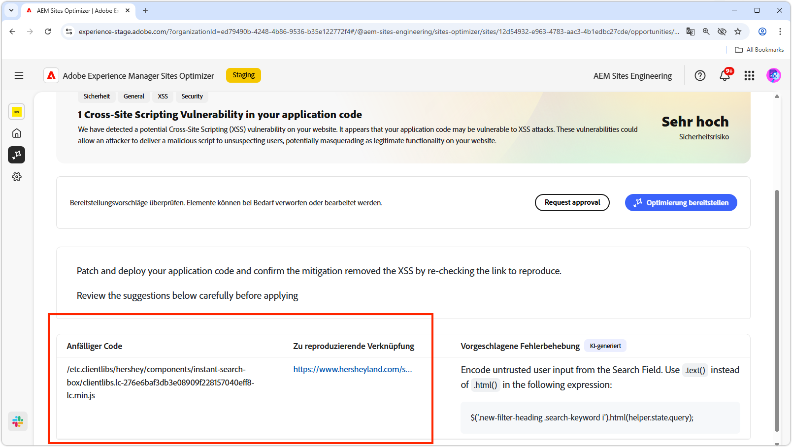
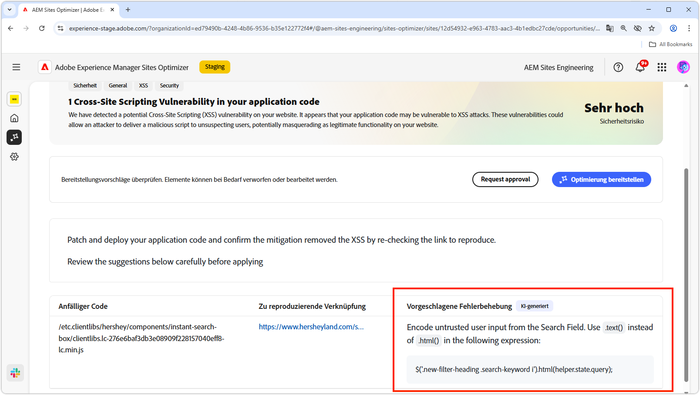

# Möglichkeit von Cross-Site-Scripting

{align="center"}

Die Möglichkeit „Cross-Site-Scripting“ identifiziert und behebt Schwachstellen im Code Ihrer Site, die von Angreifenden ausgenutzt werden könnten, um bösartige Skripte in Web-Seiten einzuschleusen, die von anderen Benutzenden angesehen werden. Diese Skripte können vertrauliche Informationen wie etwa Sitzungs-Cookies stehlen oder Aktionen im Namen der Benutzenden ausführen, z. B. ihr Passwort ändern.

## Automatische Identifizierung

{align="center"}

* **Anfälliger Code**: Jeder Code, der für Cross-Site-Scripting-Angriffe anfällig ist.
* **Zu reproduzierende Verknüpfung**: Der Link zu der Seite, auf der die Sicherheitslücke gefunden wurde.

## Automatische Vorschläge

{align="center"}

* **Vorgeschlagene Fehlerbehebung**: Ein KI-generierter Vorschlag zur Behebung der Sicherheitslücke.

## Automatische Optimierung

[!BADGE Ultimate]{type=Positive tooltip="Ultimate"}

>[!BEGINTABS]

>[!TAB Optimierung bereitstellen]

{{auto-optimize-deploy-optimization-slack}}

>[!TAB Genehmigung anfordern]

{{auto-optimize-request-approval}}

>[!ENDTABS]
