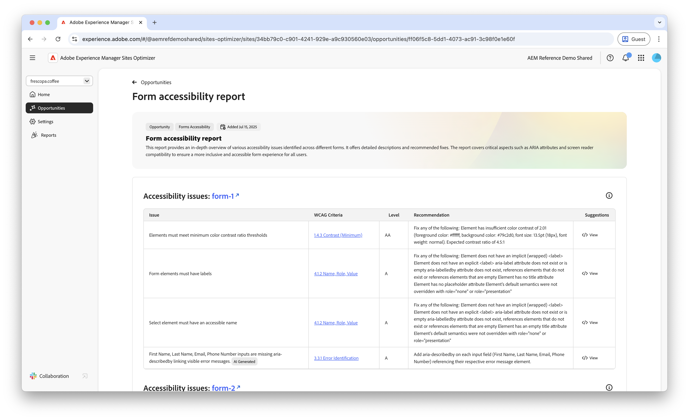
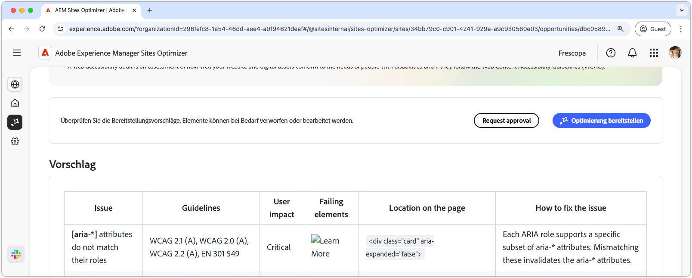

# Opportunity aufgrund von Barrierefreiheitsproblemen in Forms

{align="center"}

Die Opportunity mit Problemen im Zusammenhang mit der Barrierefreiheit von Formularen identifiziert, wie gut Ihre Formulare den Bedürfnissen von Menschen mit Behinderungen entsprechen und ob sie den [Web Content Accessibility Guidelines (WCAG)) ](https://www.w3.org/TR/WCAG21/). Indem Sie beurteilen, wie gut Ihre Formulare mit WCAG konform sind, helfen Sie, ein inklusives Formularerlebnis zu erstellen, das es Personen mit visuellen, auditiven, kognitiven und motorischen Beeinträchtigungen ermöglicht, durch Ihre Formulare zu navigieren, mit ihnen zu interagieren und sie erfolgreich auszufüllen. Dies ist nicht nur aus ethischen Gründen wichtig, sondern fördert auch die Einhaltung gesetzlicher Anforderungen, verbessert die Formularausfüllungsraten und kann die Reichweite Ihrer Zielgruppe erhöhen, was sowohl das Benutzererlebnis als auch die Geschäftsleistung verbessert.

## Automatische Identifizierung

{align="center"}

Die Opportunity **Probleme mit der Barrierefreiheit in Forms** kennzeichnet Barrierefreiheitsprobleme speziell in Ihren Formularen und umfasst Folgendes:

* **Probleme** - Das spezifische Problem bezüglich der Barrierefreiheit, das in Ihren Formularen gefunden wurde.
* **WCAG-Kriterien** - Die [WCAG-Richtlinien-ID](https://www.w3.org/TR/WCAG21/), gegen die das Formularproblem verstößt.
* **Level** - Die [Konformitätsstufen](https://www.w3.org/WAI/WCAG21/Understanding/conformance#levels) des Problems.
* **Empfehlung** - Spezifische Anleitungen zum Beheben des Problems der Barrierefreiheit in Ihren Formularen, einschließlich Code-Beispielen und Best Practices.
* **Source HTML** - Das HTML-Fragment des forms-Elements auf der von dem Problem betroffenen Seite.

## Automatische Vorschläge

{align="center"}

Der automatische Vorschlag bietet KI-generierte Empfehlungen im Feld **Vorschläge**, das normative Anleitungen dazu bietet, wie Sie das Problem der Barrierefreiheit von Formularen beheben können.

<!-- 

## Auto-optimize

[!BADGE Ultimate]{type=Positive tooltip="Ultimate"}

{align="center"}

Sites Optimizer Ultimate adds the ability to deploy auto-optimization for the form accessibility issues found.

>[!BEGINTABS]

>[!TAB Deploy optimization]

{{auto-optimize-deploy-optimization-slack}}

>[!TAB Request approval]

{{auto-optimize-request-approval}}

>[!ENDTABS]
-->

