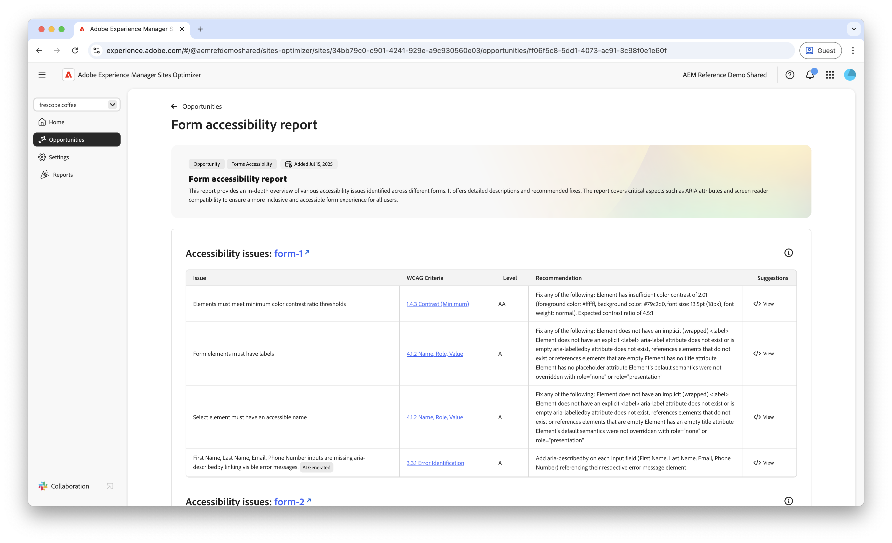
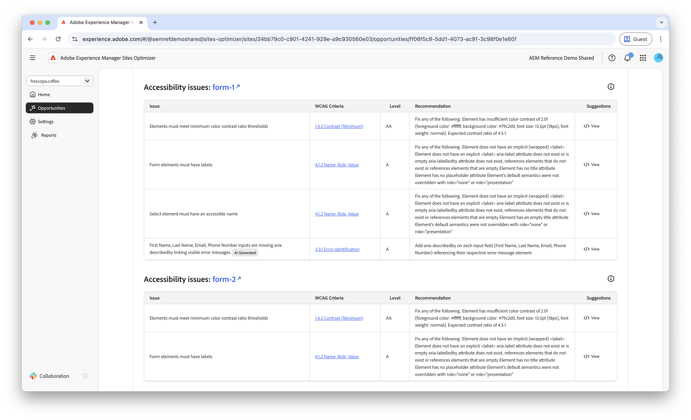
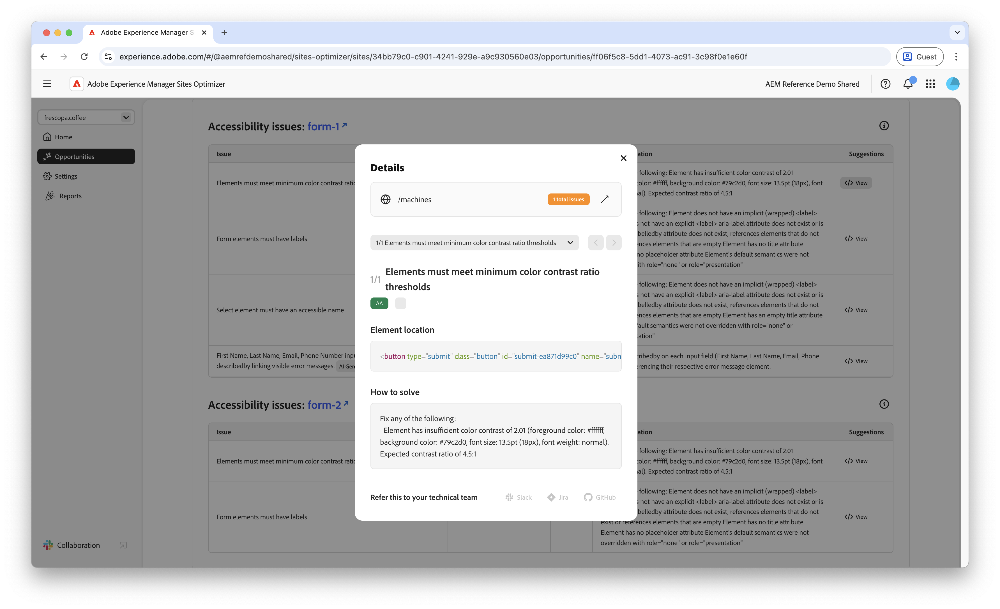
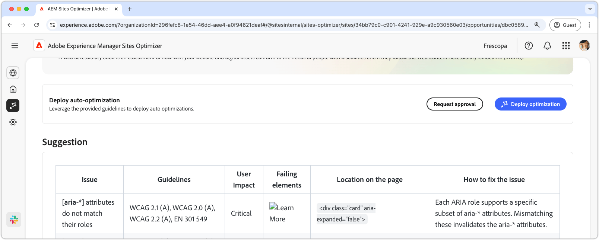

# Möglichkeit „Probleme mit der Barrierefreiheit von Formularen“

 Die Funktion „Formularoptimierung“ ist im Rahmen des Early-Adopter-Programms verfügbar. Sie können von Ihrer offiziellen E-Mail-ID aus an aem-forms-ea@adobe.com schreiben, um dem Early-Access-Programm beizutreten und den Zugriff auf diese Funktion anzufordern. 

{align="center"}

Die Möglichkeit „Probleme mit der Barrierefreiheit von Formularen“ ermittelt, wie gut Ihre Formulare auf die Bedürfnisse von Menschen mit Behinderungen ausgerichtet sind und ob sie die [Web Content Accessibility Guidelines (WCAG)](https://www.w3.org/TR/WCAG21/) erfüllen. Indem Sie die WCAG-Konformität Ihrer Formulare beurteilen, tragen Sie zur Gewährleistung eines inklusiven Formularerlebnisses bei. Dadurch können Personen mit visuellen, auditiven, kognitiven und motorischen Beeinträchtigungen in Ihren Formularen navigieren, mit ihnen interagieren und sie erfolgreich ausfüllen. Dies ist nicht nur aus ethischen Gründen unverzichtbar, sondern fördert auch die Konformität mit gesetzlichen Anforderungen. Außerdem werden die Formularabschlussraten verbessert und Ihre Zielgruppenreichweite kann erhöht werden, was sowohl das Benutzererlebnis als auch die Geschäftsleistung verbessert.

## Automatische Identifizierung

{align="center"}

Die **Möglichkeit „Probleme mit der Barrierefreiheit von Formularen“** identifiziert Probleme mit der Barrierefreiheit Ihrer Formularen und bietet Folgendes:

* **Probleme**: Das konkrete Problem bezüglich der Barrierefreiheit, das in Ihren Formularen gefunden wurde.
* **WCAG-Krieterien**: Die [ID der WCAG-Richtlinien](https://www.w3.org/TR/WCAG21/), gegen die das Formularproblem verstößt.
* **Stufe**: Die [Konformitätsstufe](https://www.w3.org/WAI/WCAG21/Understanding/conformance#levels) des Problems.
* **Empfehlung**: Konkrete Anleitungen zum Beheben des Problems der Barrierefreiheit in Ihren Formularen, einschließlich Code-Beispielen und Best Practices.
* **Quell-HTML**: Das HTML-Snippet des Formularelements, das vom Problem betroffen ist.

## Automatische Vorschläge

{align="center"}

Automatische Vorschläge stellen KI-generierte Empfehlungen im Feld **Vorschläge** bereit, die ausführliche Anleitungen zur Behebung der Probleme mit der Barrierefreiheit enthalten.

<!-- 

## Auto-optimize

[!BADGE Ultimate]{type=Positive tooltip="Ultimate"}

{align="center"}

Sites Optimizer Ultimate adds the ability to deploy auto-optimization for the form accessibility issues found.

>[!BEGINTABS]

>[!TAB Deploy optimization]

{{auto-optimize-deploy-optimization-slack}}

>[!TAB Request approval]

{{auto-optimize-request-approval}}

>[!ENDTABS]
-->

