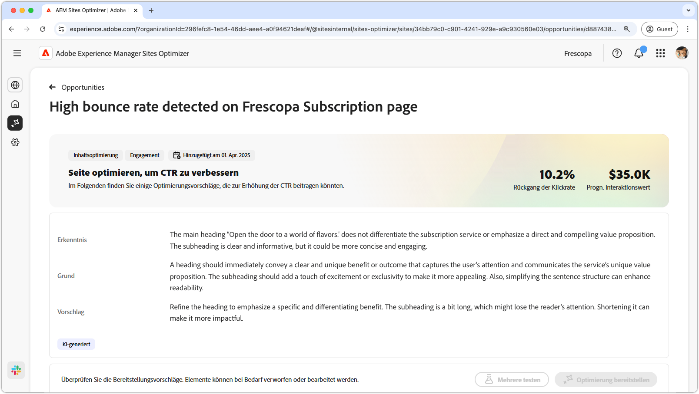
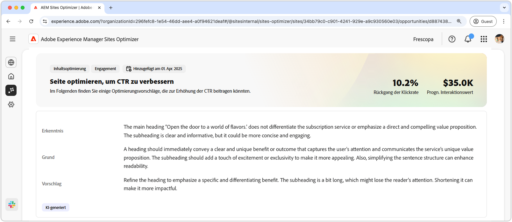
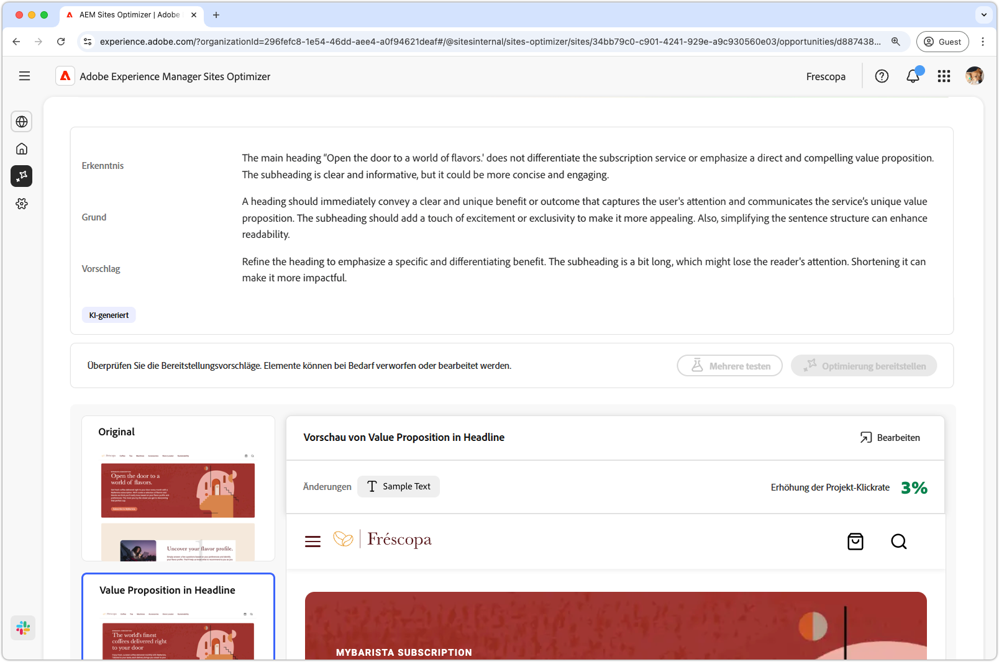
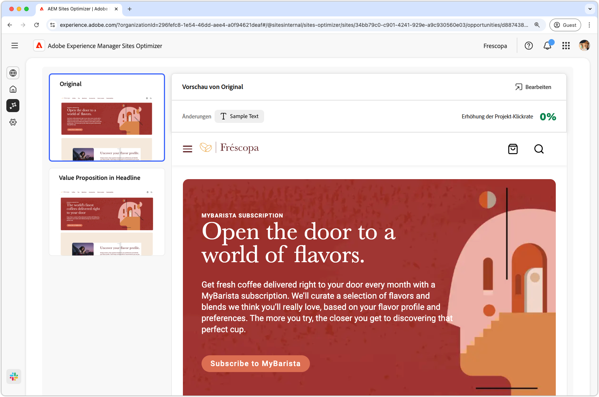
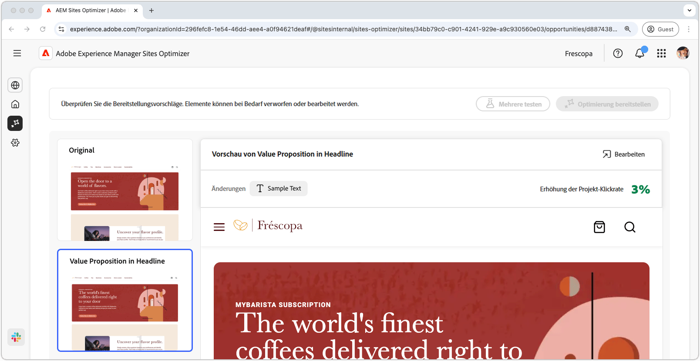

# Möglichkeit „Hohe Bounce-Rate“

{align="center"}

Die Möglichkeit „Hohe Bounce-Rate“ identifiziert Formulare mit einer hohen Bounce-Rate auf Ihrer Website. Mit dieser Möglichkeit können Sie nachvollziehen, welche Formulare nicht gut funktionieren. Sie bietet Vorschläge zur Verbesserung ihrer Interaktionsraten. Durch das Optimieren der Ansichten Ihrer Formulare können Sie die Anzahl der Formularübermittlungen erhöhen und die Gesamtleistung Ihrer Website verbessern.

## Automatische Identifizierung

{align="center"}

Jede Web-Seite mit einem Formular mit wenig Ansichten wird als eigene Möglichkeit **Hohe Bounce-Rate** aufgeführt. Eine kurze Zusammenfassung der Möglichkeit und eine KI-Begründung finden Sie oben auf der Seite der Möglichkeiten.

## Automatische Vorschläge

{align="center"}

Das automatische Vorschlagen bietet KI-generierte Varianten von Web-Seiten, mit denen die Zahl der Aufrufe Ihrer Formulare erhöht werden soll. Jede Variante zeigt die **prognostizierte Zunahme der Konversionsrate** basierend auf ihrem Potenzial zur Verbesserung der Formularinteraktion an, sodass Sie die effektivsten Vorschläge priorisieren können.

>[!BEGINTABS]

>[!TAB Kontrollvariante]

{align="center"}

Die Kontrollvariante ist das Originalformular, das derzeit auf Ihrer Website live ist. Diese Variante wird als Baseline verwendet, um die Leistung der vorgeschlagenen Varianten zu vergleichen.

>[!TAB Vorgeschlagene Varianten]

{align="center"}

Die vorgeschlagenen Varianten sind KI-generierte Varianten von Web-Seiten, mit denen die Bounce-Rate des Formulars verringert werden soll. Jede Variante zeigt die **prognostizierte Erhöhung der Klickrate** basierend auf ihrem Potenzial zur Verbesserung der Formularinteraktion an, sodass Sie die effektivsten Vorschläge priorisieren können.

Klicken Sie auf die einzelnen Varianten, um sie auf der rechten Seite des Bildschirms in der Vorschau anzuzeigen. Oben in der Vorschau stehen die folgenden Aktionen und Informationen zur Verfügung:

* **Änderungen**: Eine kurze Zusammenfassung der Änderungen in dieser Variante im Vergleich zur **Kontrollvariante**.
* **Prognostizierte Zunahme der Klickrate**: Die geschätzte Zunahme der Klickrate, wenn diese Variante implementiert wird.
* **Bearbeiten**: Klicken Sie hier, um die Variante im AEM-Authoring zu bearbeiten.

>[!ENDTABS]

## Automatische Optimierung

[!BADGE Ultimate]{type=Positive tooltip="Ultimate"}

{align="center"}

Sites Optimizer Ultimate ermöglicht es, eine automatische Optimierung für die von der Möglichkeit „Wenig Ansichten“ gefundenen Probleme bereitzustellen.

>[!BEGINTABS]

>[!TAB Mehrere testen]

>[!TAB Ausgewählte veröffentlichen]

{{auto-optimize-deploy-optimization-slack}}

>[!TAB Genehmigung anfordern]

{{auto-optimize-request-approval}}

>[!ENDTABS]
