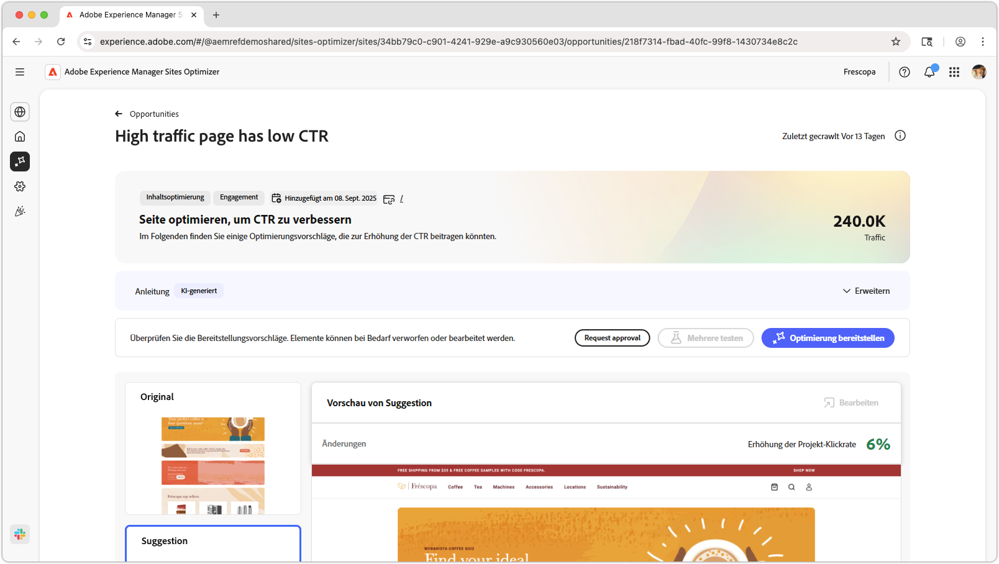
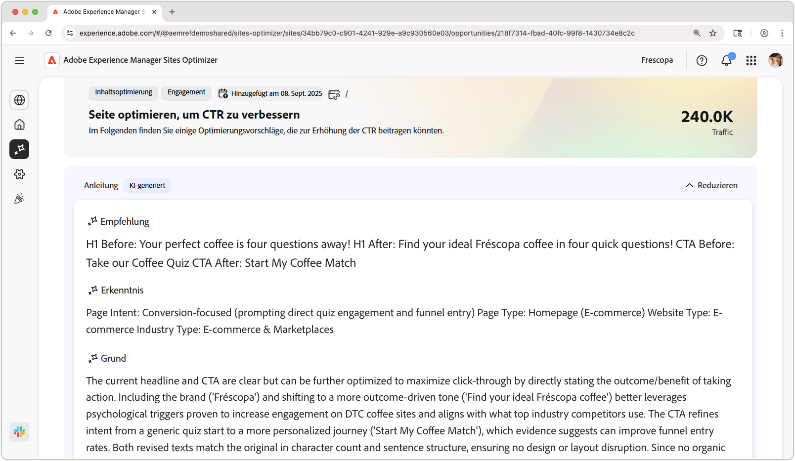
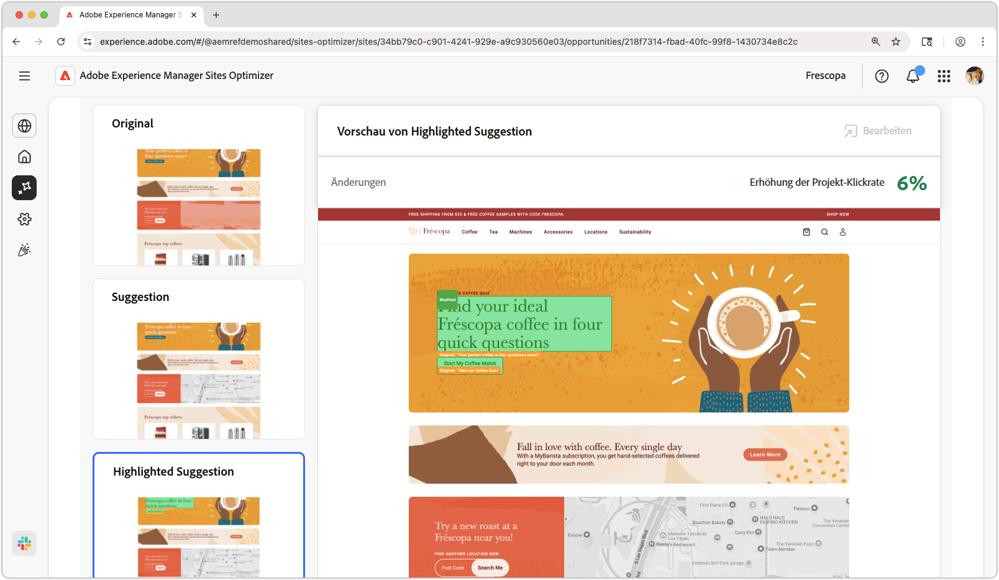
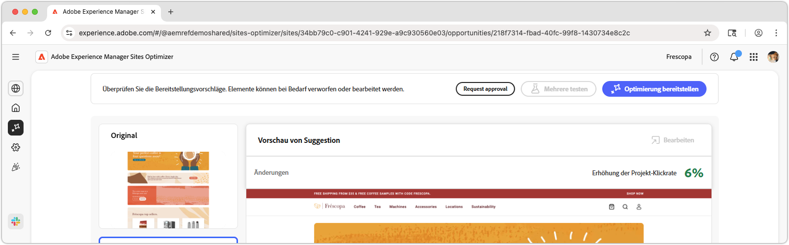

# Seiten mit hohem Traffic haben wenig CTR-Gelegenheiten

{align="center"}

Die Möglichkeit „Seite mit viel Traffic hat niedrige Klickrate“ identifiziert Seiten auf Ihrer Website, die sehr viel Traffic erhalten, aber eine niedrige Klickrate (CTR) aufweisen. Durch die Analyse solcher Seiten können Sie potenzielle Probleme aufdecken, die die Benutzerinteraktion beeinträchtigen, und Maßnahmen zur Verbesserung der Leistung ergreifen. Diese Möglichkeit ist für die Optimierung des Inhalts und Layouts Ihrer Website von entscheidender Bedeutung, was letztendlich zu höheren Conversion-Raten und besseren Anwendererlebnissen führt.

## Automatische Identifizierung

{align="center"}

Die **Seite mit hohem Traffic hat eine niedrige CTR** Gelegenheit, identifiziert Seiten mit hohem Traffic mit niedrigem CTR auf Ihrer Website und umfasst Folgendes:

* **Empfehlung** – Vorgeschlagene Maßnahmen zur Verbesserung der Klickrate der Seite.
* **Erkenntnis** – Erklärung, warum die Seite eine niedrige Klickrate aufweist.
* **Begründung** – Die Begründung hinter der Empfehlung.

## Automatische Vorschläge

{align="center"}

Automatische Vorschläge liefern einen von KI generierten Vorschlag dafür, wie ein optimiertes Web-Erlebnis aussehen könnte. Vorschläge umfassen eine **hervorgehobene** Ansicht, mit der Sie leicht erkennen können, welche Änderungen vorgeschlagen werden.

Sie können Vorschläge auswählen, um sie in der Vollansicht anzuzeigen, ihre projizierte Auswirkung auf die Klickrate zu prüfen und die Möglichkeit zu nutzen, sie zu bearbeiten, bevor sie auf die Seite angewendet werden.

## Automatische Optimierung

[!BADGE Ultimate]{type=Positive tooltip="Ultimate"}

{align="center"}

Sites Optimizer Ultimate ermöglicht es, eine automatische Optimierung für die vorgeschlagene Optimierung bereitzustellen.

>[!BEGINTABS]

>[!TAB Optimierung bereitstellen]

{{auto-optimize-deploy-optimization-slack}}

>[!TAB Genehmigung anfordern]

{{auto-optimize-request-approval}}

>[!ENDTABS]
