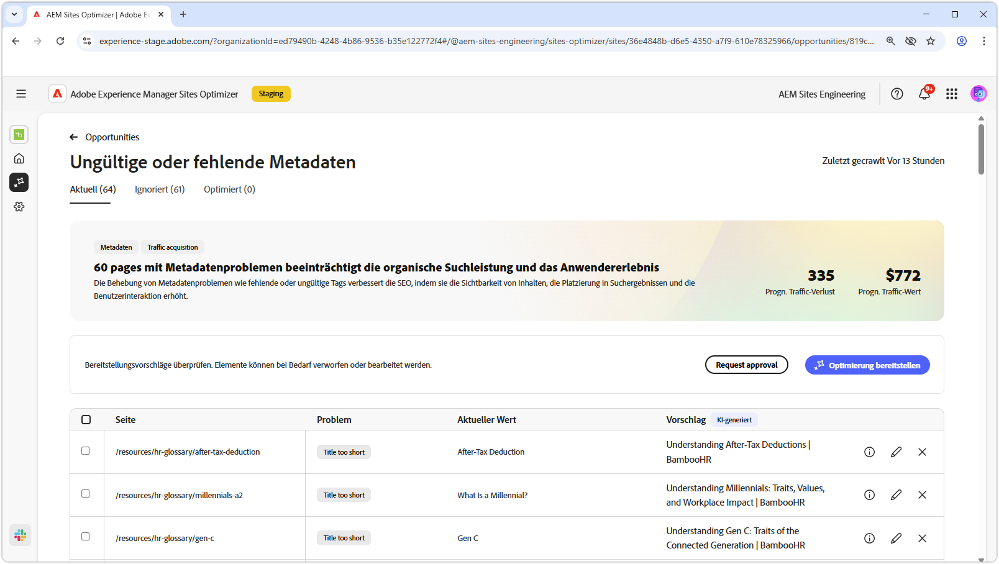
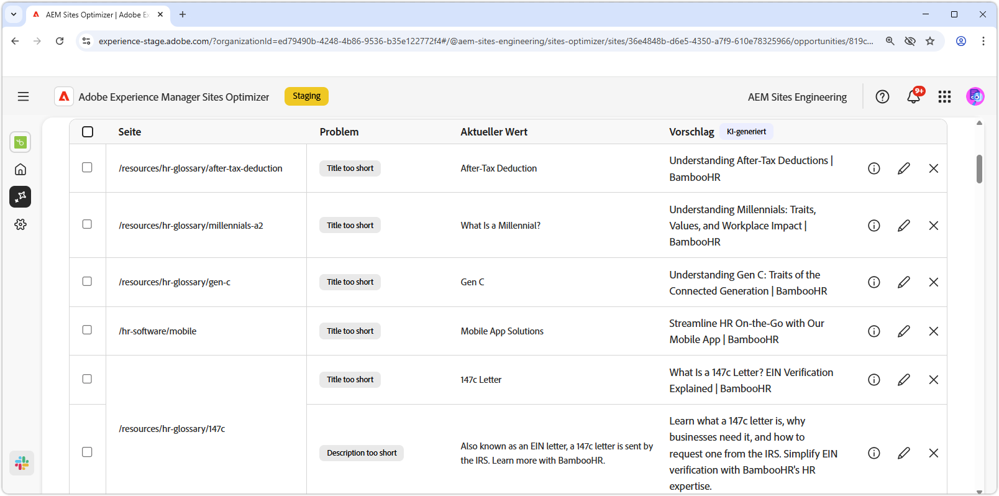
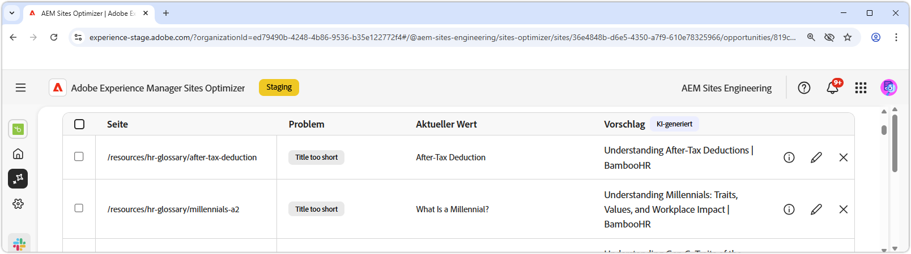
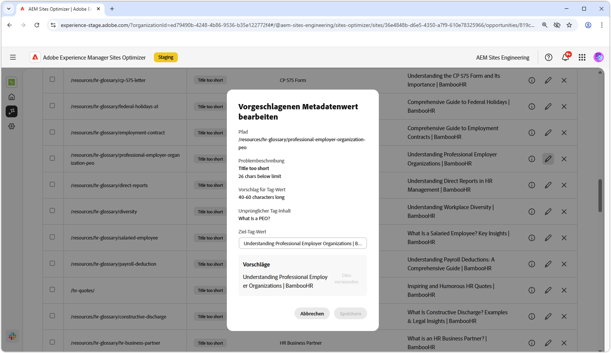
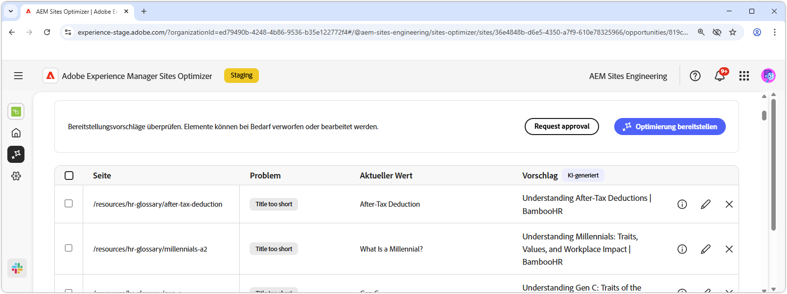

# Ungültige oder fehlende Metadaten-Opportunity

{align="center"}

Die Gelegenheit zu ungültigen oder fehlenden Metadaten identifiziert fehlende oder fehlerhafte Metadaten auf Ihren Web-Seiten. Das Beheben von Metadatenproblemen verbessert die SEO, indem die Sichtbarkeit von Inhalten, das Such-Ranking und die Benutzerinteraktion verbessert werden. Diese Probleme können durch Faktoren wie fehlende oder ungültige Tags, zu lange oder zu kurze Beschreibungen usw. verursacht werden.

Bei einer ungültigen oder fehlenden Metadaten-Opportunity wird oben auf der Seite eine Zusammenfassung angezeigt, die eine Zusammenfassung des Problems und dessen Auswirkungen auf Ihre Site und Ihr Unternehmen enthält.

* **Projizierter Traffic-**: Der geschätzte Traffic-Verlust aufgrund fehlerhafter Metadaten.
* **Projizierter Traffic-Wert** - Der geschätzte Wert des verlorenen Traffics.

## Automatisch identifizieren

{align="center"}

Die Opportunity „Ungültige oder fehlende Metadaten“ listet alle fehlerhaften Metadaten auf Ihren Seiten auf und umfasst Folgendes:

* **Seite** - Die Seite, die die ungültigen oder fehlenden Metadaten enthält.
* **Problem** - Gibt die Art des Problems an, das sich auf das Metadaten-Tag auswirkt. Diese reichen von fehlenden Titeln bis hin zu doppelten H1-Titeln usw.
* **Value** - Der aktuelle Metadaten-Tag-Wert, der geändert werden muss.
* **Vorschlag** - Ein von KI generierter Vorschlag für geeignete Tag-Aktualisierungen. Weitere Informationen finden Sie im folgenden Abschnitt.

## Automatisch vorschlagen

{align="center"}

Die Gelegenheit zu ungültigen oder fehlenden Metadaten bietet auch KI-generierte Vorschläge zum Ändern oder Aktualisieren der Metadaten-Tags. Diese Vorschläge basieren auf dem ursprünglichen -Tag, das die fehlerhaften Metadaten enthielt, und dem Inhalt der vorgeschlagenen Aktualisierung.

>[!BEGINTABS]

>[!TAB KI-Begründung]

Durch Auswahl **Symbols „Informationen** erhalten Sie eine KI-Begründung für die vorgeschlagene Aktualisierung.

>[!TAB  Bearbeiten des vorgeschlagenen Metadatenwerts]

{align="center"}

Wenn Sie mit dem KI-generierten Vorschlag nicht einverstanden sind, können Sie den vorgeschlagenen Metadatenwert bearbeiten, indem Sie auf das **Bearbeiten** klicken. Auf diese Weise können Sie den Wert, den Sie für die Metadaten für am besten geeignet halten, manuell eingeben. Das Bearbeitungsfenster enthält Folgendes:

* **Path** - Der Pfad zu der Seite, die die Metadaten enthält (oder nicht vorhanden ist).
* **Problembeschreibung** - Gibt die Art des Problems an, das sich auf das Metadaten-Tag auswirkt, sowie eine kurze Beschreibung.
* **Vorschlag für Tag-Wert** - Der von KI generierte Vorschlag zum Ändern oder Aktualisieren des Metadaten-Tags. Beispielsweise, wie viele Zeichen die Tag-Aktualisierung enthalten soll usw.
* **Ursprünglicher Tag-**: Der ursprüngliche Tag-Wert.
* **Target-Tag-**: Bearbeiten Sie dieses Feld und fügen Sie den gewünschten Tag-Wert manuell hinzu. Wenn Sie **Speichern** auswählen, ist dies der Wert, der auf die vorgeschlagene Aktualisierung angewendet wird.
* **Vorschlag** - Der von KI generierte Vorschlag zum Ändern des Werts.
* **Speichern** - Speichert und wendet den Wert im Feld **Target-Tag-**&quot; an.

>[!TAB Einträge ignorieren]

Sie können Einträge mit fehlerhaften oder ungültigen Zielmetadaten ignorieren. Wenn Sie auf das **Ignorieren** klicken, wird der Eintrag aus der Opportunity-Liste entfernt. Ignorierte Einträge können über die Registerkarte **Ignoriert** oben auf der Opportunity-Seite erneut aktiviert werden.

>[!ENDTABS]

## [!BADGE Ultimate automatisch optimieren]{type=Positive tooltip="Ultimate"}

{align="center"}

Sites Optimizer Ultimate bietet jetzt die Möglichkeit, eine automatische Optimierung für die Probleme bereitzustellen, die durch die ungültige oder fehlende Metadaten-Opportunity gefunden wurden. <!--- TBD-need more in-depth and opportunity specific information here. What does the auto-optimization do?-->

>[!BEGINTABS]

>[!TAB Optimierung bereitstellen]

{{auto-optimize-deploy-optimization-slack}}

>[!TAB Bestätigung anfordern]

{{auto-optimize-request-approval}}

>[!ENDTABS]
