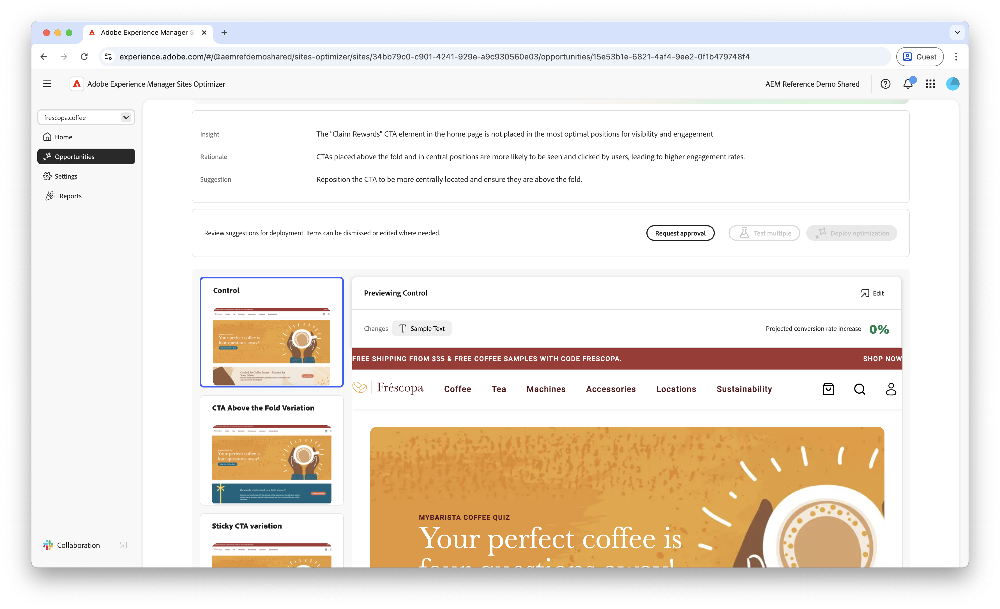

# Forms Low Navigation-Opportunity

 Die Funktion &quot;Forms Optimizer“ ist im Rahmen des EARLY ACCESS-Programms verfügbar. Sie können von Ihrer offiziellen E-Mail-ID aus an aem-forms-ea@adobe.com schreiben, um dem Early-Access-Programm beizutreten und Zugriff auf die Funktion zu beantragen. 

{align="center"}

Durch die Möglichkeit der geringen Navigation werden Formulare auf Ihrer Website identifiziert, die niedrige Navigationsraten aufweisen. Dieser Opportunity-Typ hilft Ihnen zu verstehen, welche Formulare von Benutzenden nicht erkannt oder aufgerufen werden, und liefert Vorschläge, wie die Auffindbarkeit dieser Formulare verbessert werden kann.

## Automatische Identifizierung

{align="center"}

Jede Web-Seite mit Formularen mit niedriger Navigation wird als eigene **Niedrige Navigation** aufgeführt. Eine kurze Zusammenfassung der Opportunity und der Logik finden Sie oben auf der Opportunity-Seite.

## Automatische Vorschläge

Auto-Suggest bietet von KI generierte Formularvarianten, die die Navigation zu Ihren Formularen verbessern sollen. Jede Variante zeigt die **projizierte Konversionsratenerhöhung** basierend auf ihrem Potenzial zur Verbesserung der Erkennung und Barrierefreiheit von Formularen an, sodass Sie die effektivsten Vorschläge priorisieren können.

>[!BEGINTABS]

>[!TAB Kontrollvariante]

{align="center"}

Die Kontrollvariante sind die Originalformulare, die derzeit auf Ihrer Website verfügbar sind. Diese Variante wird als Baseline verwendet, um die Leistung der vorgeschlagenen Varianten zu vergleichen.

>[!TAB Vorgeschlagene Varianten]

{align="center"}

Bei den vorgeschlagenen Varianten handelt es sich um KI-generierte Formularvarianten, mit denen die Navigation zu Ihren Formularen verbessert werden soll. Jede Variante zeigt die **projizierte Konversionsratenerhöhung** basierend auf ihrem Potenzial zur Verbesserung der Erkennung und Barrierefreiheit von Formularen an, sodass Sie die effektivsten Vorschläge priorisieren können.

Klicken Sie auf die einzelnen Varianten, um sie auf der rechten Seite des Bildschirms in der Vorschau anzuzeigen. Oben in der Vorschau stehen die folgenden Aktionen und Informationen zur Verfügung:

* **Änderungen**: Eine kurze Zusammenfassung der Änderungen in dieser Variante im Vergleich zur **Kontrollvariante**.
* **Projizierte Erhöhung der Konversionsrate** - Die geschätzte Zunahme der Interaktion mit Formularen, wenn diese Variante implementiert ist.
* **Bearbeiten**: Klicken Sie hier, um die Variante im AEM-Authoring zu bearbeiten.

>[!ENDTABS]

<!-- 

## Auto-optimize

[!BADGE Ultimate]{type=Positive tooltip="Ultimate"}

{align="center"}

Sites Optimizer Ultimate adds the ability to deploy auto-optimization for the issues found by the low navigation opportunity.

>[!BEGINTABS]

>[!TAB Test multiple]

>[!TAB Publish selected]

{{auto-optimize-deploy-optimization-slack}}

>[!TAB Request approval]

{{auto-optimize-request-approval}}

>[!ENDTABS]

-->
