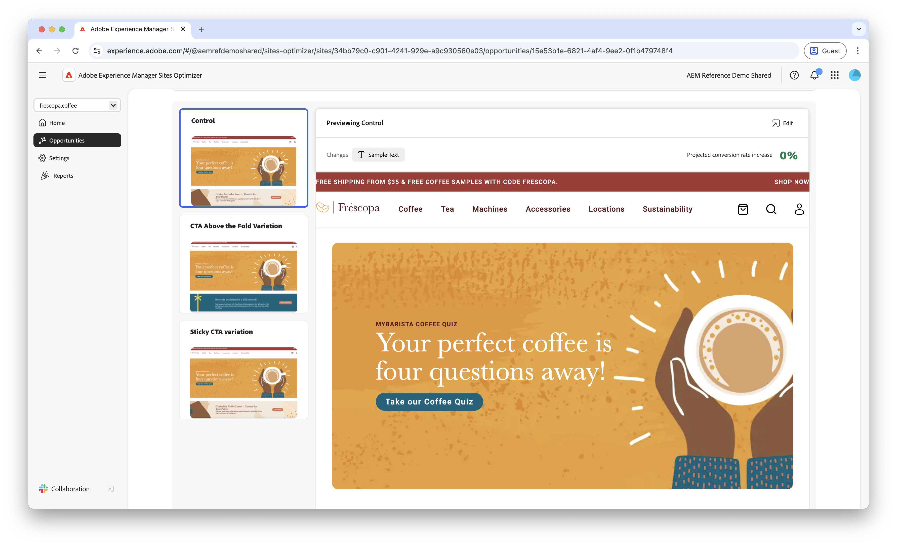

# Möglichkeit „Wenig Formularnavigation“

 Die Funktion „Formularoptimierung“ ist im Rahmen des Early-Adopter-Programms verfügbar. Sie können von Ihrer offiziellen E-Mail-ID aus an aem-forms-ea@adobe.com schreiben, um dem Early-Access-Programm beizutreten und den Zugriff auf diese Funktion anzufordern. 

{align="center"}

Die Möglichkeit „Wenig Navigation“ identifiziert Formulare mit niedrigen Navigationsraten auf Ihrer Website. Mit dieser Möglichkeitsart können Sie nachvollziehen, welche Formulare Benutzende nicht finden oder auf welche sie nicht zugreifen. Sie bietet Vorschläge zur Verbesserung der Auffindbarkeit dieser Formulare.

## Automatische Identifizierung

{align="center"}

Jede Web-Seite mit einem Formular mit wenig Navigation wird als eigene Möglichkeit der Art **Wenig Navigation** aufgeführt. Eine kurze Zusammenfassung der Möglichkeit und eine Begründung finden Sie oben auf der Seite der Möglichkeiten.

## Automatische Vorschläge

Automatische Vorschläge liefern KI-generierte Formularvarianten, mit denen die Navigationsrate Ihrer Formulare erhöht werden soll. Jede Variante zeigt die **prognostizierte Zunahme der Konversionsrate** basierend auf ihrem Potenzial zur Verbesserung der Auffindbarkeit und Barrierefreiheit von Formularen an, sodass Sie die effektivsten Vorschläge priorisieren können.

>[!BEGINTABS]

>[!TAB Kontrollvariante]

{align="center"}

Die Kontrollvariante ist das Originalformular, das derzeit auf Ihrer Website live ist. Diese Variante wird als Baseline verwendet, um die Leistung der vorgeschlagenen Varianten zu vergleichen.

>[!TAB Vorgeschlagene Varianten]

{align="center"}

Die vorgeschlagenen Varianten sind KI-generierte Formularvarianten, mit denen die Navigationsrate Ihrer Formulare erhöht werden soll. Jede Variante zeigt die **prognostizierte Zunahme der Konversionsrate** basierend auf ihrem Potenzial zur Verbesserung der Auffindbarkeit und Barrierefreiheit von Formularen an, sodass Sie die effektivsten Vorschläge priorisieren können.

Klicken Sie auf die einzelnen Varianten, um sie auf der rechten Seite des Bildschirms in der Vorschau anzuzeigen. Oben in der Vorschau stehen die folgenden Aktionen und Informationen zur Verfügung:

* **Änderungen**: Eine kurze Zusammenfassung der Änderungen in dieser Variante im Vergleich zur **Kontrollvariante**.
* **Prognostizierte Zunahme der Konversionsrate**: Die geschätzte Zunahme der Formularinteraktion, wenn diese Variante implementiert wird.
* **Bearbeiten**: Klicken Sie hier, um die Variante im AEM-Authoring zu bearbeiten.

>[!ENDTABS]

<!-- 

## Auto-optimize

[!BADGE Ultimate]{type=Positive tooltip="Ultimate"}

{align="center"}

Sites Optimizer Ultimate adds the ability to deploy auto-optimization for the issues found by the low navigation opportunity.

>[!BEGINTABS]

>[!TAB Test multiple]

>[!TAB Publish selected]

{{auto-optimize-deploy-optimization-slack}}

>[!TAB Request approval]

{{auto-optimize-request-approval}}

>[!ENDTABS]

-->
