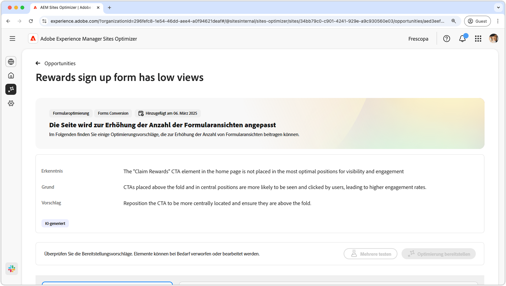
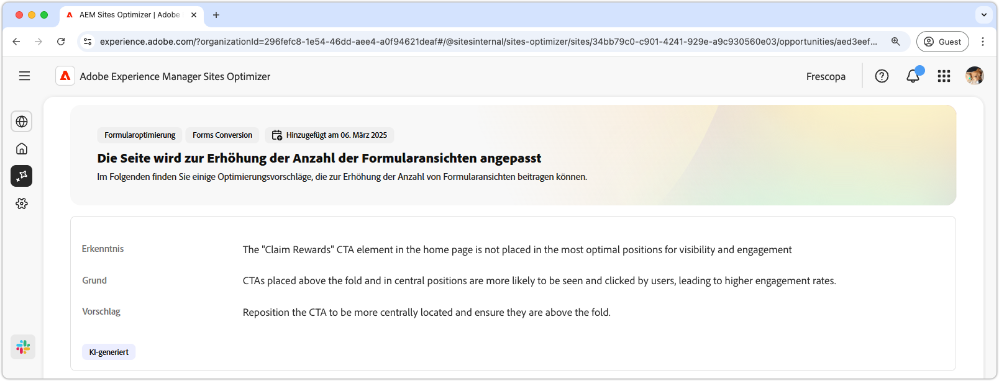
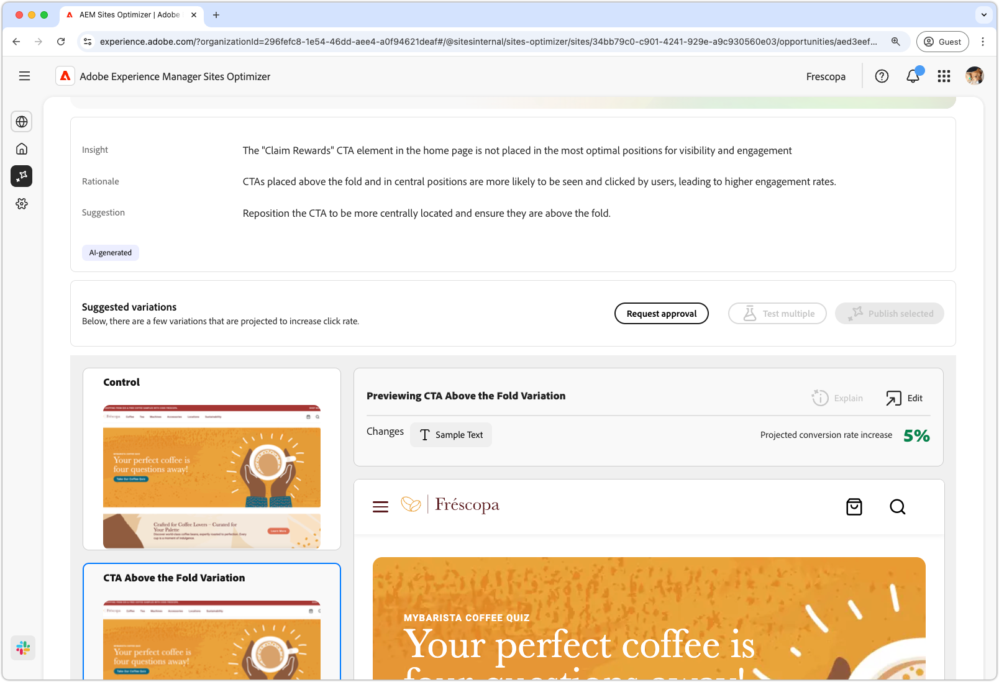

# Niedrige Opportunity-Ansichten

{align="center"}

Die Opportunity für niedrige Ansichten identifiziert Formulare auf Ihrer Website, die niedrige Ansichtsraten haben. Diese Gelegenheit hilft Ihnen zu verstehen, welche Formulare nicht gut funktionieren, und bietet Vorschläge, wie Sie ihre Interaktionsraten verbessern können. Durch die Optimierung der Ansichten Ihrer Formulare können Sie die Anzahl der Formularübermittlungen erhöhen und die Gesamtleistung Ihrer Website verbessern.

## Automatisch identifizieren

{align="center"}

Jede Web-Seite mit einem Formular mit niedrigen Ansichten wird als eigene **niedrige Ansichten** aufgeführt. Eine kurze Zusammenfassung der Opportunity und eine KI-Begründung finden Sie oben auf der Opportunity-Seite.

## Automatisch vorschlagen

{align="center"}

Auto-Suggest bietet von KI generierte Web-Seiten-Varianten, die die Ansicht Ihrer Formulare verbessern sollen. Jede Variante zeigt die **Erhöhung der Projektkonversionsrate** basierend auf ihrem Potenzial zur Verbesserung der Formularinteraktion an, sodass Sie die effektivsten Vorschläge priorisieren können.

>[!BEGINTABS]

>[!TAB Kontrollvariante]

{align="center"}

Die Kontrollvariante ist das Originalformular, das derzeit auf Ihrer Website live ist. Diese Variante wird als Grundlage verwendet, um die Leistung der vorgeschlagenen Varianten zu vergleichen.

>[!TAB Vorgeschlagene Varianten]

{align="center"}

Bei den vorgeschlagenen Varianten handelt es sich um von KI generierte Web-Seitenvarianten, mit denen die Ansichten Ihrer Formulare erhöht werden sollen. Jede Variante zeigt die **projizierte Erhöhung der Konversionsrate** basierend auf ihrem Potenzial zur Verbesserung der Formularinteraktion an, sodass Sie die effektivsten Vorschläge priorisieren können.

Klicken Sie auf die einzelnen Varianten, um sie auf der rechten Seite des Bildschirms in der Vorschau anzuzeigen. Oben in der Vorschau stehen die folgenden Aktionen und Informationen zur Verfügung:

* **Änderungen** - Eine kurze Zusammenfassung der Änderungen in dieser Variante der **Kontrolle**.
* **Projizierte Erhöhung der Konversionsrate** - Die geschätzte Zunahme der Formularinteraktion, wenn diese Variante implementiert ist.
* **Bearbeiten** - Klicken Sie, um die Variante beim AEM-Authoring zu bearbeiten.

>[!ENDTABS]

## Automatische Optimierung

[!BADGE Ultimate]{type=Positive tooltip="Ultimate"}

{align="center"}

Sites Optimizer Ultimate bietet zusätzlich die Möglichkeit, eine automatische Optimierung für die Probleme bereitzustellen, die durch die niedrige Ansichtsmöglichkeit verursacht werden.

>[!BEGINTABS]

>[!TAB Mehrere testen]

>[!TAB Veröffentlichen ausgewählt]

{{auto-optimize-deploy-optimization-slack}}

>[!TAB Bestätigung anfordern]

{{auto-optimize-request-approval}}

>[!ENDTABS]
