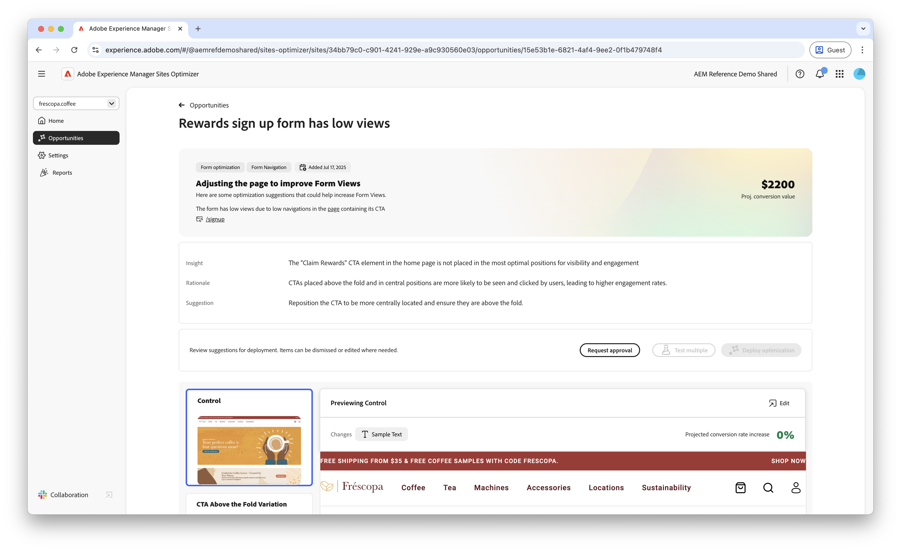

# Opportunity für niedrige Ansichten in Forms

 Die Funktion &quot;Forms Optimizer“ ist im Rahmen des EARLY ACCESS-Programms verfügbar. Sie können von Ihrer offiziellen E-Mail-ID aus an aem-forms-ea@adobe.com schreiben, um dem Early-Access-Programm beizutreten und Zugriff auf die Funktion zu beantragen. 

{align="center"}

Die Möglichkeit „Wenig Ansichten“ identifiziert Formulare mit niedrigen Ansichtsraten auf Ihrer Website. Dieser Opportunity-Typ hilft Ihnen zu verstehen, welche Formulare nicht gut funktionieren, und bietet Vorschläge zur Verbesserung ihrer Interaktionsraten.

## Automatische Identifizierung

{align="center"}

Jede Web-Seite mit Formularen mit niedrigen Ansichten wird als eigene **niedrige Ansichten** aufgeführt. Eine kurze Zusammenfassung der Opportunity und der Logik finden Sie oben auf der Opportunity-Seite.

## Automatische Vorschläge

{align="center"}

Auto-Suggest bietet von KI generierte Formularvarianten, mit denen die Ansichten Ihrer Formulare erhöht werden. Jede Variante zeigt die **projizierte Erhöhung der Konversionsrate** basierend auf ihrem Potenzial zur Verbesserung der Formularinteraktion an, sodass Sie die effektivsten Vorschläge priorisieren können.

>[!BEGINTABS]

>[!TAB Kontrollvariante]

{align="center"}

Die Kontrollvariante sind die Originalformulare, die derzeit auf Ihrer Website verfügbar sind. Diese Variante wird als Baseline verwendet, um die Leistung der vorgeschlagenen Varianten zu vergleichen.

>[!TAB Vorgeschlagene Varianten]

{align="center"}

Bei den vorgeschlagenen Varianten handelt es sich um KI-generierte Formularvarianten, mit denen die Ansichten Ihrer Formulare erhöht werden sollen. Jede Variante zeigt die **projizierte Erhöhung der Konversionsrate** basierend auf ihrem Potenzial zur Verbesserung der Formularinteraktion an, sodass Sie die effektivsten Vorschläge priorisieren können.

Klicken Sie auf die einzelnen Varianten, um sie auf der rechten Seite des Bildschirms in der Vorschau anzuzeigen. Oben in der Vorschau stehen die folgenden Aktionen und Informationen zur Verfügung:

* **Änderungen**: Eine kurze Zusammenfassung der Änderungen in dieser Variante im Vergleich zur **Kontrollvariante**.
* **Projizierte Erhöhung der Konversionsrate** - Die geschätzte Zunahme der Interaktion mit Formularen, wenn diese Variante implementiert ist.
* **Bearbeiten**: Klicken Sie hier, um die Variante im AEM-Authoring zu bearbeiten.

>[!ENDTABS]

<!-- 

## Auto-optimize

[!BADGE Ultimate]{type=Positive tooltip="Ultimate"}

{align="center"}

Sites Optimizer Ultimate adds the ability to deploy auto-optimization for the issues found by the low views opportunity.

>[!BEGINTABS]

>[!TAB Test multiple]

>[!TAB Publish selected]

{{auto-optimize-deploy-optimization-slack}}

>[!TAB Request approval]

{{auto-optimize-request-approval}}

>[!ENDTABS]

-->

