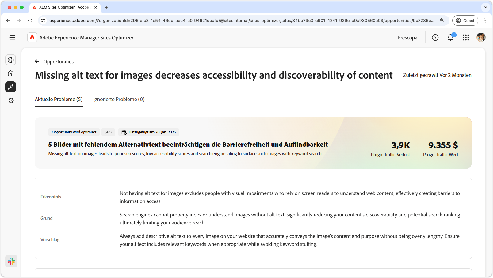
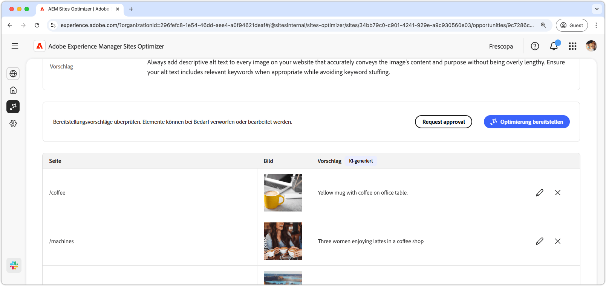
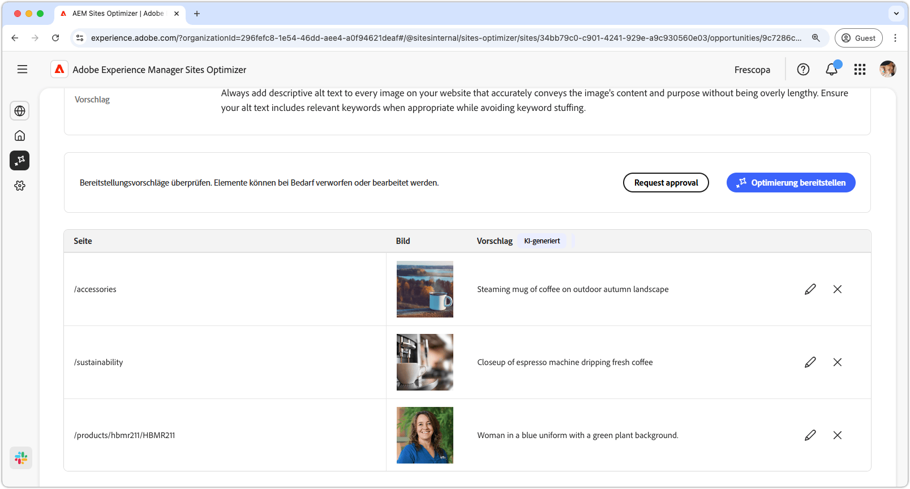
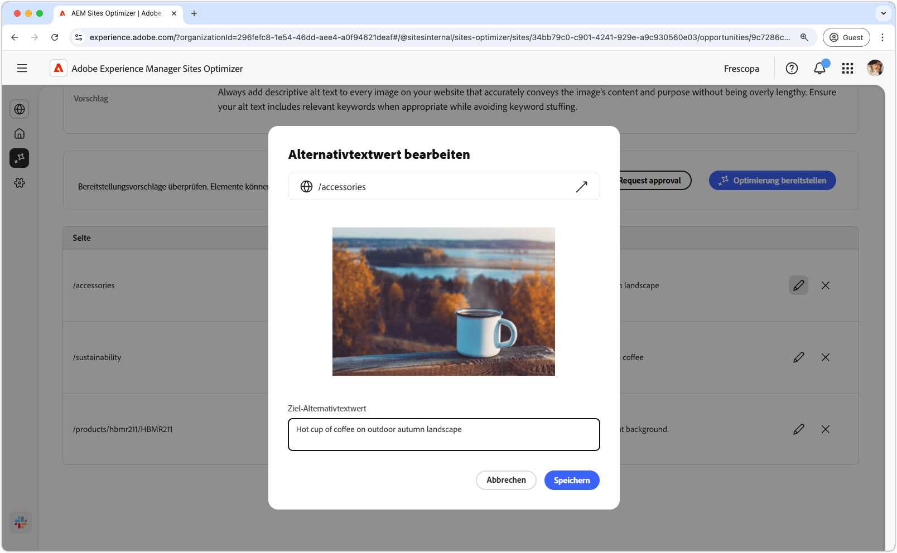
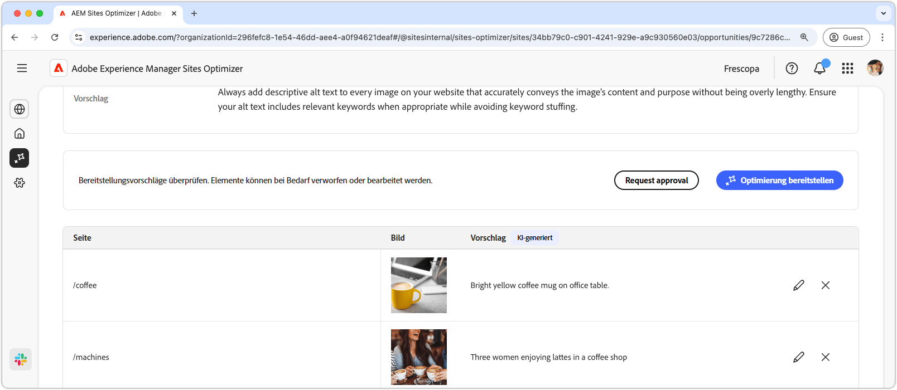

# Möglichkeit „Fehlender Alternativtext“

{align="center"}

Die Möglichkeit „Fehlender Alternativtext“ identifiziert Bilder ohne beschreibenden Alternativtext auf Ihrer Website. Suchmaschinen können Bilder ohne Alternativtext nicht richtig indizieren oder verstehen, was die Auffindbarkeit Ihrer Inhalte und die potenzielle Platzierung in Suchergebnissen erheblich reduziert und letztendlich das Erreichen Ihrer Zielgruppe einschränkt. Darüber hinaus werden Personen mit Sehbehinderungen, die sich auf Bildschirmlesehilfen verlassen, um Web-Inhalte zu verstehen, durch fehlenden Alternativtext bei Bildern ausgeschlossen, wodurch effektiv Barrieren für den Zugriff auf Informationen geschaffen werden.

Die Möglichkeit „Fehlender Alternativtext“ zeigt oben auf der Seite eine Übersicht an, die eine Zusammenfassung des Problems und dessen Auswirkungen auf Ihre Site und Ihr Geschäft enthält.

* **Prognostizierter Traffic-Verlust**: Der geschätzte Traffic-Verlust aufgrund von fehlendem Alternativtext.
* **Prognostizierter Traffic-Wert**: Der geschätzte Wert des verlorenen Traffics.

Es gibt außerdem ein zusätzliches Feld, das die Gründe, Erkenntnisse und Vorschläge im Zusammenhang mit der Möglichkeit anzeigt.

## Automatische Identifizierung

{align="center"}

Die Möglichkeit „Fehlender Alternativtext“ führt alle Bilder auf Ihrer Website auf, bei denen der Alternativtext fehlt. Dieser Abschnitt enthält die folgenden Kategorien:

* **Seite**: Der Pfad zu der Seite mit dem fehlenden Alternativtext.
* **Bild**: Das Bild, bei dem der beschreibende Alternativtext fehlt.
* **Vorschlag**: Ein KI-generierter Vorschlag für den Alternativtext. 

## Automatische Vorschläge

{align="center"}

Das automatische Vorschlagen bietet KI-generierte Vorschläge für den Alternativtext von Bildern. Die KI-generierten Vorschläge sollen Ihnen dabei helfen, schnell Alternativtext zu Bildern hinzuzufügen, ohne jedes Bild manuell analysieren zu müssen.

>[!BEGINTABS]

>[!TAB Fehlenden Alternativtext bearbeiten]

{align="center"}

Wenn Sie mit dem KI-generierten Vorschlag nicht einverstanden sind, können Sie den vorgeschlagenen Alternativtext bearbeiten, indem Sie das **Symbol „Bearbeiten“** auswählen. Auf diese Weise können Sie manuell den Text eingeben, der Ihrer Meinung nach am besten für das Bild geeignet ist. Das Bearbeitungsfenster enthält Folgendes:

* **Seitenpfad**: Ein schreibgeschütztes Feld, das den Pfad zu der Seite anzeigt, auf der das Problem mit dem fehlenden Alternativtext auftritt. Klicken Sie auf den Pfeil neben dem Pfad, um die entsprechende Seite zu öffnen.
* **Bild**: Eine schreibgeschützte Vorschau des Bildes, für das ein Alternativtext erforderlich ist.
* **Ziel-Alternativtext**: Ein bearbeitbares Feld, in dem Sie manuell einen beschreibenden Alternativtext für das Bild eingeben können. Stellen Sie sicher, dass der Alternativtext den Inhalt und den Zweck des Bildes klar und deutlich vermittelt. Schließen Sie ggf. auf natürliche Weise Keywords ein, ohne sie jedoch im Übermaß zu verwenden.

>[!TAB Einträge ignorieren]

Sie können Einträge aus der Liste der Möglichkeiten ignorieren. Durch das Auswählen des **Symbols „Ignorieren“** wird der Eintrag aus der Liste entfernt. Ignorierte Einträge können über die Registerkarte **Ignoriert** oben auf der Seite der Möglichkeiten erneut aktiviert werden.

>[!ENDTABS]

## Automatische Optimierung

[!BADGE Ultimate]{type=Positive tooltip="Ultimate"}

{align="center"}

Sites Optimizer Ultimate ermöglicht es, eine automatische Optimierung für die von der Möglichkeit „Fehlender Alternativtext“ gefundenen Probleme bereitzustellen.<!--- TBD-need more in-depth and opportunity specific information here. What does the auto-optimization do?-->

>[!BEGINTABS]

>[!TAB Optimierung bereitstellen]

{{auto-optimize-deploy-optimization-slack}}

>[!TAB Genehmigung anfordern]

{{auto-optimize-request-approval}}

>[!ENDTABS]
