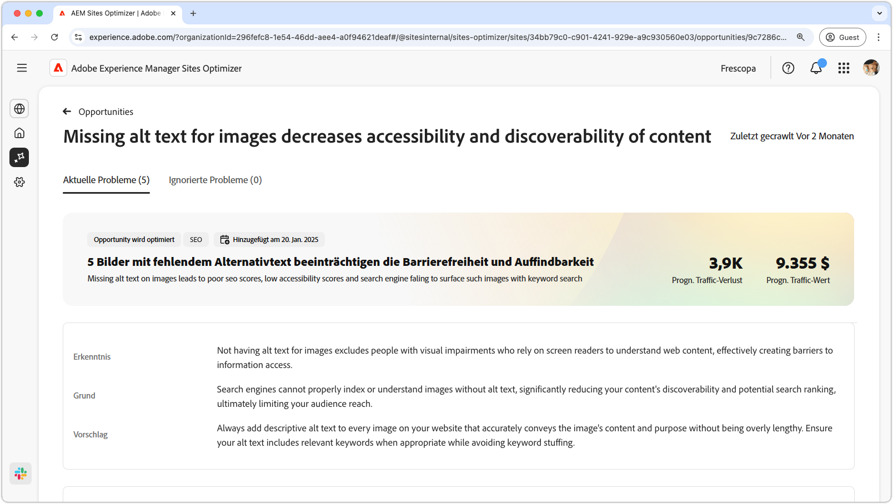
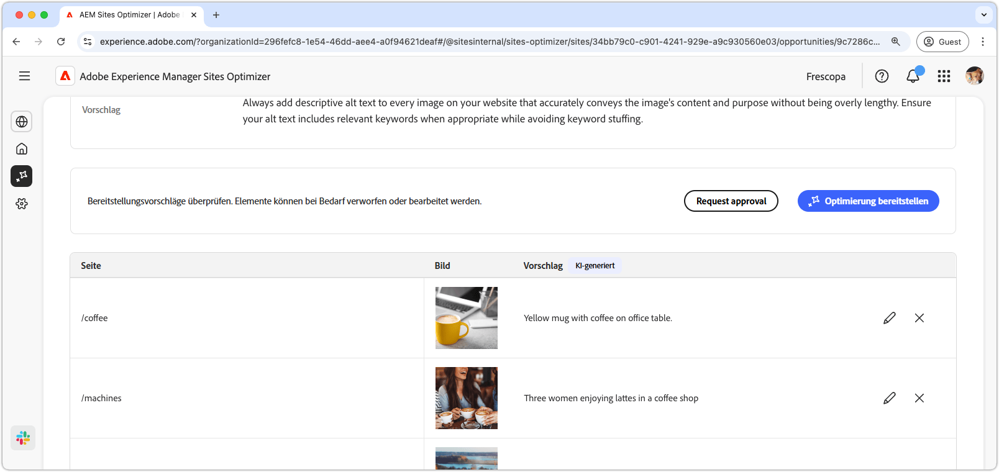
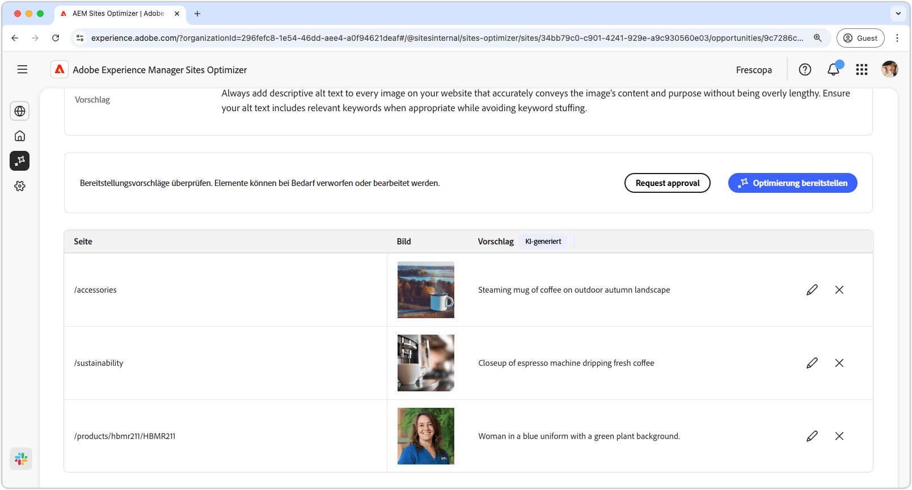
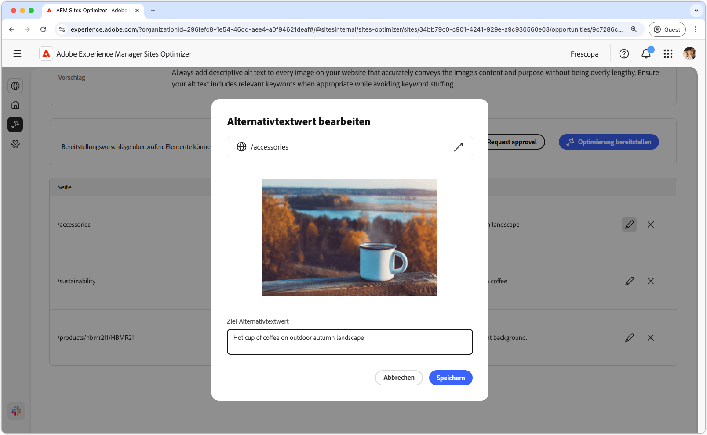

# Möglichkeit „Fehlender Alternativtext“

<!--{align="center"}-->

>[!VIDEO](https://video.tv.adobe.com/v/3483273/?captions=ger&learn=on&enablevpops)

Die Möglichkeit für fehlenden Alternativtext identifiziert Bilder auf Ihrer Website, die keinen beschreibenden Alternativtext haben. Ohne Alternativtext können Benutzende, die auf Bildschirmlesehilfen angewiesen sind, visuelle Inhalte nicht interpretieren. Dies bedeutet Hindernisse bei der Barrierefreiheit. Darüber hinaus wird die Art und Weise eingeschränkt, wie Suchmaschinen Bilder verstehen und indizieren, was die Auffindbarkeit von Inhalten und die Suchleistung verringert. AEM Sites Optimizer erkennt Probleme mit fehlendem Alternativtext, bietet spezifische KI-Empfehlungen und ermöglicht die Bereitstellung einer Korrektur mit einem Klick, und das alles in einer zentralen Ansicht.

## Automatische Identifizierung

<!--{align="center"}-->

AEM Sites Optimizer scannt Ihre Website mithilfe eines mehrstufigen Audits, bei dem Website-Crawling, Daten aus realem Benutzer-Traffic und KI-Analysen kombiniert werden, um Bilder zu identifizieren, für die Alternativtext erforderlich ist, aber nicht definiert wurde. Außerdem werden Bilder auf der Seite ausgewertet, um zu ermitteln, ob Alternativtext erforderlich ist. Ausgenommen sind dekorative oder nicht-informative Bilder gemäß den Web Content Accessibility Guidelines (WCAG). Bilder werden anhand ihrer Rolle und Relevanz innerhalb der Seite analysiert, wobei Korrekturen mit den höchsten Prioritäten für Barrierefreiheit und SEO-Optimierung ausgewählt werden.

Diese Möglichkeit stellt eine Liste der identifizierten Probleme bereit, zum Beispiel:

* **Seite**: Der Pfad zu der Seite mit dem fehlenden Alternativtext.
* **Bild**: Das Bild, bei dem der beschreibende Alternativtext fehlt.

## Automatische Vorschläge

<!--{align="center"}-->

Für jedes identifizierte Problem schlägt AEM Sites Optimizer einen beschreibenden Alternativtext für das Bild vor. Mit AI Vision Models wird das Bild analysiert und eine Beschreibung generiert, die seinen Inhalt und seine Rolle innerhalb der Seite widerspiegelt. Die Empfehlungen sind kurz gefasst, relevant und auf die Best Practices zur Barrierefreiheit abgestimmt. Jeder Vorschlag kann vor seiner Anwendung geprüft und bearbeitet werden.

>[!BEGINTABS]

>[!TAB Fehlenden Alternativtext bearbeiten]

<!--{align="center"}-->

Wenn Sie mit dem KI-generierten Vorschlag nicht einverstanden sind, können Sie den vorgeschlagenen Alternativtext bearbeiten, indem Sie das **Symbol „Bearbeiten“** auswählen. Auf diese Weise können Sie manuell den Text eingeben, der Ihrer Meinung nach am besten für das Bild geeignet ist. Das Bearbeitungsfenster enthält Folgendes:

* **Seitenpfad**: Ein schreibgeschütztes Feld, das den Pfad zu der Seite anzeigt, auf der das Problem mit dem fehlenden Alternativtext auftritt. Klicken Sie auf den Pfeil neben dem Pfad, um die entsprechende Seite zu öffnen.
* **Bild**: Eine schreibgeschützte Vorschau des Bildes, für das ein Alternativtext erforderlich ist.
* **Ziel-Alternativtext**: Ein bearbeitbares Feld, in dem Sie manuell einen beschreibenden Alternativtext für das Bild eingeben können. Stellen Sie sicher, dass der Alternativtext den Inhalt und den Zweck des Bildes klar und deutlich vermittelt. Schließen Sie ggf. auf natürliche Weise Keywords ein, ohne sie jedoch im Übermaß zu verwenden.

>[!TAB Einträge ignorieren]

Sie können Einträge aus der Liste der Möglichkeiten ignorieren. Durch Auswählen von  wird der Eintrag aus der Liste entfernt. Ignorierte Einträge können über die Registerkarte **Ignoriert** oben auf der Seite der Möglichkeiten erneut aktiviert werden.

>[!ENDTABS]

## Automatische Optimierung

<!--[!BADGE Ultimate]{type=Positive tooltip="Ultimate"}-->

Sobald die Vorschläge geprüft und genehmigt wurden, können Sie auf **Optimierung bereitstellen** klicken. AEM Sites Optimizer wendet die Korrekturen dann in der Autorenumgebung an, je nachdem, wie Alternativtext in Ihrer Implementierung verwaltet wird. AEM-Autorinnen und -Autoren können dann die Änderungen über das Content Management System (CMS) veröffentlichen.

Je nach Konfiguration können Aktualisierungen direkt auf Seiteninhalte, Asset-Metadaten oder unterstützende Inhaltsmodelle angewendet werden. Der Optimierungsprozess umfasst die folgenden Schritte:

* **Validierung** – Stellt sicher, dass Aktualisierungen sicher angewendet werden, ohne die vorhandene Funktionalität zu beeinträchtigen.
* **Bereitstellung** – Wendet die Aktualisierungen über vorhandene Prozesse an, z. B. Inhaltsaktualisierungen in AEM oder die Integration mit Inhalts-APIs.
* **Berechtigungsprüfung** – Prüft, ob Benutzende über die entsprechenden Berechtigungen zum Anwenden von Änderungen verfügen. Ist dies nicht der Fall, können alternative Ausgaben wie herunterladbare Updates für die Übergabe verwendet werden.

Sofern unterstützt, werden Aktualisierungen versioniert, damit Sichtbarkeit und Rollback-Fähigkeit bereitgestellt werden. Dadurch wird sichergestellt, dass Aktualisierungen von Alternativtexten korrekt angewendet werden, mit bestehenden Implementierungen abgestimmt sind und mit Governance- und Barrierefreiheitsstandards konsistent sind.

Basierend auf Ihrem Setup wendet AEM Sites Optimizer Aktualisierungen des Alternativtexts automatisch wie folgt an:

>[!BEGINTABS]

>[!TAB Edge Delivery Services]

Aktualisiert das Quelldokument (z. B. Google Docs oder SharePoint)

>[!TAB AEM as a Cloud Service]

Schreibt Aktualisierungen direkt über die Content-API mit Versionierungs- und Fallback-Unterstützung.

>[!TAB Digital Asset Management (optional)]

Aktualisiert Alternativtext bei Bedarf auf Asset-Ebene.

>[!ENDTABS]
