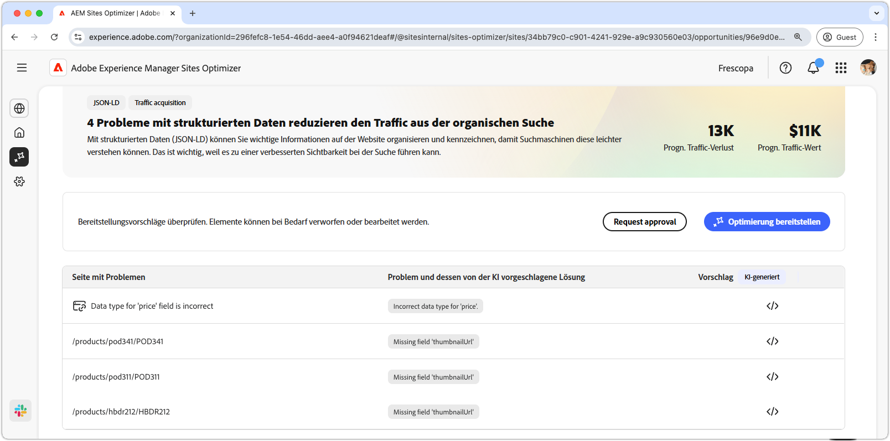
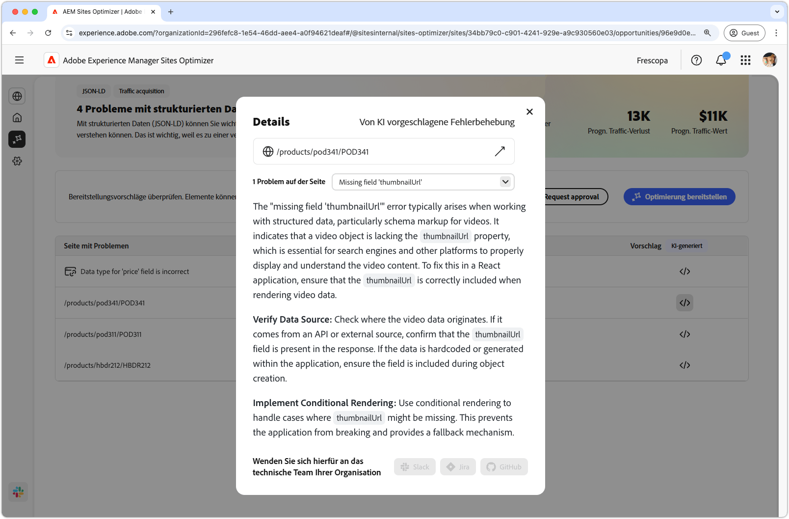
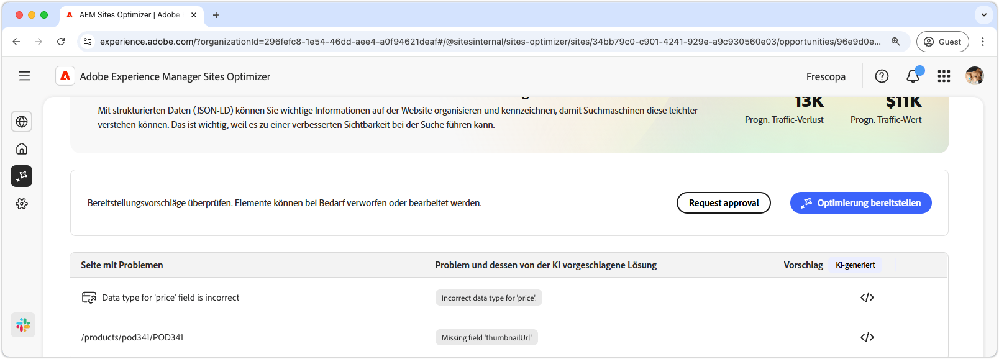

# Möglichkeit „Fehlende oder ungültige strukturierte Daten“

{align="center"}

Die Möglichkeit „Fehlende oder ungültige strukturierte Daten“ identifiziert fehlende oder fehlerhafte strukturierte Daten im standardisierten Json-LD-Format. Strukturierte Daten sind eine Möglichkeit zum Organisieren, Beschreiben und Kennzeichnen von wichtigen Informationen auf Ihrer Website. Dies hilft Suchmaschinen, den Inhalt Ihrer Seiten zu interpretieren, und verbessert die Sichtbarkeit in den Suchergebnissen. Bessere Suchergebnisse können dazu führen, dass mehr Benutzende mit Ihrer Website interagieren.

Die Möglichkeit „fehlende oder ungültige strukturierte Daten“ zeigt oben auf der Seite eine Übersicht an, die eine Zusammenfassung des Problems und dessen Auswirkungen auf Ihre Site und Ihr Geschäft enthält.

* **Prognostizierter Traffic-Verlust**: Der geschätzte Traffic-Verlust aufgrund von fehlerhaften strukturierten Daten.
* **Prognostizierter Traffic-Wert**: Der geschätzte Wert des verlorenen Traffics.

## Automatische Identifizierung

{align="center"}

Die Möglichkeit „Fehlende oder ungültige strukturierte Daten“ führt alle auf Ihren Seiten erkannten Probleme auf und umfasst die folgenden Kategorien:

* **Seite mit Problemen** - Die Seite, die ungültige oder fehlende strukturierte Daten enthält.
* **Problem und dessen von der KI vorgeschlagene Lösung**: Gibt den Typ des Problems mit strukturierten Daten an, das die Seite beeinträchtigt.
* **Vorschlag**: Ein KI-generierter Vorschlag für geeignete Aktualisierungen für strukturierte Daten. Weitere Informationen finden Sie im folgenden Abschnitt.

## Automatische Vorschläge

{align="center"}

Die Möglichkeit „Ungültige oder fehlende strukturierte Daten“ bietet außerdem KI-generierte Vorschläge zum Ändern oder Aktualisieren der strukturierten Daten. Wenn Sie auf die Schaltfläche „Vorschläge“ klicken, wird ein neues Fenster angezeigt, das Folgendes enthält:

* **Seitenpfad**: Ein Feld, das den Pfad zu der Seite mit ungültigen oder fehlenden strukturierten Daten enthält.
* **Probleme**: Ein Feld, das die Anzahl der Probleme und ein Dropdown-Menü mit einer Auflistung aller Probleme enthält.
* **Feld „Vorschläge“**: Eine KI-generierte Beschreibung und Vorschläge für geeignete Aktualisierungen für strukturierte Daten. Sie können nach unten scrollen, um zusätzliche Vorschläge und Probleme anzuzeigen.

## Automatische Optimierung

[!BADGE Ultimate]{type=Positive tooltip="Ultimate"}

{align="center"}

Sites Optimizer Ultimate ermöglicht es, eine automatische Optimierung für die von der Möglichkeit „Ungültige oder fehlende strukturierte Daten“ gefundenen Probleme bereitzustellen. <!--- TBD-need more in-depth and opportunity specific information here. What does the auto-optimization do?-->

>[!BEGINTABS]

>[!TAB Optimierung bereitstellen]

{{auto-optimize-deploy-optimization-slack}}

>[!TAB Genehmigung anfordern]

{{auto-optimize-request-approval}}

>[!ENDTABS]
