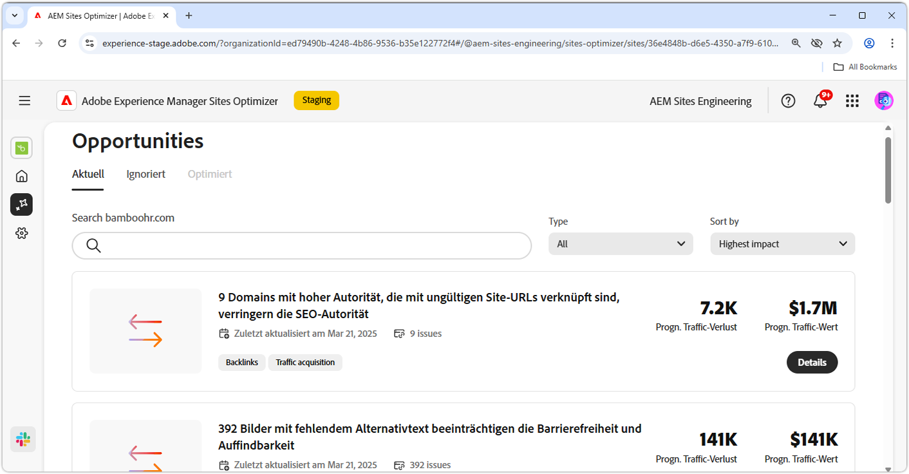
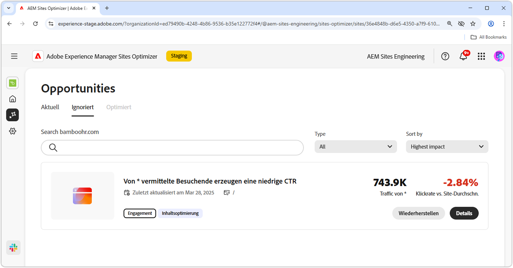

# Dokumentation zu Möglichkeiten

{align="center"}

Sites Optimizer umfasst eine ständig wachsende Palette von Möglichkeiten, die von der Adobe-KI unterstützt werden und dazu dienen, Verbesserungen für Ihre Website zu identifizieren und vorzuschlagen. Jede Möglichkeit bietet Erkenntnisse zum potenziellen geschäftlichen Nutzen, hebt Bereiche hervor, die besondere Aufmerksamkeit erfordern, und bietet umsetzbare Optimierungsempfehlungen. Klicken Sie auf jede Möglichkeit, um die identifizierten Probleme, die vorgeschlagenen Verbesserungen und die schrittweisen Anleitungen für die Implementierung dieser Änderungen zur Verbesserung der Website-Leistung und des Anwendererlebnisses zu erkunden.

Möglichkeiten sind in der [persistenten Navigation in Site Optimizer](/help/documentation/basics.md#navigation) über die Menüoption **Möglichkeiten** verfügbar.

## Status der Möglichkeit

Verwenden Sie die Registerkarten oben, um Opportunities zu organisieren und nach Status zu filtern.

>[!BEGINTABS]

>[!TAB Aktuell]

{align="center"}

Möglichkeiten, die derzeit ausstehend sind.

>[!TAB Ignoriert]

{align="center"}

Möglichkeiten, die ignoriert wurden. Ignorierte Möglichkeiten können aus dieser Ansicht wiederhergestellt werden.

>[!TAB Optimiert]

Eine historische Liste von Möglichkeiten, die optimiert wurden.

>[!ENDTABS]

## Opportunitys

Wenn Sie [Status der Möglichkeit](#opportunity-status) ausgewählt haben, können Sie eine Liste von Möglichkeiten anzeigen. Sie können die Liste der Opportunitys wie folgt filtern:

* **Suche**: Suche nach Möglichkeiten anhand von **Keywords, Tags oder URLs**.
* **Art der Möglichkeit**: Verwenden Sie das Dropdown-Menü **Typ** zum Filtern von Möglichkeiten nach [Art der Möglichkeit](/help/opportunity-types/overview.md).

### Details der Möglichkeiten

{align="center"}

Jede Möglichkeit bietet eine kurze Beschreibung des Problems, seine potenzielle Auswirkung auf Ihre Site und einen Link zu den vollständigen Details. Sie können auch den Status sehen, der angibt, ob eine Optimierung vorgenommen wurde oder noch aussteht.

* **Titel der Möglichkeit**: Eine kurze Beschreibung des Problems und seiner potenziellen Auswirkung auf die Leistung Ihrer Site.
* **Zuletzt aktualisiert** - Sites Optimizer hat die Opportunity zu diesem Datum zuletzt mit neuen Daten aktualisiert.
* **Anzahl der Probleme**: Die Anzahl der Instanzen des Problems, die auf Ihrer Site identifiziert wurden.
* **Opportunity-**: Die [Opportunity-Typen](/help/opportunity-types/overview.md) zu denen diese Opportunity gehört - z. B. Traffic-Akquise, Interaktion, Konversion oder Site-Status.

Die Zusammenfassungsinformationen für jede Möglichkeit variieren je nach Typ und können Details zu Umsatzauswirkungen, Traffic, Benutzerinteraktion oder Sicherheitsbedrohungen enthalten.

Klicken Sie zum Anzeigen der Details einer Möglichkeit auf die Schaltfläche **Details**.

Um eine Möglichkeit aus dem Dashboard in Sites Optimizer auszuschließen, klicken Sie auf die Schaltfläche **Ignorieren**.  Diese Aktion verschiebt die Möglichkeit auf die Registerkarte[&#128279;](#opportunity-status) **Ignoriert**.

## Alle Möglichkeiten

Erkunden Sie alle in Sites Optimizer verfügbaren Möglichkeiten:

<!-- CARDS

* ./accessibility-issues.md
  {title=Accessibility issues}
  {image=../../assets/common/card-arrows.png} 
* ./broken-backlinks.md
  {title=Broken backlinks}
  {image=../../assets/common/card-arrows.png}
* ./broken-internal-links.md
  {title=Broken internal links}
  {image=../../assets/common/card-link.png}
* ./cors-configuration.md
  {title=CORS configuration}
  {image=../../assets/common/card-code.png}
* ./core-web-vitals.md
  {title=Core web vitals}
  {image=../../assets/common/card-performance.png}
* ./cross-site-scripting.md
  {title=Cross-site scripting}
  {image=../../assets/common/card-code.png}
* ./high-bounce-rate.md
  {title=High bounce rate}
  {image=../../assets/common/card-arrows.png}    
* ./invalid-or-missing-metadata.md
  {title=Invalid or missing metadata}
  {image=../../assets/common/card-code.png}
* ./low-conversions.md
  {title=Low conversions}
  {image=../../assets/common/card-bag.png}
* ./low-views.md
  {title=Low views}
  {image=../../assets/common/card-bag.png} 
* ./missing-alt-text.md
  {title=Missing alt text}
  {image=../../assets/common/card-arrows.png}
* ./missing-invalid-structured-data.md
  {title=Missing or invalid structured data}
  {image=../../assets/common/card-bag.png}
* ./sitemap-issues.md
  {title=Sitemap issues}
  {image=../../assets/common/card-relationship.png}
* ./website-permissions.md
  {title=Website permissions}
  {image=../../assets/common/card-people.png}
* ./website-vulnerabilities.md
  {title=Website vulnerabilities}
  {image=../../assets/common/card-puzzle.png}
  
--->
<!-- START CARDS HTML - DO NOT MODIFY BY HAND -->

    

        

            

                <figure class="image x-is-16by9">
                    
                </figure>
            

            

                

                    

                        <a href="./accessibility-issues.md" target="_blank" rel="referrer" title="Probleme mit der Barrierefreiheit">Probleme mit der Barrierefreiheit</a>
                    

                    
Erfahren Sie mehr über die Möglichkeit „Probleme mit der Barrierefreiheit“ und finden Sie heraus, wie Sie damit die Sicherheit auf Ihrer Website erhöhen können.

                

                <a href="./accessibility-issues.md" target="_blank" rel="referrer" class="spectrum-Button spectrum-Button--outline spectrum-Button--primary spectrum-Button--sizeM" style="align-self: flex-start; margin-top: 1rem;">
Mehr erfahren
</a>
            

        

    

    

        

            

                <figure class="image x-is-16by9">
                    
                </figure>
            

            

                

                    

                        <a href="./broken-backlinks.md" target="_blank" rel="referrer" title="Fehlerhafte Backlinks">Fehlerhafte Backlinks</a>
                    

                    
Erfahren Sie mehr über die Möglichkeit „Fehlerhafte Backlinks“ und darüber, wie Sie sie zur Verbesserung der Traffic-Akquise nutzen können.

                

                <a href="./broken-backlinks.md" target="_blank" rel="referrer" class="spectrum-Button spectrum-Button--outline spectrum-Button--primary spectrum-Button--sizeM" style="align-self: flex-start; margin-top: 1rem;">
Mehr erfahren
</a>
            

        

    

    

        

            

                <figure class="image x-is-16by9">
                    
                </figure>
            

            

                

                    

                        <a href="./broken-internal-links.md" target="_blank" rel="referrer" title="Fehlerhafte interne Links">Fehlerhafte interne Links</a>
                    

                    
Erfahren Sie mehr über die Möglichkeit „Fehlerhafte interne Links“ und darüber, wie Sie sie zur Verbesserung der Interaktion auf Ihrer Website verwenden können.

                

                <a href="./broken-internal-links.md" target="_blank" rel="referrer" class="spectrum-Button spectrum-Button--outline spectrum-Button--primary spectrum-Button--sizeM" style="align-self: flex-start; margin-top: 1rem;">
Mehr erfahren
</a>
            

        

    

    

        

            

                <figure class="image x-is-16by9">
                    
                </figure>
            

            

                

                    

                        <a href="./cors-configuration.md" target="_blank" rel="referrer" title="CORS-Konfiguration">CORS-Konfiguration</a>
                    

                    
Erfahren Sie mehr über die Opportunity „CORS-Konfiguration“ und finden Sie heraus, wie Sie Sicherheitsschwachstellen auf der Site identifizieren und beheben.

                

                <a href="./cors-configuration.md" target="_blank" rel="referrer" class="spectrum-Button spectrum-Button--outline spectrum-Button--primary spectrum-Button--sizeM" style="align-self: flex-start; margin-top: 1rem;">
Mehr erfahren
</a>
            

        

    

    

        

            

                <figure class="image x-is-16by9">
                    
                </figure>
            

            

                

                    

                        <a href="./core-web-vitals.md" target="_blank" rel="referrer" title="Core Web Vitals">Core Web Vitals</a>
                    

                    
Erfahren Sie mehr über die Möglichkeit „Core Web Vital“ und darüber, wie Sie sie zur Verbesserung der Traffic-Akquise nutzen können.

                

                <a href="./core-web-vitals.md" target="_blank" rel="referrer" class="spectrum-Button spectrum-Button--outline spectrum-Button--primary spectrum-Button--sizeM" style="align-self: flex-start; margin-top: 1rem;">
Mehr erfahren
</a>
            

        

    

    

        

            

                <figure class="image x-is-16by9">
                    
                </figure>
            

            

                

                    

                        <a href="./cross-site-scripting.md" target="_blank" rel="referrer" title="Cross-Site-Scripting">Cross-Site-Scripting</a>
                    

                    
Informieren Sie sich über die Möglichkeit von Cross-Site-Scripting und über das Erkennen und Beheben von Sicherheitsschwachstellen auf Websites.

                

                <a href="./cross-site-scripting.md" target="_blank" rel="referrer" class="spectrum-Button spectrum-Button--outline spectrum-Button--primary spectrum-Button--sizeM" style="align-self: flex-start; margin-top: 1rem;">
Mehr erfahren
</a>
            

        

    

    

        

            

                <figure class="image x-is-16by9">
                    
                </figure>
            

            

                

                    

                        <a href="./high-bounce-rate.md" target="_blank" rel="referrer" title="Hohe Bounce-Rate">Hohe Absprungrate</a>
                    

                    
Erfahren Sie mehr über die niedrige Ansichtschance und wie Sie sie verwenden können, um die Interaktion mit Formularen auf Ihrer Website zu verbessern.

                

                <a href="./high-bounce-rate.md" target="_blank" rel="referrer" class="spectrum-Button spectrum-Button--outline spectrum-Button--primary spectrum-Button--sizeM" style="align-self: flex-start; margin-top: 1rem;">
Mehr erfahren
</a>
            

        

    

    

        

            

                <figure class="image x-is-16by9">
                    
                </figure>
            

            

                

                    

                        <a href="./invalid-or-missing-metadata.md" target="_blank" rel="referrer" title="Ungültige oder fehlende Metadaten">Ungültige oder fehlende Metadaten</a>
                    

                    
Erfahren Sie mehr über die Möglichkeit „Ungültige oder fehlende Metadaten“ und darüber, wie Sie sie zur Verbesserung der Traffic-Akquise verwenden können.

                

                <a href="./invalid-or-missing-metadata.md" target="_blank" rel="referrer" class="spectrum-Button spectrum-Button--outline spectrum-Button--primary spectrum-Button--sizeM" style="align-self: flex-start; margin-top: 1rem;">
Mehr erfahren
</a>
            

        

    

        

            

                <figure class="image x-is-16by9">
                    
                </figure>
            

            

                

                    

                        <a href="./low-conversions.md" target="_blank" rel="referrer" title="Forms - niedrige Konversionen">niedrige Forms-Konversionen</a>
                    

                    
Erfahren Sie mehr über die niedrige Konversionsrate und wie Sie damit die Interaktion mit Formularen auf Ihrer Website verbessern können.

                

                <a href="./low-conversions.md" target="_blank" rel="referrer" class="spectrum-Button spectrum-Button--outline spectrum-Button--primary spectrum-Button--sizeM" style="align-self: flex-start; margin-top: 1rem;">
                    Mehr erfahren
                </a>
            

        

    

    

        

            

                <figure class="image x-is-16by9">
                    
                </figure>
            

            

                

                    

                        <a href="./low-views.md" target="_blank" rel="referrer" title="Wenig Ansichten">Forms-Detailansichten</a>
                    

                    
Erfahren Sie mehr über die Opportunity für niedrige Ansichten von Formularen und wie Sie damit die Formularinteraktion auf Ihrer Website verbessern können.

                

                <a href="./low-views.md" target="_blank" rel="referrer" class="spectrum-Button spectrum-Button--outline spectrum-Button--primary spectrum-Button--sizeM" style="align-self: flex-start; margin-top: 1rem;">
                    Mehr erfahren
                </a>
            

        

    

    

        

            

                <figure class="image x-is-16by9">
                    
                </figure>
            

            

                

                    

                        <a href="./low-navigation.md" target="_blank" rel="referrer" title="Forms-Niedrignavigation">Forms - niedrige Navigation</a>
                    

                    
Erfahren Sie mehr über die Möglichkeit der niedrigen Navigation in Forms und wie Sie damit die Formularinteraktion auf Ihrer Website verbessern können.

                

                <a href="./low-navigation.md" target="_blank" rel="referrer" class="spectrum-Button spectrum-Button--outline spectrum-Button--primary spectrum-Button--sizeM" style="align-self: flex-start; margin-top: 1rem;">
                    Mehr erfahren
                </a>
            

        

    

    

        

            

                <figure class="image x-is-16by9">
                    
                </figure>
            

            

                

                    

                        <a href="./forms-accessibility-issues.md" target="_blank" rel="referrer" title="Probleme mit der Barrierefreiheit in Forms">Probleme mit der Barrierefreiheit von Forms</a>
                    

                    
Erfahren Sie mehr über Probleme mit der Barrierefreiheit von Formularen und wie Sie damit die Interaktion auf Ihrer Website verbessern können.

                

                <a href="./forms-accessibility-issues.md" target="_blank" rel="referrer" class="spectrum-Button spectrum-Button--outline spectrum-Button--primary spectrum-Button--sizeM" style="align-self: flex-start; margin-top: 1rem;">
Mehr erfahren
</a>
            

        

    

    

        

            

                <figure class="image x-is-16by9">
                    
                </figure>
            

            

                

                    

                        <a href="./missing-alt-text.md" target="_blank" rel="referrer" title="Fehlender Alternativtext">Fehlender Alternativtext</a>
                    

                    
Erfahren Sie mehr über die Möglichkeit „Fehlender Alternativtext“ und darüber, wie Sie sie zur Verbesserung der Interaktion auf Ihrer Website verwenden können.

                

                <a href="./missing-alt-text.md" target="_blank" rel="referrer" class="spectrum-Button spectrum-Button--outline spectrum-Button--primary spectrum-Button--sizeM" style="align-self: flex-start; margin-top: 1rem;">
Mehr erfahren
</a>
            

        

    

    

        

            

                <figure class="image x-is-16by9">
                    
                </figure>
            

            

                

                    

                        <a href="./missing-invalid-structured-data.md" target="_blank" rel="referrer" title="Fehlende oder ungültige strukturierte Daten">Fehlende oder ungültige strukturierte Daten</a>
                    

                    
Erfahren Sie mehr über die Möglichkeit „Fehlende oder ungültige strukturierte Daten“ und darüber, wie Sie sie zur Verbesserung der Traffic-Akquise verwenden können.

                

                <a href="./missing-invalid-structured-data.md" target="_blank" rel="referrer" class="spectrum-Button spectrum-Button--outline spectrum-Button--primary spectrum-Button--sizeM" style="align-self: flex-start; margin-top: 1rem;">
Mehr erfahren
</a>
            

        

    

    

        

            

                <figure class="image x-is-16by9">
                    
                </figure>
            

            

                

                    

                        <a href="./sitemap-issues.md" target="_blank" rel="referrer" title="Sitemap-Probleme">Sitemap-Probleme</a>
                    

                    
Erfahren Sie mehr über die Möglichkeit „Sitemap-Probleme“ und darüber, wie Sie sie zur Verbesserung der Traffic-Akquise nutzen können.

                

                <a href="./sitemap-issues.md" target="_blank" rel="referrer" class="spectrum-Button spectrum-Button--outline spectrum-Button--primary spectrum-Button--sizeM" style="align-self: flex-start; margin-top: 1rem;">
Mehr erfahren
</a>
            

        

    

    

        

            

                <figure class="image x-is-16by9">
                    
                </figure>
            

            

                

                    

                        <a href="./website-permissions.md" target="_blank" rel="referrer" title="Website-Berechtigungen">Website-Berechtigungen</a>
                    

                    
Erfahren Sie mehr über die Opportunity „Website-Berechtigungen“ und finden Sie heraus, wie Sie damit die Sicherheit auf Ihrer Website erhöhen können.

                

                <a href="./website-permissions.md" target="_blank" rel="referrer" class="spectrum-Button spectrum-Button--outline spectrum-Button--primary spectrum-Button--sizeM" style="align-self: flex-start; margin-top: 1rem;">
Mehr erfahren
</a>
            

        

    

    

        

            

                <figure class="image x-is-16by9">
                    
                </figure>
            

            

                

                    

                        <a href="./website-vulnerabilities.md" target="_blank" rel="referrer" title="Website-Schwachstellen">Website-Schwachstellen</a>
                    

                    
Erfahren Sie mehr über die Opportunity „Website-Schwachstellen“ und finden Sie heraus, wie Sie damit die Sicherheit auf Ihrer Website erhöhen können.

                

                <a href="./website-vulnerabilities.md" target="_blank" rel="referrer" class="spectrum-Button spectrum-Button--outline spectrum-Button--primary spectrum-Button--sizeM" style="align-self: flex-start; margin-top: 1rem;">
Mehr erfahren
</a>
            

        

    

<!-- END CARDS HTML - DO NOT MODIFY BY HAND -->

