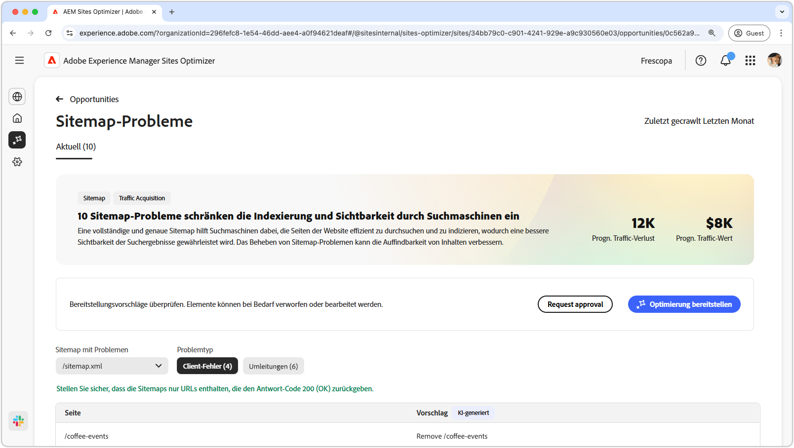
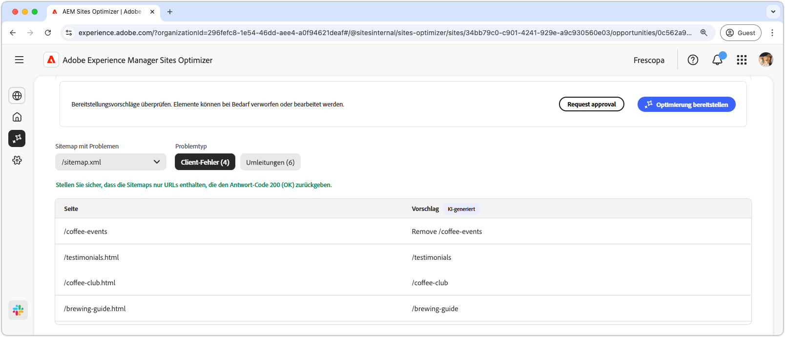
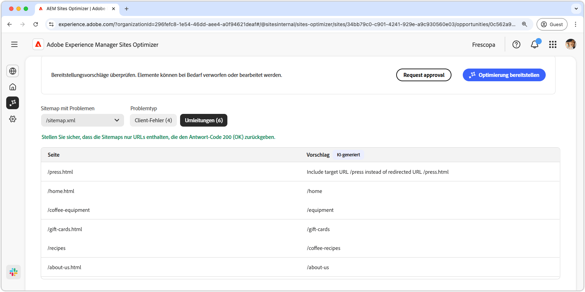
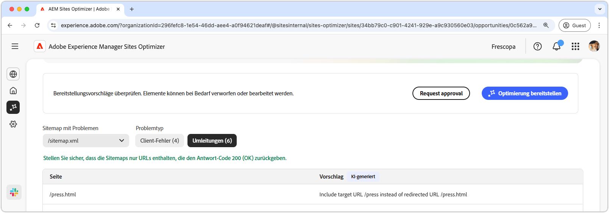

# Möglichkeit „Sitemap-Probleme“

{align="center"}

Eine vollständige und genaue Sitemap hilft Suchmaschinen dabei, die Seiten der Website effizient zu durchsuchen und zu indizieren, wodurch eine bessere Sichtbarkeit der Suchergebnisse gewährleistet wird. Die Möglichkeit „Sitemap“ identifiziert potenzielle Probleme mit Ihrer Sitemap. Das Beheben dieser Probleme kann die Suchmaschinenindizierung und die Auffindbarkeit von Inhalten auf Ihrer Site erheblich verbessern.

Oben auf der Seite wird eine Zusammenfassung angezeigt, die einen Überblick über das Problem und seine Auswirkungen auf Ihre Site und Ihr Geschäft enthält.

* **Prognostizierter Traffic-Verlust**: Der geschätzte Traffic-Verlust aufgrund von Sitemap-Problemen.
* **Prognostizierter Traffic-Wert**: Der geschätzte Wert des verlorenen Traffics.

## Automatische Identifizierung

Sitemap-Probleme können anhand der folgenden Kriterien gefiltert werden:

* **Sitemap mit Problemen**: Die URL der analysierten Sitemap mit potenziellen Problemen.
* **Problemtyp**: Der in der Sitemap identifizierte Problemtyp:
   * **Client-Fehler**: Einträge, die keine Antwort vom Typ `200 Success` zurückgeben.
   * **Umleitungen**: Fehlerhafte oder falsch konfigurierte Umleitungen.

>[!BEGINTABS]

>[!TAB Client-Fehler]

{align="center"}

Wenn URLs in Ihrer Sitemap diese Fehler zurückgeben, können Suchmaschinen davon ausgehen, dass Ihre Sitemap veraltet ist oder dass Seiten versehentlich entfernt wurden. Der Client gibt an, dass die Anfrage des Clients (Browser oder Crawler) ungültig war. Häufige Fehler sind:

* **404 Nicht gefunden** - Die angeforderte Seite existiert nicht.
* **403 Verboten**: Der Server verweigert den Zugriff auf die angeforderte Seite.
* **410 Gone** - Die Seite wurde absichtlich entfernt und wird nicht zurückgegeben.
* **401 Nicht autorisiert**: Authentifizierung ist erforderlich, wird aber nicht bereitgestellt.

Diese Fehler können der SEO schaden, insbesondere wenn wichtige Seiten **404 oder 410** zurückgeben, da sie dann von Suchmaschinen möglicherweise aus dem Index entfernt werden.

Jedes Problem wird in einer Tabelle angezeigt, wobei die Spalte **Seite** den betroffenen Sitemap-Eintrag angibt:

* **Seite**: Die URL des Sitemap-Eintrags mit einem Problem.

>[!TAB Umleitungen]

{align="center"}

Sitemaps sollten nur endgültige Ziel-URLs enthalten und keine URLs mit Umleitungen. Umleitungen haben zwar das Ziel, Benutzende und Crawler zum richtigen Ort zu führen, können bei falscher Konfiguration jedoch Probleme verursachen:

* **302 Gefunden (temporäre Umleitung)**: Kann SEO-Probleme verursachen, wenn dies versehentlich anstelle von **301** verwendet wird.
* **307 temporäre Umleitung**: Ähnlich wie 302, behält jedoch die HTTP-Methode bei.
* **Umleitungsschleifen**: Wenn eine Seite eine Umleitung zurück zu sich selbst enthält oder eine Endlosschleife erstellt.
* **Fehlerhafte Weiterleitungen**: Wenn eine Weiterleitung zu einer nicht vorhandenen oder 4xx-Seite führt.

Jedes Problem wird in einer Tabelle angezeigt, wobei die Spalte **Seite** den betroffenen Sitemap-Eintrag angibt:

* **Seite**: Die URL des Sitemap-Eintrags mit einem Problem.

>[!ENDTABS]

## Automatische Vorschläge

Jedes Sitemap-Problem, [das die Filterkriterien erfüllt](#auto-identify), wird in einer Tabelle mit den folgenden Spalten aufgeführt:

* **Seite**: Die URL des Sitemap-Eintrags mit einem Problem.
* **Vorschlag**: Die empfohlene Fehlerbehebung für das Problem.

Vorschläge enthalten normalerweise einen aktualisierten Site-Pfad, um den Sitemap-Eintrag zu korrigieren. In einigen Fällen können sie auch detailliertere Anweisungen bieten, z. B. die Angabe des richtigen Umleitungsziels.

## Automatische Optimierung

[!BADGE Ultimate]{type=Positive tooltip="Ultimate"}

{align="center"}

Sites Optimizer Ultimate bietet nun die Möglichkeit, automatische Optimierungen von Sitemaps bereitzustellen.

>[!BEGINTABS]

>[!TAB Optimierung bereitstellen]

{{auto-optimize-deploy-optimization-slack}}

>[!TAB Genehmigung anfordern]

{{auto-optimize-request-approval}}

>[!ENDTABS]
