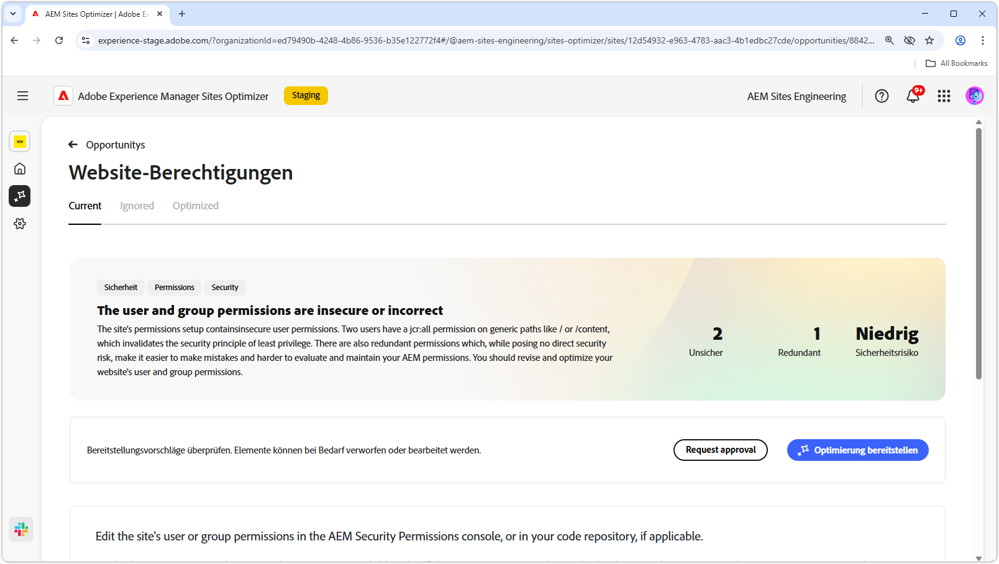
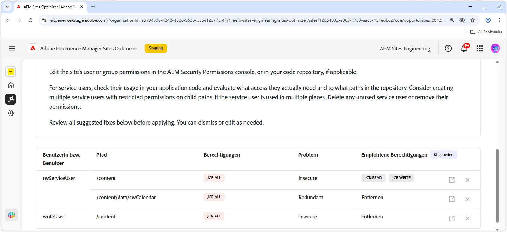
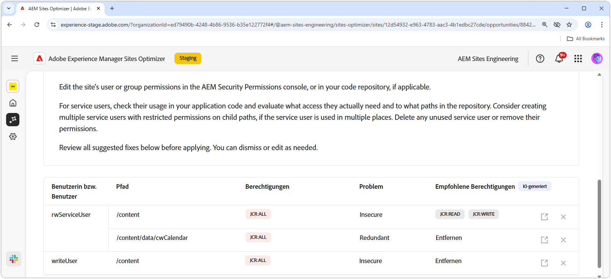
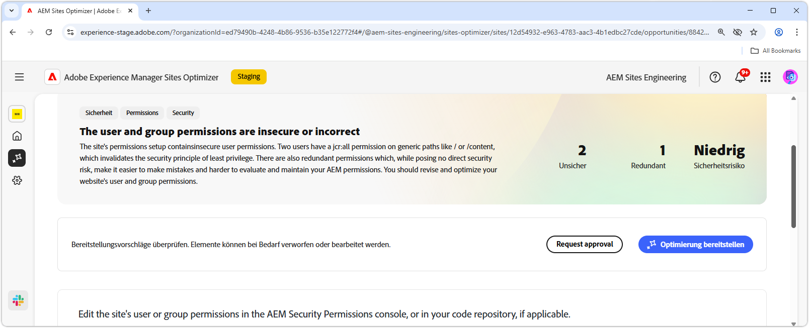

# Website-Zugriffsmöglichkeit

{align="center"}

Die Website-Berechtigungs-Opportunity optimiert Website-Berechtigungen, die für die Aufrechterhaltung einer sicheren und verwaltbaren AEM-Umgebung von entscheidender Bedeutung sind. Diese Möglichkeit ermöglicht es Ihnen, die Zugriffssteuerung zu verfeinern, indem Sie übermäßig umfassende Berechtigungen entfernen - z. B. `jcr:all` für generische Pfade wie `/` oder `/content` - und den Benutzerzugriff an das Prinzip der geringsten Berechtigung anpassen. Durch die Optimierung von Berechtigungen und die Beseitigung von Redundanzen können Sie Sicherheitsrisiken reduzieren, die Wartbarkeit verbessern und zukünftige Fehlkonfigurationen verhindern. Ergreifen Sie Maßnahmen, indem Sie die Berechtigungen in der AEM-Sicherheitsberechtigungskonsole oder Ihrem Code-Repository überprüfen und aktualisieren und so sicherstellen, dass Dienstbenutzende nur den Zugriff haben, den sie wirklich benötigen.

## Automatisch identifizieren

{align="center"}

Die **Opportunity für Websiteberechtigungen** identifiziert und listet automatisch auf

* **Benutzer** - Das Benutzerkonto mit der Berechtigung „Verdächtig“.
* **Path** - Der Pfad in AEM, der von der Berechtigung betroffen ist.
* **Permission** - Die verdächtige Berechtigung.
* **Problem** - Gibt die Art des Problems an, das sich auf die Berechtigung auswirkt.

## Automatisch vorschlagen

{align="center"}

Der automatische Vorschlag bietet KI-generierte Empfehlungen im Feld **Vorgeschlagene Berechtigungen** mit denen Sie alle gekennzeichneten Berechtigungen durch sichere Alternativen ersetzen können.

## [!BADGE Ultimate automatisch optimieren]{type=Positive tooltip="Ultimate"}

{align="center"}

Sites Optimizer Ultimate bietet die Möglichkeit, eine automatische Optimierung für die gefundenen Sicherheitslücken bereitzustellen.

>[!BEGINTABS]

>[!TAB Optimierung bereitstellen]

{{auto-optimize-deploy-optimization-slack}}

>[!TAB Bestätigung anfordern]

{{auto-optimize-request-approval}}

>[!ENDTABS]
