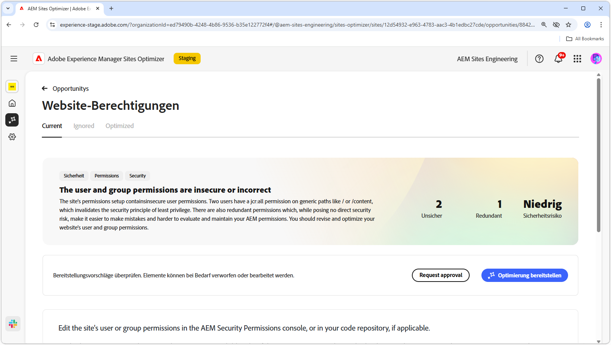
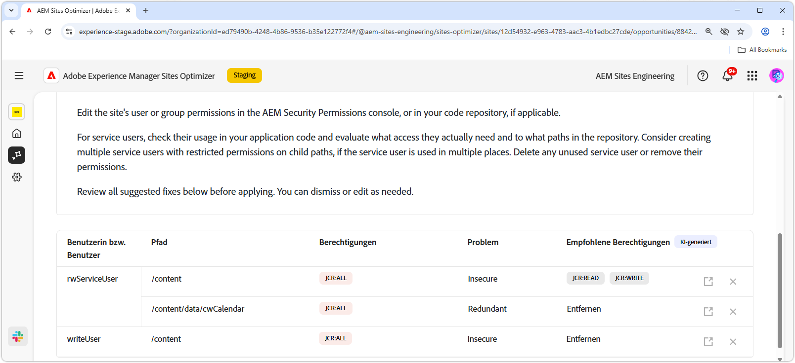
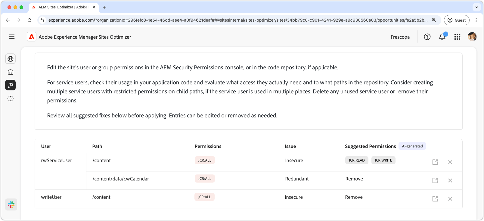
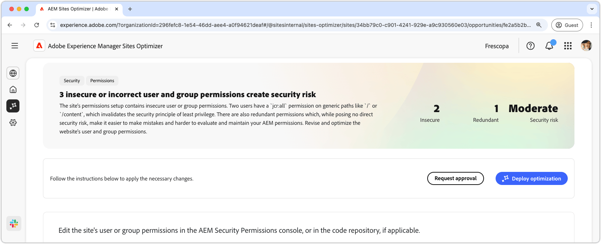

# Möglichkeit „Website-Berechtigungen“

{align="center"}

Die Möglichkeit „Website-Berechtigungen“ optimiert Website-Berechtigungen, die für die Aufrechterhaltung einer sicheren und verwaltbaren AEM-Umgebung von entscheidender Bedeutung sind. Mit dieser Möglichkeit können Sie die Zugriffssteuerung verfeinern, indem Sie übermäßig umfassende Berechtigungen entfernen – z. B. `jcr:all` in generischen Pfaden wie `/` oder `/content` – und den Benutzerzugriff an das Prinzip der geringsten Berechtigung anpassen. Durch das Optimieren von Berechtigungen und das Beseitigen von Redundanzen können Sie Sicherheitsrisiken reduzieren, die Wartbarkeit verbessern und zukünftige Fehlkonfigurationen verhindern. Überprüfen und aktualisieren Sie Berechtigungen in der AEM-Konsole für Sicherheitsberechtigungen oder in Ihrem Code-Repository. So wird sichergestellt, dass Service-Benutzerinnen und -Benutzer nur den Zugriff haben, den sie wirklich benötigen.

## Automatische Identifizierung

{align="center"}

Die Funktion **Möglichkeit „Website-Berechtigungen“** identifiziert und listet Folgendes automatisch auf:

* **Benutzer**: Das Benutzerkonto mit der fragwürdigen Berechtigung.
* **Pfad**: Verwenden Sie die Registerkarten oben, um Möglichkeiten nach Status zu organisieren und zu filtern.
* **Berechtigung**: Die vermutete Berechtigung.
* **Problem**: Gibt die Art des Problems an, das sich auf die Berechtigung auswirkt.

## Automatische Vorschläge

{align="center"}

Das automatische Vorschlagen bietet KI-generierte Empfehlungen im Feld **Empfohlene Berechtigungen**, mit denen Sie jede markierte Berechtigung durch eine sichere Alternative ersetzen können.

## Automatische Optimierung

[!BADGE Ultimate]{type=Positive tooltip="Ultimate"}

{align="center"}

Sites Optimizer Ultimate ermöglicht es, eine automatische Optimierung für die gefundenen Schwachstellen bereitzustellen.

>[!BEGINTABS]

>[!TAB Optimierung bereitstellen]

{{auto-optimize-deploy-optimization-slack}}

>[!TAB Bestätigung anfordern]

{{auto-optimize-request-approval}}

>[!ENDTABS]
