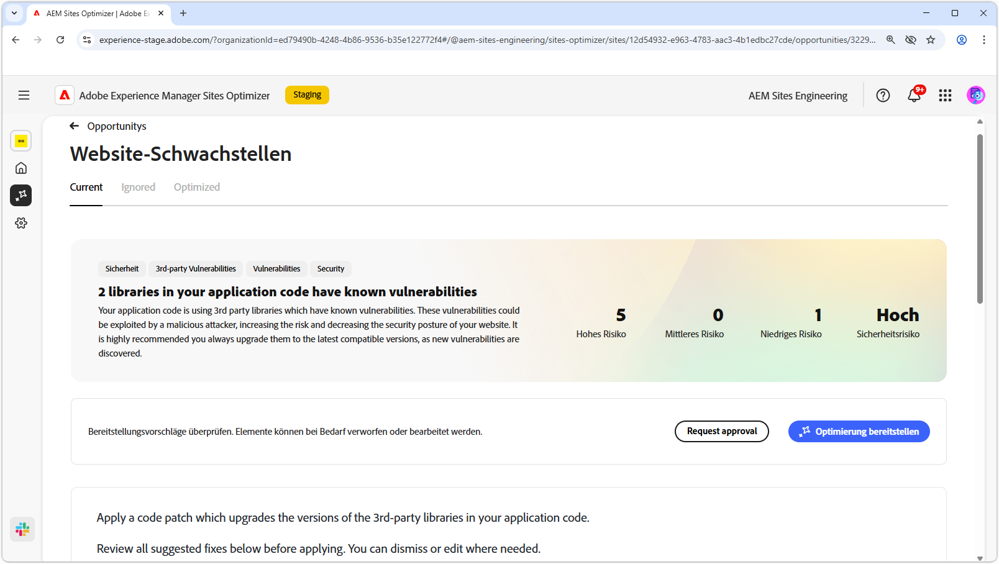
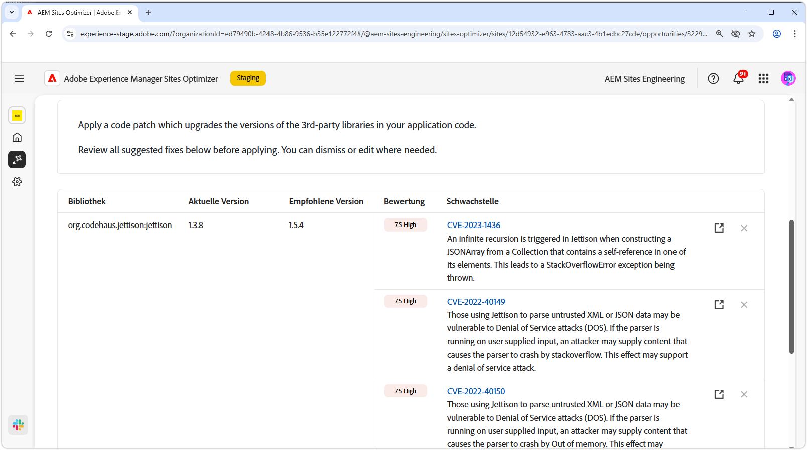
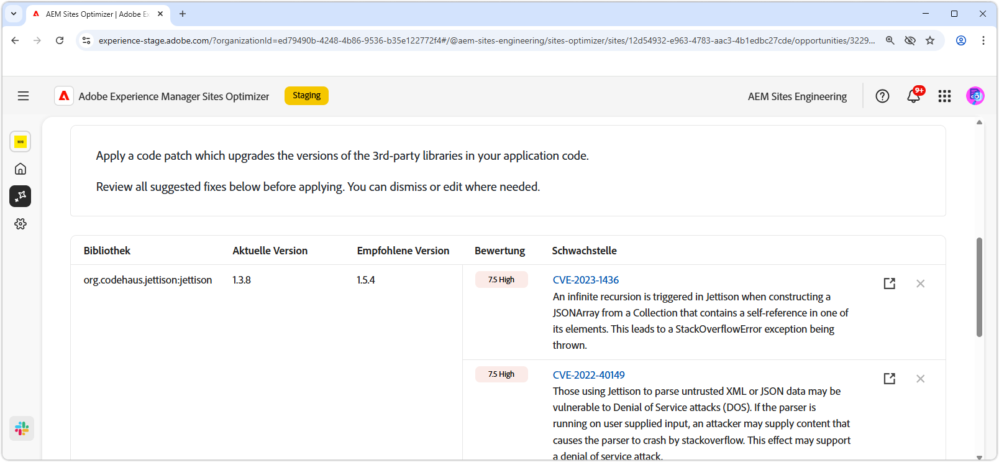
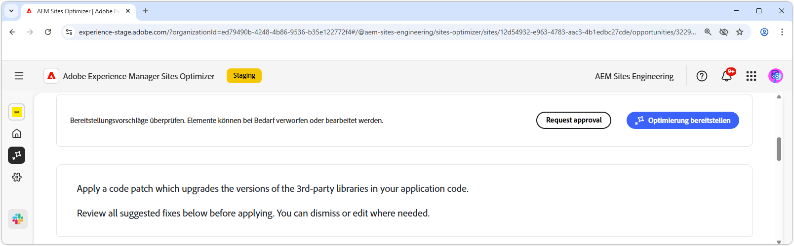

# Opportunity „Website-Schwachstellen“

{align="center"}

Die Möglichkeit „Website-Schwachstellen“ identifiziert Sicherheitsschwachstellen in den von Ihrem Anwendungs-Code verwendeten Drittanbieterbibliotheken. Diese Schwachstellen könnten von böswilligen Angreiferinnen und Angreifern ausgenutzt werden, was das Risiko erhöht und den Sicherheitsstatus Ihrer Website herabsetzt.

Bei der Opportunity „Website-Schwachstellen“ wird oben auf der Seite eine Zusammenfassung angezeigt, die u. a. folgende Informationen enthält:

* **Gefundene Probleme**: Die Anzahl der gefundenen Schwachstellen, kategorisiert nach dem von ihnen ausgehenden Sicherheitsrisiko (niedrig, mittel, hoch).
* **Aggregiertes Sicherheitsrisiko**: Das allgemeine Sicherheitsrisiko für Ihre Website, basierend auf den von der Opportunity-Funktion gefundenen Schwachstellen.

## Automatische Identifizierung

{align="center"}

Die Funktion **Möglichkeit „Website-Schwachstellen“** identifiziert automatisch Schwachstellen in den von Ihrem Anwendungs-Code verwendeten Drittanbieterbibliotheken und listet sie auf. Sie liefert die folgenden Informationen:

* **Bibliothek**: Die Drittanbieterbibliothek mit der Schwachstelle. Eine einzelne Bibliothek kann mehrere Schwachstellen aufweisen.
* **Aktuelle Version**: Die Version der derzeit verwendeten Bibliothek.
* **Empfohlene Version**: Die vorgeschlagene Version, mit der die Schwachstelle behoben wird.
* **Bewertung**: Die Bewertung des Schweregrads der Schwachstelle, die ebenfalls oben auf der Seite zusammengefasst wird.
* **Schwachstelle**: Die Kennung der Schwachstelle, eine kurze Beschreibung und ein Link zur National Vulnerability Database (NVD), um weitere Details zu erfahren. Greifen Sie auf den NVD-Link zu, indem Sie auf die Kennung oder den Link neben der Beschreibung klicken.

## Automatische Vorschläge

{align="center"}

Automatische, KI-generierte Vorschläge für die **empfohlene Version** anfälliger Bibliotheken, auf die Sie aktualisieren sollten. Jeder Eintrag hat einen **Score**, der den allgemeinen Schweregrad angibt und dabei hilft, die kritischsten Schwachstellen zu priorisieren.

>[!BEGINTABS]

>[!TAB Schwachstelle – Details]

Jede Schwachstelle enthält einen Link zu ausführlichen Informationen in der [National Vulnerability Database (NVD)](https://nvd.nist.gov/). Durch Klicken auf die Kennung der Schwachstelle oder den Link rechts neben der Beschreibung gelangen Sie zur NVD-Seite für diese Schwachstelle.

>[!TAB Einträge ignorieren]

Sie können Einträge aus der Liste der Schwachstellen ignorieren. Wenn Sie auf das Symbol **Ignorieren** klicken, wird der Eintrag aus der Liste entfernt. Ignorierte Einträge können über die Registerkarte **Ignoriert** oben auf der Opportunity-Seite erneut aktiviert werden.<!---right now it does not seem to be implemented, but the page description mentions this functionality-->

>[!ENDTABS]

## Automatische Optimierung

[!BADGE Ultimate]{type=Positive tooltip="Ultimate"}

{align="center"}

Sites Optimizer Ultimate ermöglicht es, eine automatische Optimierung für die gefundenen Schwachstellen bereitzustellen.

>[!BEGINTABS]

>[!TAB Optimierung bereitstellen]

{{auto-optimize-deploy-optimization-slack}}

>[!TAB Genehmigung anfordern]

{{auto-optimize-request-approval}}

>[!ENDTABS]