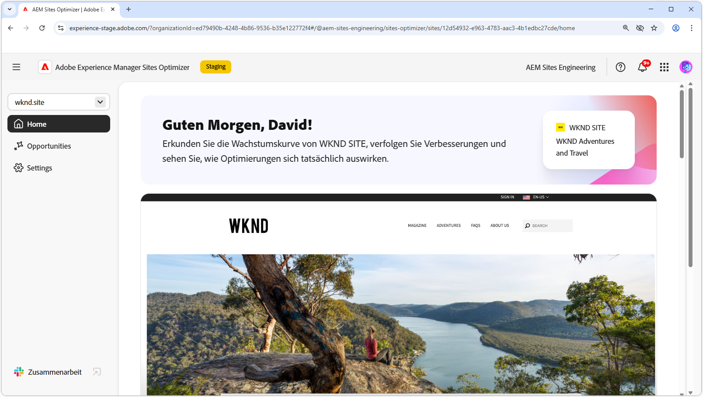
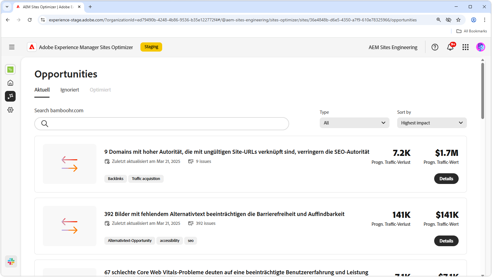
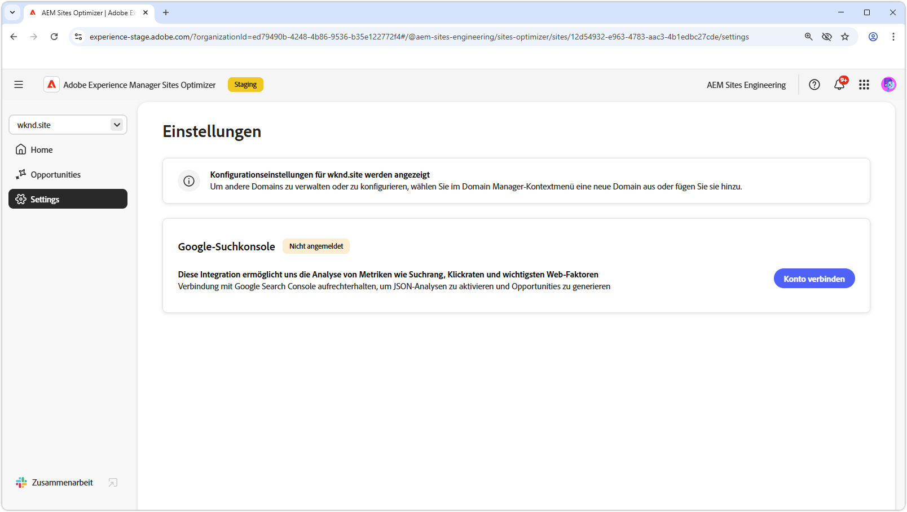

# Dokumentation zu Sites Optimizer

{align="center"}

Willkommen bei der Dokumentation zu Sites Optimizer. Hier finden Sie Informationen zur Verwendung von Sites Optimizer zur Optimierung Ihrer AEM-Sites.

## Grundlagen zu Sites Optimizer

In der Dokumentation zu AEM Sites Optimizer erfahren Sie mehr über die wichtigsten Komponenten der Benutzeroberfläche, einschließlich des Startseiten-Dashboards, der Einstellungskonfigurationen und der Liste mit Möglichkeiten für Erkenntnisse zur Optimierung.

<!-- CARDS 

* ./basics.md
  {title = Basics}
  {image = ./assets/basics/card.png}
* ./opportunities/overview.md
  {title = Opportunities}
* ./settings.md
  {title = Settings}

-->
<!-- START CARDS HTML - DO NOT MODIFY BY HAND -->

    

        

            

                <figure class="image x-is-16by9">
                    
                </figure>
            

            

                

                    

                        <a href="./basics.md" target="_blank" rel="referrer" title="Grundlagen">Grundlagen</a>
                    

                    
Erfahren Sie mehr über Grundlegendes zu Sites Optimizer und darüber, wie Sie darin navigieren.

                

                <a href="./basics.md" target="_blank" rel="referrer" class="spectrum-Button spectrum-Button--outline spectrum-Button--primary spectrum-Button--sizeM" style="align-self: flex-start; margin-top: 1rem;">
Mehr erfahren
</a>
            

        

    

    

        

            

                <figure class="image x-is-16by9">
                    
                </figure>
            

            

                

                    

                        <a href="./opportunities/overview.md" target="_blank" rel="referrer" title="Opportunitys">Möglichkeiten</a>
                    

                    
Erfahren Sie mehr über alle verfügbaren Möglichkeiten in Sites Optimizer und darüber, wie Sie sie zur Verbesserung der Leistung Ihrer Site einsetzen können.

                

                <a href="./opportunities/overview.md" target="_blank" rel="referrer" class="spectrum-Button spectrum-Button--outline spectrum-Button--primary spectrum-Button--sizeM" style="align-self: flex-start; margin-top: 1rem;">
Mehr erfahren
</a>
            

        

    

    

        

            

                <figure class="image x-is-16by9">
                    
                </figure>
            

            

                

                    

                        <a href="./settings.md" target="_blank" rel="referrer" title="Einstellungen">Einstellungen</a>
                    

                    
Erfahren Sie, wie Sie die Einstellungen für Sites Optimizer konfigurieren und mit anderen Tools integrieren.

                

                <a href="./settings.md" target="_blank" rel="referrer" class="spectrum-Button spectrum-Button--outline spectrum-Button--primary spectrum-Button--sizeM" style="align-self: flex-start; margin-top: 1rem;">
Mehr erfahren
</a>
            

        

    

<!-- END CARDS HTML - DO NOT MODIFY BY HAND -->

