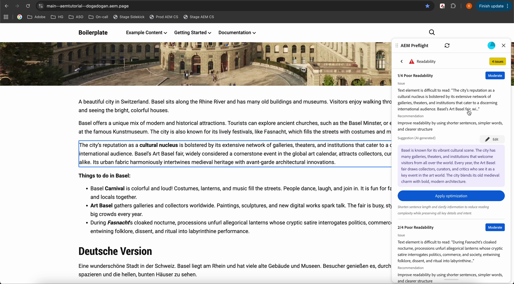

# Audit-Ergebnisse in Preflight

Wenn die Prüfung abgeschlossen ist, zeigt Preflight die Prüfergebnisse als Opportunities an. Jede Opportunity ist nach Typ organisiert und enthält Empfehlungen, wie Sie die Seite verbessern und optimieren können. Innerhalb einer Opportunity identifizieren einzelne Probleme bestimmte Elemente, die überprüft oder behoben werden müssen.

Am oberen Rand des AEM Preflight-Dialogfelds befindet sich eine Benutzer-Fortschrittsleiste, die die gesamten Auditergebnisse widerspiegelt. Es zeigt den Prozentsatz der Opportunitys an, die ohne Probleme bestanden wurden, und die Gesamtzahl der gefundenen Probleme für alle Opportunitys. Mit der Fortschrittsleiste für Benutzende können Autoren den Gesamtzustand der Seite auf einen Blick erfassen.

{align="center"}

Der Balken ist farbcodiert:

* Rot für **weniger als 1/3** der abgeschlossenen Chancen
* Orange für **1/3 bis 2/3 vollständig**
* Grün für **mehr als 2/3 vollständig**
* Blau , während Audits **noch laufen**

Siehe die [vollständige Liste der verfügbaren Opportunity-Typen und wie Sie sie behandeln](./overview.md#preflight-opportunities).

## Zu Problemen navigieren und Vorschläge anwenden

Nach Abschluss des Audits können Sie schnell zu identifizierten Problemen wechseln und KI-generierte Vorschläge direkt in der Vorschau anwenden.

{align="center"}

### Zu einem Problem navigieren

1. Wählen Sie ein Problem aus der Problemliste im Preflight-Bedienfeld aus.
1. Die Vorschau scrollt automatisch zu und markiert die entsprechende Position auf der Seite, sodass Sie das Problem im Kontext überprüfen können, ohne manuell danach zu suchen.

### Anwenden von KI-generierten Vorschlägen

Bei Problemen, die KI-generierte Empfehlungen enthalten, können Sie vorgeschlagene Optimierungen direkt über das Vorschlagsbedienfeld anwenden.

#### Anwenden einer Optimierung

1. Review the AI-generated suggestion.
1. Select **Apply Optimization**.

The recommended content is applied directly to the content.

#### Edit before applying

If adjustments are required:

1. Modify the AI-generated suggestion in the suggestion panel.
1. Select **Apply Optimization**.

Your edited version is applied to the preview.
