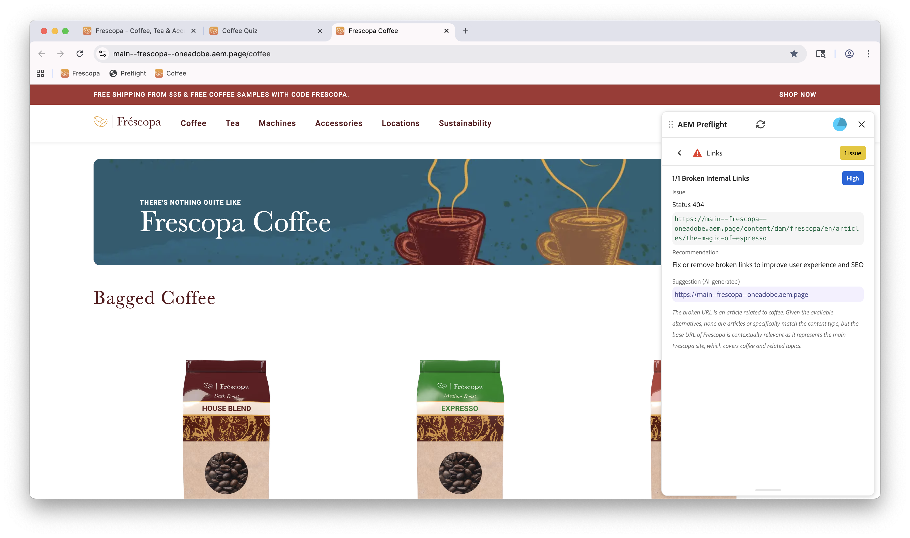
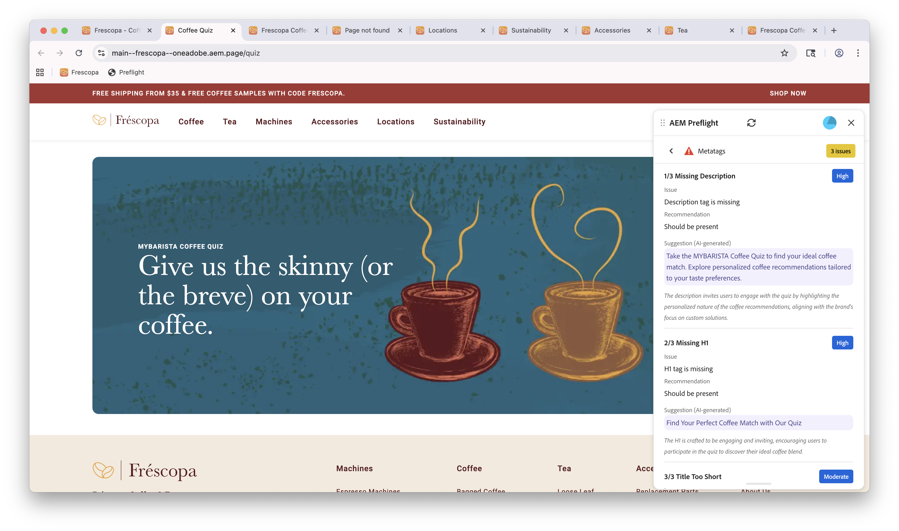

# AEM Sites Optimizer Preflight

{align="center"}

Mit Preflight in AEM Sites Optimizer können Sie Seiten vor der Live-Schaltung validieren und optimieren, indem Sie Inhalte und Struktur analysieren und Probleme mit umsetzbaren Empfehlungen kennzeichnen. Sie wurde für Autoren, Marketing-Experten und Entwickler entwickelt, die sicherstellen möchten, dass Seiten von hoher Qualität, Leistung und Veröffentlichungsbereitschaft sind, während die Nachbearbeitung reduziert wird.

Im Mittelpunkt von Preflight stehen Opportunities, die durch eine Reihe von Audits identifiziert werden, die wichtige Aspekte Ihrer Seite vor der Veröffentlichung bewerten. Diese Prüfungen decken potenzielle Probleme auf und geben klare, umsetzbare Empfehlungen zur Verbesserung der Gesamtqualität und -leistung.

## Erste Schritte mit Preflight

Der Einstieg in Preflight ist einfach. Richten Sie einfach Preflight ein, öffnen Sie es in Ihrer Authoring-Umgebung und führen Sie einen Audit auf Ihrer Seite durch, und Preflight erledigt den Rest.

1. [Preflight einrichten](./setup.md) - Erfahren Sie, wie Sie Preflight für Ihre AEM-Instanz einrichten
1. [Zugriff auf Preflight](./access-preflight.md) - Erfahren Sie, wo Preflight in Ihrer Authoring-Umgebung angezeigt wird
1. [Audits ausführen](./audits.md) - Erfahren Sie, wie Sie ein Preflight-Audit starten.
1. [Audit-Ergebnisse und -](./audit-results.md): Erfahren Sie, wie Audit-Ergebnisse interpretiert werden.

## Preflight-Möglichkeiten

<!-- CARDS

* ./opportunities/accessibility.md
* ./opportunities/h1-count.md
* ./opportunities/links.md
* ./opportunities/meta-data.md
* ./opportunities/readability.md
-->
<!-- START CARDS HTML - DO NOT MODIFY BY HAND -->

    

        

            

                <figure class="image x-is-16by9">
                    
                </figure>
            

            

                

                    

                        <a href="./opportunities/accessibility.md" target="_blank" rel="referrer" title="Preflight-Möglichkeit für Barrierefreiheit">Preflight-Möglichkeit für Barrierefreiheit</a>
                    

                    
Erfahren Sie mehr über die Preflight-Möglichkeit für Barrierefreiheit in Sites Optimizer.

                

                <a href="./opportunities/accessibility.md" target="_blank" rel="referrer" class="spectrum-Button spectrum-Button--outline spectrum-Button--primary spectrum-Button--sizeM" style="align-self: flex-start; margin-top: 1rem;">
                    Weitere Informationen
                </a>
            

        

    

    

        

            

                <figure class="image x-is-16by9">
                    
                </figure>
            

            

                

                    

                        <a href="./opportunities/h1-count.md" target="_blank" rel="referrer" title="Preflight-Möglichkeit für H1-Anzahl">Preflight-Möglichkeit für H1-Anzahl</a>
                    

                    
Erfahren Sie mehr über die Preflight-Möglichkeit für Barrierefreiheit in Sites Optimizer.

                

                <a href="./opportunities/h1-count.md" target="_blank" rel="referrer" class="spectrum-Button spectrum-Button--outline spectrum-Button--primary spectrum-Button--sizeM" style="align-self: flex-start; margin-top: 1rem;">
                    Weitere Informationen
                </a>
            

        

    

    

        

            

                <figure class="image x-is-16by9">
                    
                </figure>
            

            

                

                    

                        <a href="./opportunities/links.md" target="_blank" rel="referrer" title="Preflight-Möglichkeit für Links">Preflight-Möglichkeit für Links</a>
                    

                    
Erfahren Sie mehr über die Preflight-Möglichkeit für Links in Sites Optimizer.

                

                <a href="./opportunities/links.md" target="_blank" rel="referrer" class="spectrum-Button spectrum-Button--outline spectrum-Button--primary spectrum-Button--sizeM" style="align-self: flex-start; margin-top: 1rem;">
                    Weitere Informationen
                </a>
            

        

    

    

        

            

                <figure class="image x-is-16by9">
                    
                </figure>
            

            

                

                    

                        <a href="./opportunities/meta-data.md" target="_blank" rel="referrer" title="Preflight-Möglichkeit für Metadaten">Preflight-Möglichkeit für Metadaten</a>
                    

                    
Erfahren Sie mehr über die Preflight-Möglichkeit für Metadaten in Sites Optimizer.

                

                <a href="./opportunities/meta-data.md" target="_blank" rel="referrer" class="spectrum-Button spectrum-Button--outline spectrum-Button--primary spectrum-Button--sizeM" style="align-self: flex-start; margin-top: 1rem;">
                    Weitere Informationen
                </a>
            

        

    

    

        

            

                <figure class="image x-is-16by9">
                    
                </figure>
            

            

                

                    

                        <a href="./opportunities/readability.md" target="_blank" rel="referrer" title="Preflight-Möglichkeit für Lesbarkeit">Preflight-Möglichkeit für Lesbarkeit</a>
                    

                    
Erfahren Sie mehr über die Preflight-Möglichkeit für Lesbarkeit in Sites Optimizer.

                

                <a href="./opportunities/readability.md" target="_blank" rel="referrer" class="spectrum-Button spectrum-Button--outline spectrum-Button--primary spectrum-Button--sizeM" style="align-self: flex-start; margin-top: 1rem;">
                    Mehr erfahren
                </a>
            

        

    

<!-- END CARDS HTML - DO NOT MODIFY BY HAND -->
