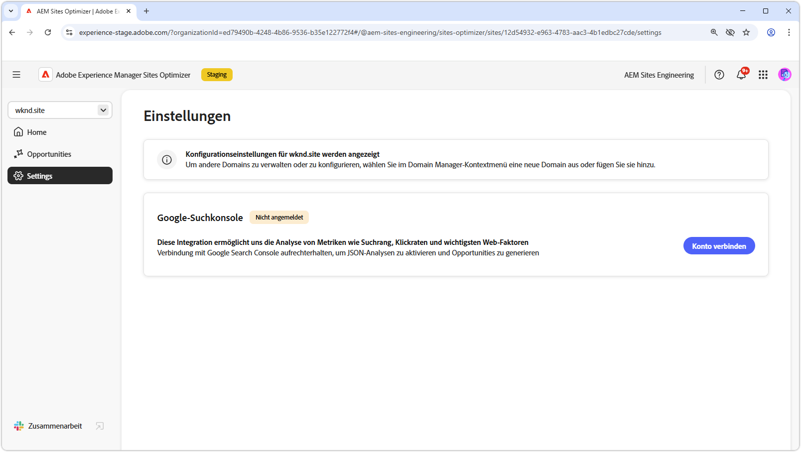
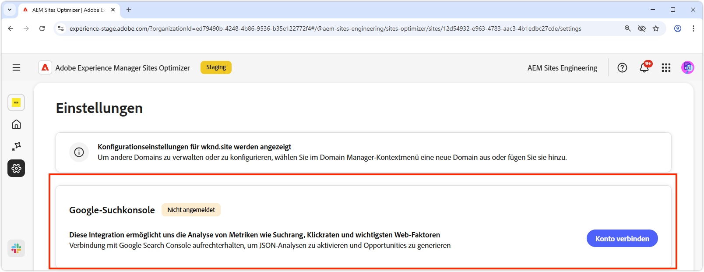
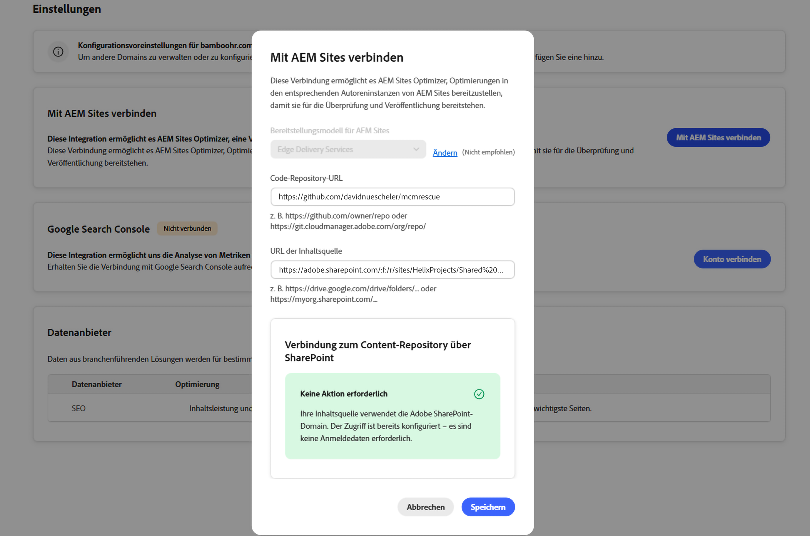
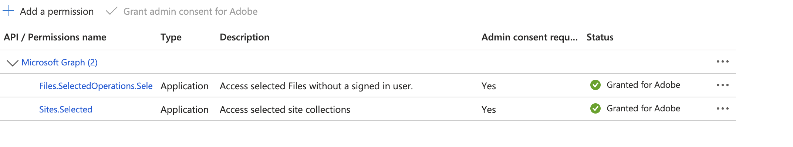
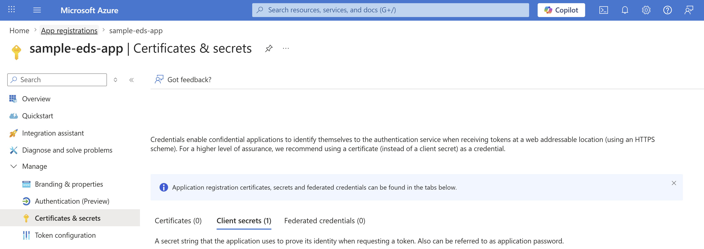
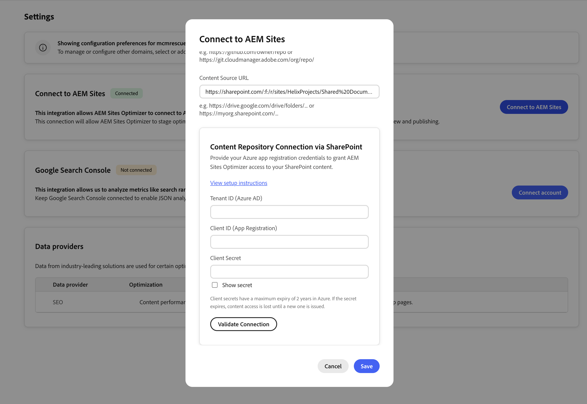
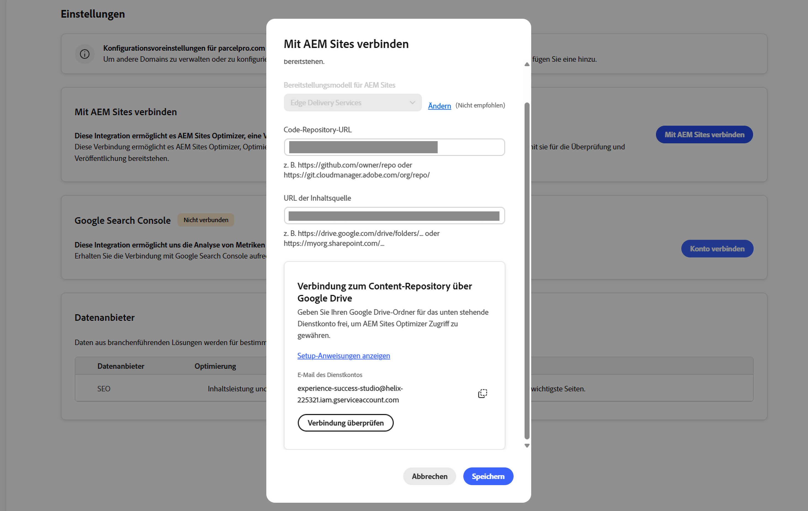

# Sites Optimizer-Einstellungen

{align="center"}

Die Einstellungen von Sites Optimizer sind der zentrale Hub für die Konfiguration Ihres Sites Optimizer-Erlebnisses.

## Google Search Console

{align="center"}

Der Connector für die Google Search Console-Einstellungen in AEM Sites Optimizer ermöglicht die Analyse von wichtigen SEO-Metriken wie Platzierungen in Suchergebnissen, Klickraten und Core Web Vitals. Durch das Aufrechterhalten der Verbindung mit der Google Search Console können Sie die JSON-Analyse nutzen, um Optimierungsmöglichkeiten zu entdecken und die Site-Leistung zu verbessern.

Für die Einrichtung dieses Connectors benötigen Sie Anmeldeinformationen mit Administratorzugriff auf die Google Search Console für die Domain.

## Mit AEM Sites verbinden

In diesem Leitfaden wird beschrieben, wie Sie Ihre bestehende Edge Delivery Services-Site (EDS) mit AEM Sites Optimizer verbinden. Bevor Sie beginnen, stellen Sie sicher, dass Ihre EDS-Site bereits eingerichtet ist und funktioniert. Diese Verbindung ist speziell für den Zugriff von AEM Sites Optimizer auf Ihre Inhalte vorgesehen.

Die Verbindung erfordert zwei Schritte:

1. Geben Sie Ihre Code-Repository-URL und Inhaltsquellen-URL an.
2. Gewähren Sie AEM Sites Optimizer Zugriff auf Ihre Inhaltsquelle.

### Schritt 1: Verknüpfen des Code-Repositorys und der Inhaltsquelle

Wechseln Sie in AEM Sites Optimizer zu **Einstellungen → Mit AEM Sites verbinden** und geben Sie Folgendes ein:

- **Code-Repository-URL** – die GitHub-URL Ihrer EDS-Site, z. B.:
  `https://github.com/owner/repo`

- **Inhaltsquellen-URL** – die URL des SharePoint-Ordners oder Google Drive-Ordners, auf dem Ihre EDS-Site beruht, z. B.:
  `https://drive.google.com/drive/folders/...` oder `https://myorg.sharepoint.com/...`

Sobald Sie die Inhaltsquellen-URL eingeben, erkennt AEM Sites Optimizer den Typ Ihrer Inhaltsquelle und zeigt die entsprechenden Zugriffsanweisungen unten an.

### Schritt 2: Gewähren des Zugriffs auf Ihre Inhaltsquelle

Folgen Sie den Anleitungen in dem Abschnitt, der Ihrer Inhaltsquelle entspricht.

#### SharePoint – Adobe-Domain

{align="center"}

Wenn Ihre Inhaltsquellen-URL die SharePoint-Domain von Adobe verwendet, sind keine weiteren Maßnahmen erforderlich. Der Zugriff ist bereits konfiguriert. Klicken Sie zum Herstellen der Verbindung auf **Speichern**.

#### SharePoint – Benutzerdefinierte Domain

Wenn Ihre Inhaltsquellen-URL eine eigene SharePoint-Domain Ihres Unternehmens verwendet, müssen Sie eine Azure-Anwendung registrieren und deren Anmeldeinformationen für AEM Sites Optimizer angeben.

##### Voraussetzungen

- Berechtigung zur Registrierung von Anwendungen im Azure-Portal oder eine Kontaktperson, die die Anwendungen in Ihrem Namen registrieren kann.
- Mandantenadministratorrechte, um das API-Einverständnis zu erteilen, oder eine Administratorin oder ein Administrator, die bzw. der das API-Einverständnis für Sie genehmigen kann.

##### Schritt 2a – Registrieren einer Anwendung in Azure

1. Wechseln Sie zu **Azure-Portal → Microsoft Entra ID → App-Registrierungen → Neue Registrierung**.
2. Vergeben Sie einen Namen, z. B.: `AEM Sites Optimizer`.
3. Übernehmen Sie für alle anderen Angaben die Standardwerte und klicken Sie auf **Registrieren**.
4. Notieren Sie sich folgende Informationen auf der Seite **Überblick**:
   - **Anwendungs-ID (Client)**
   - **Verzeichnis-ID (Mandant)**

##### Schritt 2b – Hinzufügen von API-Berechtigungen

1. Navigieren Sie zu **API-Berechtigungen → Berechtigung hinzufügen → Microsoft Graph → Anwendungsberechtigungen**.
2. Fügen Sie die beiden folgenden Angaben hinzu:
   - `Sites.Selected` – Bereichsbasierter Zugriff auf bestimmte SharePoint-Website-Sammlungen.
   - `Files.SelectedOperations.Selected` – Dateizugriff ohne angemeldete Person.
3. Klicken Sie für beides auf **Administratoreinverständnis erteilen**.

{align="center"}

>[!NOTE]
>
>Für die Erteilung des Administratoreinverständnisses sind Administratorrechte auf Mandantenseite erforderlich. Sollten diese nicht vorhanden sein, bitten Sie Ihre IT- oder Azure-Admin-Fachkraft, diesen Schritt abzuschließen, bevor Sie fortfahren.

##### Schritt 2c – Erstellen eines Client-Geheimnisses

{align="center"}

1. Navigieren Sie zu **Zertifikate und Geheimnisse → Neues Client-Geheimnis**.
2. Legen Sie eine Beschreibung und ein Ablaufdatum fest und klicken Sie dann auf **Hinzufügen**.
3. Kopieren Sie den geheimen Wert sofort – er wird nur einmal angezeigt.

##### Schritt 2d – Gewähren des App-Zugriffs auf Ihre SharePoint-Site

Sie können Microsoft Graph Explorer, PowerShell oder direkte Graph-API-Aufrufe verwenden, um der App Zugriff zu gewähren.

Navigieren Sie zu [Microsoft Graph Explorer](https://developer.microsoft.com/graph/graph-explorer), melden Sie sich mit Ihrem Microsoft-Konto an und führen Sie die folgenden Anfragen aus:

1. Ermitteln Sie die Site-ID:

```
GET https://graph.microsoft.com/v1.0/sites/{tenant}.sharepoint.com:/sites/{site-name}
```

1. Kopieren Sie die `id` aus der Antwort und gewähren Sie dann Zugriff auf Site-Ebene:

```
POST https://graph.microsoft.com/v1.0/sites/{siteId}/permissions
```

Hauptteil:

```json
{
  "roles": ["write"],
  "grantedToIdentities": [{
    "application": {
      "id": "{your-client-id}",
      "displayName": "{Your app name}"
    }
  }]
}
```

##### Schritt 2e – Eingeben der Anmeldedaten in AEM Sites Optimizer

{align="center"}

Geben Sie im Dialogfeld **Mit AEM Sites verbinden** Folgendes unter **Content Repository-Verbindung über SharePoint** ein:

- **Mandanten-ID (Azure AD)** – aus „App-Registrierung → Überblick“.
- **Client-ID (App-Registrierung)** – aus „App-Registrierung → Überblick“.
- **Client-Geheimnis** – in Schritt 2c erstellt.

Klicken Sie auf **Verbindung überprüfen**, um den Zugriff zu bestätigen, und klicken Sie dann auf **Speichern**.

#### Google Drive

{align="center"}

1. Klicken Sie in Google Drive mit der rechten Maustaste auf den Ordner, auf dem Ihre EDS-Site basiert, und wählen Sie **Freigeben**.
2. Geben Sie im Feld **Personen und Gruppen hinzufügen** die E-Mail-Adresse des Service-Kontos ein, die im Dialogfeld **Mit AEM Sites verbinden** angezeigt wird:
   `experience-success-studio@helix-225321.iam.gserviceaccount.com`
3. Setzen Sie die Berechtigungsstufe auf **Editor**.
4. Deaktivieren Sie **Personen benachrichtigen** und klicken Sie auf **Freigeben**.

Nachdem die Freigabe abgeschlossen ist, klicken Sie im Dialogfeld auf **Verbindung überprüfen** und anschließend auf **Speichern**.
