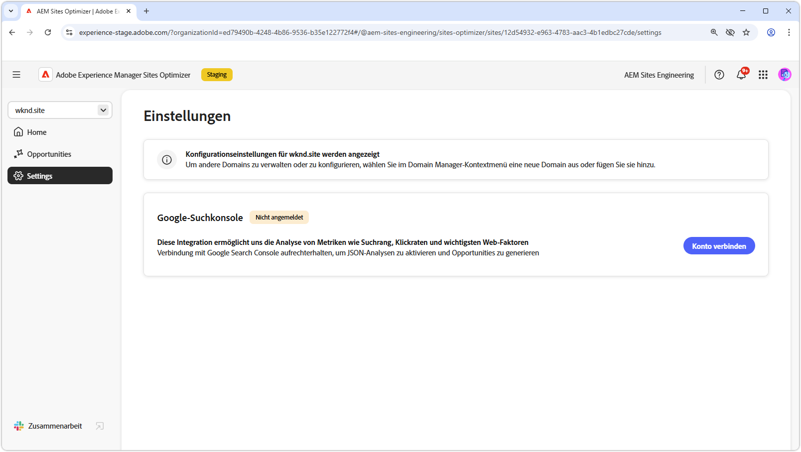
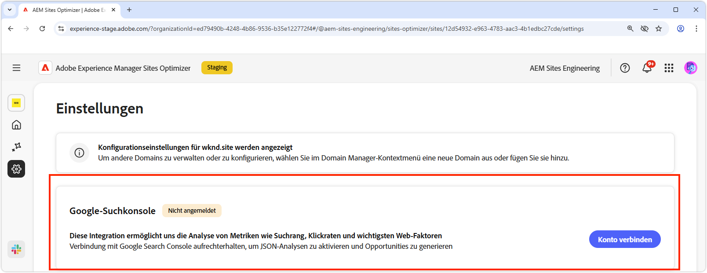
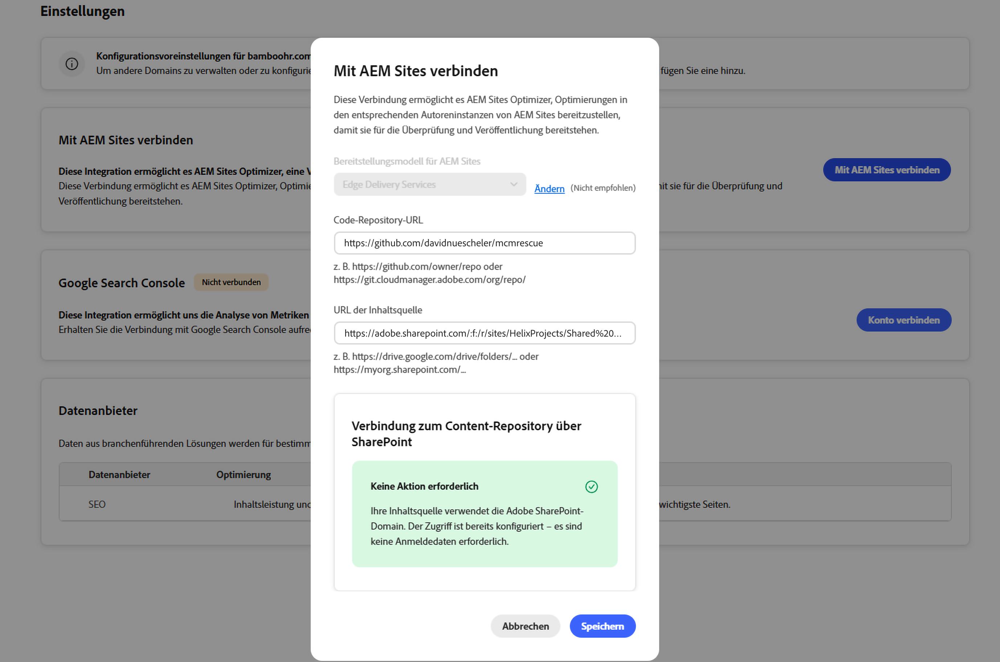
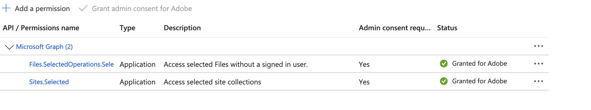
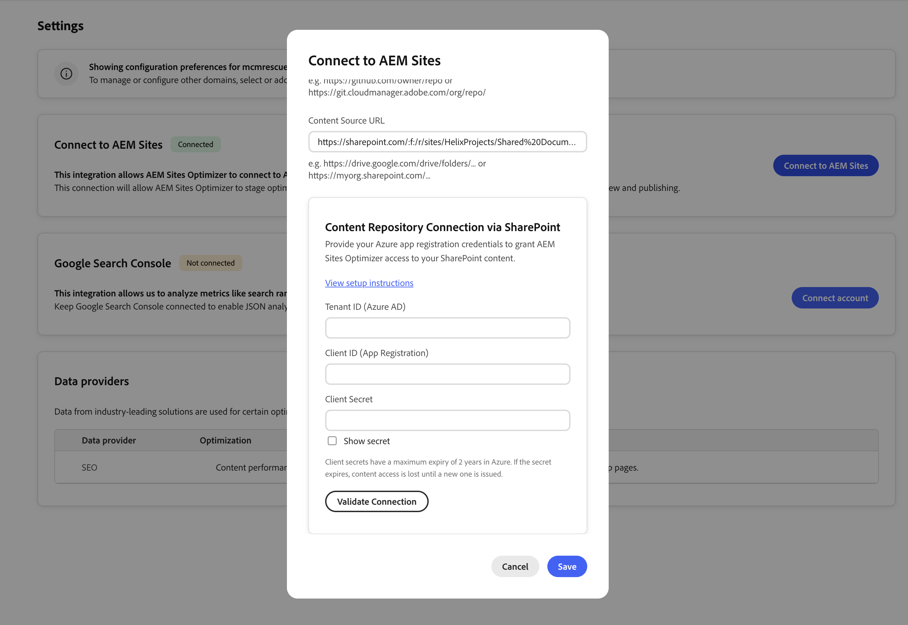

# Sites Optimizer-Einstellungen

{align="center"}

Die Einstellungen von Sites Optimizer sind der zentrale Hub für die Konfiguration Ihres Sites Optimizer-Erlebnisses.

## Google Search Console

{align="center"}

Der Connector für die Google Search Console-Einstellungen in AEM Sites Optimizer ermöglicht die Analyse von wichtigen SEO-Metriken wie Platzierungen in Suchergebnissen, Klickraten und Core Web Vitals. Durch das Aufrechterhalten der Verbindung mit der Google Search Console können Sie die JSON-Analyse nutzen, um Optimierungsmöglichkeiten zu entdecken und die Site-Leistung zu verbessern.

Für die Einrichtung dieses Connectors benötigen Sie Anmeldeinformationen mit Administratorzugriff auf die Google Search Console für die Domain.

## Mit AEM Sites verbinden

In diesem Leitfaden wird beschrieben, wie Sie Ihre bestehende Edge Delivery Services-Site (EDS) mit AEM Sites Optimizer verbinden. Bevor Sie beginnen, stellen Sie sicher, dass Ihre EDS-Site bereits eingerichtet ist und funktioniert. Diese Verbindung ist speziell für den Zugriff von AEM Sites Optimizer auf Ihre Inhalte vorgesehen.

Die Verbindung erfordert zwei Schritte:

1. Geben Sie Ihre Code-Repository-URL und Inhaltsquellen-URL an.
2. Gewähren Sie AEM Sites Optimizer Zugriff auf Ihre Inhaltsquelle.

### Schritt 1: Verknüpfen des Code-Repositorys und der Inhaltsquelle

Wechseln Sie in AEM Sites Optimizer zu **Einstellungen → Mit AEM Sites verbinden** und geben Sie Folgendes ein:

- **Code-Repository-URL** – die GitHub-URL Ihrer EDS-Site, z. B.:
  `https://github.com/owner/repo`

- **Inhaltsquellen-URL** – die URL des SharePoint-Ordners oder Google Drive-Ordners, auf dem Ihre EDS-Site beruht, z. B.:
  `https://drive.google.com/drive/folders/...` oder `https://myorg.sharepoint.com/...`

Sobald Sie die Inhaltsquellen-URL eingeben, erkennt AEM Sites Optimizer den Typ Ihrer Inhaltsquelle und zeigt die entsprechenden Zugriffsanweisungen unten an.

### Schritt 2: Gewähren des Zugriffs auf Ihre Inhaltsquelle

Folgen Sie den Anleitungen in dem Abschnitt, der Ihrer Inhaltsquelle entspricht.

#### SharePoint – Adobe-Domain

{align="center"}

Wenn Ihre Inhaltsquellen-URL die SharePoint-Domain von Adobe verwendet, sind keine weiteren Maßnahmen erforderlich. Der Zugriff ist bereits konfiguriert. Klicken Sie zum Herstellen der Verbindung auf **Speichern**.

#### SharePoint – Benutzerdefinierte Domain

Wenn Ihre Inhaltsquellen-URL eine eigene SharePoint-Domain Ihres Unternehmens verwendet, müssen Sie eine Azure-Anwendung registrieren und deren Anmeldeinformationen für AEM Sites Optimizer angeben.

##### Voraussetzungen

- Berechtigung zur Registrierung von Anwendungen im Azure-Portal oder eine Kontaktperson, die die Anwendungen in Ihrem Namen registrieren kann.
- Mandantenadministratorrechte, um das API-Einverständnis zu erteilen, oder eine Administratorin oder ein Administrator, die bzw. der das API-Einverständnis für Sie genehmigen kann.

##### Schritt 2a – Registrieren einer Anwendung in Azure

1. Wechseln Sie zu **Azure-Portal → Microsoft Entra ID → App-Registrierungen → Neue Registrierung**.
2. Vergeben Sie einen Namen, z. B.: `AEM Sites Optimizer`.
3. Übernehmen Sie für alle anderen Angaben die Standardwerte und klicken Sie auf **Registrieren**.
4. Notieren Sie sich folgende Informationen auf der Seite **Überblick**:
   - **Anwendungs-ID (Client)**
   - **Verzeichnis-ID (Mandant)**

##### Schritt 2b – Hinzufügen von API-Berechtigungen

1. Navigieren Sie zu **API-Berechtigungen → Berechtigung hinzufügen → Microsoft Graph → Anwendungsberechtigungen**.
2. Fügen Sie die beiden folgenden Angaben hinzu:
   - `Sites.Selected` – Bereichsbasierter Zugriff auf bestimmte SharePoint-Website-Sammlungen.
   - `Files.SelectedOperations.Selected` – Dateizugriff ohne angemeldete Person.
3. Klicken Sie für beides auf **Administratoreinverständnis erteilen**.

{align="center"}

>[!NOTE]
>
>Für die Erteilung des Administratoreinverständnisses sind Administratorrechte auf Mandantenseite erforderlich. Sollten diese nicht vorhanden sein, bitten Sie Ihre IT- oder Azure-Admin-Fachkraft, diesen Schritt abzuschließen, bevor Sie fortfahren.

##### Schritt 2c – Erstellen eines Client-Geheimnisses

{align="center"}

1. Navigieren Sie zu **Zertifikate und Geheimnisse → Neues Client-Geheimnis**.
2. Legen Sie eine Beschreibung und ein Ablaufdatum fest und klicken Sie dann auf **Hinzufügen**.
3. Kopieren Sie den geheimen Wert sofort – er wird nur einmal angezeigt.

##### Schritt 2d – Gewähren des App-Zugriffs auf Ihre SharePoint-Site

Sie können Microsoft Graph Explorer, PowerShell oder direkte Graph-API-Aufrufe verwenden, um der App Zugriff zu gewähren.

Navigieren Sie zu [Microsoft Graph Explorer](https://developer.microsoft.com/graph/graph-explorer), melden Sie sich mit Ihrem Microsoft-Konto an und führen Sie die folgenden Anfragen aus:

1. Ermitteln Sie die Site-ID:

```
GET https://graph.microsoft.com/v1.0/sites/{tenant}.sharepoint.com:/sites/{site-name}
```

1. Kopieren Sie die `id` aus der Antwort und gewähren Sie dann Zugriff auf Site-Ebene:

```
POST https://graph.microsoft.com/v1.0/sites/{siteId}/permissions
```

Hauptteil:

```json
{
  "roles": ["write"],
  "grantedToIdentities": [{
    "application": {
      "id": "{your-client-id}",
      "displayName": "{Your app name}"
    }
  }]
}
```

##### Schritt 2e – Eingeben der Anmeldedaten in AEM Sites Optimizer

{align="center"}

Geben Sie im Dialogfeld **Mit AEM Sites verbinden** Folgendes unter **Content Repository-Verbindung über SharePoint** ein:

- **Mandanten-ID (Azure AD)** – aus „App-Registrierung → Überblick“.
- **Client-ID (App-Registrierung)** – aus „App-Registrierung → Überblick“.
- **Client-Geheimnis** – in Schritt 2c erstellt.

Klicken Sie auf **Verbindung überprüfen**, um den Zugriff zu bestätigen, und klicken Sie dann auf **Speichern**.

#### Google Drive

{align="center"}

1. Klicken Sie in Google Drive mit der rechten Maustaste auf den Ordner, auf dem Ihre EDS-Site basiert, und wählen Sie **Freigeben**.
2. Geben Sie im Feld **Personen und Gruppen hinzufügen** die E-Mail-Adresse des Service-Kontos ein, die im Dialogfeld **Mit AEM Sites verbinden** angezeigt wird:
   `aem-sites-optimizer@adbe-gcp0843.iam.gserviceaccount.com`
3. Setzen Sie die Berechtigungsstufe auf **Editor**.
4. Deaktivieren Sie **Personen benachrichtigen** und klicken Sie auf **Freigeben**.

Nachdem die Freigabe abgeschlossen ist, klicken Sie im Dialogfeld auf **Verbindung überprüfen** und anschließend auf **Speichern**.

## Verwalten von Benutzerberechtigungen

Steuern Sie, wer auf eine Site in Sites Optimizer zugreifen kann und was damit möglich ist. Der Zugriff basiert auf einer kleinen Anzahl unabhängiger *Funktionen* - Anzeigen, Bearbeiten, Bereitstellen, Konfigurieren und Verwalten von Benutzern -, die Sie jeder Person gewähren.

Zugriff ist **additiv**: Die Berechtigungen einer Person sind die Summe von allem, was ihr gewährt wurde. Es gibt kein „Verweigern“, daher widersprechen sich Zuschüsse nie oder löschen sich gegenseitig aus. Um jemandem weniger Zugriff zu gewähren, entfernen Sie eine Grant-ID, anstatt zu versuchen, sie zu überschreiben.

### Gewähren des Zugriffs

Es gibt zwei Möglichkeiten, wie eine Person Zugriff erhalten kann, und sie arbeiten zusammen:

- **Organisationsweiter Zugriff** - Wird von Ihrem Adobe-Organisationsadministrator in der [Adobe Admin Console zugewiesen](https://adminconsole.adobe.com/). Dies gilt für alle Sites in Ihrem Unternehmen. Nutzen Sie es für Personen, die überall den gleichen Zugang benötigen.
- **Zugriff auf Site** - wird in Sites Optimizer auf der Seite **Einstellungen → Berechtigungen** zugewiesen. Sie gilt für eine einzelne Site und kann so breit oder so schmal wie nötig sein. Es ist kein Zugriff auf Admin Console erforderlich.

>[!NOTE]
>
>Die beiden Schichten addieren sich. Jemand mit organisationsweitem Ansichtszugriff, dem auch die Berechtigung „Bearbeiten“ auf einer Website gewährt wird, kann jede Website anzeigen und diese bearbeiten. Damit eine Person auf eine einzelne Site beschränkt bleibt, stellen Sie sicher, dass sie nicht auch eine organisationsweite Rolle innehat.

#### Unternehmensweite Rollen (Admin Console)

Der organisationsweite Zugriff erfolgt über eine von zwei **AEM Sites Optimizer**-Produktrollen, die in der [Adobe Admin Console zugewiesen &#x200B;](https://adminconsole.adobe.com/):

- **ASO Manager** - Vollständiger Zugriff auf jede Website, einschließlich **Benutzer verwalten**. Ein Manager kann die Seite **Berechtigungen** für jede Site öffnen und anderen Zugriff zuweisen.
- **ASO User** — Nur-Ansicht-Zugriff auf jede Website. Keine Änderungen und keine Benutzerverwaltung.

Um eine Rolle zuzuweisen, müssen Sie ein **Systemadministrator** für das Unternehmen oder ein (**)** für AEM Sites Optimizer sein.

1. Melden Sie sich bei der [Adobe Admin Console](https://adminconsole.adobe.com/) an.
1. Navigieren Sie zu **Produkte** und wählen Sie **AEM Sites Optimizer** aus.
1. Öffnen Sie die **Benutzer** und fügen Sie den Benutzer per E-Mail hinzu (oder wählen Sie einen vorhandenen Benutzer aus).
1. Klicken Sie auf **+** (Hinzufügen), um ein Produktprofil hinzuzufügen, und wählen Sie dann das Produktprofil aus.

   {align="center"}

1. Klicken Sie auf **Weiter**.
1. Wählen Sie die Rolle aus **ASO Manager** für Vollzugriff oder **ASO User** für Nur-Ansicht-Zugriff - und klicken Sie dann auf **Anwenden**.

   {align="center"}

   {align="center"}

Weitere Informationen zum Hinzufügen von Benutzern finden Sie unter [Onboarden von Benutzern](setup/onboard-users.md).

>[!IMPORTANT]
>
>Nur ein Organisations-Admin kann organisationsweit **Benutzer verwalten** gewähren. Ein Mitglied, das **Benutzer verwalten** auf einer Site hat, kann Zugriff auf diese Site zuweisen, aber keinen organisationsweiten **ASO-Manager** erstellen.

### Funktionsstufen

Jede Funktion steuert eine Art von Aktion. Sie sind unabhängig, z. B. können Sie die Bereitstellung ohne Bearbeitung gewähren.

| Funktion | Was es erlaubt | Was nicht zulässig ist |
|---|---|---|
| Anzeigen | Anzeigen der Daten der Website - Chancen, Vorschläge, Fehlerbehebungen, Berichte und Konfiguration - ohne Änderungen. | Jede Änderung. |
| Bearbeiten | Gelegenheiten und Vorschläge erstellen und ändern (was sollte sich ändern). | Veröffentlichen von Änderungen, Ändern von Einstellungen oder Verwalten von Benutzern. |
| Bereitstellen | Fehlerbehebungen live auf der Site veröffentlichen und zurücksetzen. | Verwalten von Benutzern. |
| Konfigurieren | Ändern Sie die Einstellungen und Verbindungen der Site. | Veröffentlichen von Fehlerbehebungen oder Verwalten von Benutzern. |
| Verwalten von Benutzenden | Gewähren oder widerrufen Sie den Zugriff anderer Mitglieder auf die Website. | Verwalten einer Site, auf die die Person noch keinen Zugriff hat. |

>[!NOTE]
>
>**Ansicht ist immer enthalten.** Jede Grant-Aktion enthält automatisch „Anzeigen“ - Sie können etwas, das Sie nicht sehen können, nicht verwalten, konfigurieren, bearbeiten oder bereitstellen. Aus diesem Grund kann View nicht eigenständig entfernt werden. Um den Zugriff einer Person vollständig zu entfernen, entfernen Sie das Mitglied (siehe [Bearbeiten oder Entfernen eines Mitglieds](#edit-or-remove-a-member) unten), anstatt jede Funktion zu deaktivieren.

### Zugriffsbereich auf Opportunity-Typen erweitern

Auf einer einzelnen Site können Sie die Ansicht, Bearbeitung und Bereitstellung für **bestimmte Opportunity-Typen** (z. B. Core Web Vitals oder fehlerhafte interne Links) anstelle der gesamten Site gewähren. Auf diese Weise kann eine Person Core Web Vitals bearbeiten, während nur alles andere angezeigt wird.

- **Anzeigen**, **Bearbeiten** und **Bereitstellen** können auf einen oder mehrere Opportunity-Typen oder **Alle** Opportunity-Typen angewendet werden.
- **Konfigurieren** und **Benutzer verwalten** gelten immer für die gesamte Site - sie können nicht auf einen Opportunity-Typ beschränkt sein.

Jede in den Umfang einbezogene Finanzhilfe wird als eigene Zeile für das Mitglied mit einer Spalte **Gilt für** mit dem Opportunity-Typ, **Alle** oder **Site-Wide** angezeigt.

>[!CAUTION]
>
>Der Umfang beschränkt nur *, was* Gewährt - er entfernt nie den Zugriff, den ein anderer Gewährt gewährt. Wenn eine Person auch über organisationsweiten Zugriff verfügt oder eine **Alle**-Typ-Gewährung verfügt, gilt dieser breitere Zugriff weiterhin. Um jemanden wirklich auf bestimmte Opportunity-Typen zu beschränken, stellen Sie sicher, dass er nicht auch eine breitere Rolle oder eine **All**-types-Förderung innehat.

### Mitglied hinzufügen

1. Gehen Sie zu **Einstellungen → Berechtigungen** und wählen Sie die Site aus.
1. Klicken Sie **Mitglieder hinzufügen**.
1. Nach Name oder E-Mail suchen und eine oder mehrere Personen auswählen.
1. Wählen Sie die **Opportunity-Typen** für die der Zugriff gilt (oder **Alle**), und wählen Sie dann die zu gewährenden Funktionen aus.
1. Klicken Sie auf **Hinzufügen**.

<!-- MEDIA PENDING: Site Manager / Site User walkthrough videos are being re-recorded with demo data to remove PII, then re-uploaded to video.tv.adobe.com and embedded here with >[!VIDEO]. The earlier uploads v/3503767 and v/3503768 (KT-22672 / KT-22673) contain PII and must not be used. -->

### Mitglied bearbeiten oder entfernen

In der **Mitglieder** Tabelle:

- Klicken Sie **Funktionen bearbeiten** in der Zeile eines Mitglieds, um zu ändern, was es tun kann. Wenn Sie ein vorhandenes Grant bearbeiten, bleibt sein Opportunity-Typ unverändert - Sie ändern nur die Funktionen und mindestens eine Funktion muss ausgewählt bleiben.
- Klicken Sie **Entfernen**, um dem Abonnenten den Zugriff auf die Website vollständig zu entziehen.

>[!NOTE]
>
>Das Ändern von Funktionen und das Entfernen eines Mitglieds sind unterschiedliche Aktionen. Um allen Zugriff zu entziehen, verwenden Sie **Entfernen** - Sie können dies nicht tun, indem Sie die Option „Funktionen“ deaktivieren, da eine Grant-ID mindestens eine Funktion beibehalten muss (und die Ansicht immer beibehalten wird).

### Wer Berechtigungen verwalten kann

Die **Berechtigungen** für eine Site ist verfügbar für:

- Mitglieder mit der Funktion **Benutzer verwalten** auf dieser Website und
- Organisationsadministratoren (ein ASO-Manager).

Mitglieder ohne **Benutzer verwalten** sehen eine Meldung, dass sie nicht über die Berechtigung zum Verwalten des Zugriffs für diese Website verfügen.

### Aktivieren der Benutzer- und Zugriffsverwaltung

Die Benutzer- und Zugriffsverwaltung wird durch eine Einstellung für Ihre Organisation gesteuert. Sie können den Zugriff vor dem Aktivieren zuweisen, aber er wird nur **erzwungen** wenn die Einstellung aktiviert ist.

Wenn es noch nicht aktiviert ist, werden auf der Seite **Berechtigungen** ein Banner angezeigt, in dem Sie aufgefordert werden, sich an Ihr Konto-Team zu wenden. Wenden Sie sich an Ihr Sites Optimizer-Account-Team, um es einzuschalten.

>[!NOTE]
>
>Bis die Benutzer- und Zugriffsverwaltung aktiviert ist, werden die von Ihnen zugewiesenen Berechtigungen gespeichert, aber nicht erzwungen.

### Häufig gestellte Fragen

**Benötigen Mitglieder auf Site-Ebene eine Admin Console-Rolle?**

Nein. Der Zugriff auf Site-Ebene wird vollständig innerhalb von Sites Optimizer auf der Seite **Berechtigungen** gewährt. In der Admin Console werden nur organisationsweite Rollen zugewiesen.

**Was passiert, wenn jemand sowohl unternehmensweiten als auch Standortzugriff hat?**

Beides gilt. Ihr tatsächlicher Zugang ist die Kombination aus beidem. Finanzhilfen stehen nie im Konflikt, da kein Finanzhilfeempfänger den Zugriff verweigern kann.

**Warum kann ein Mitglied mit „Benutzer verwalten“ keinen organisationsweiten Manager erstellen?**

Das Erstellen einer organisationsweiten Rolle ist eine Admin Console-Aktion. Ein Mitglied mit **Benutzer verwalten** kann Zugriff auf seine eigene Site zuweisen, aber nur ein Organisationsadministrator kann organisationsweite Rollen gewähren.

**Wie kann ich einer Person den Zugriff auf eine Website entziehen?**

Entfernen Sie die Gewährung auf der Seite **Berechtigungen** . Dies unterscheidet sich von den Bearbeitungsfunktionen, bei denen immer mindestens eine Funktion verbleiben muss.

**Kann ich eine Person auf bestimmte Opportunity-Typen beschränken?**

Ja - Ansicht, Bearbeitung oder Bereitstellung für bestimmte Opportunity-Typen anstelle von &quot;**&quot;**. Da der Zugriff additiv ist, wird dies nur wirksam, wenn die Person nicht auch über organisationsweiten Zugriff oder eine **Alle**-Gewährungstypen verfügt.
