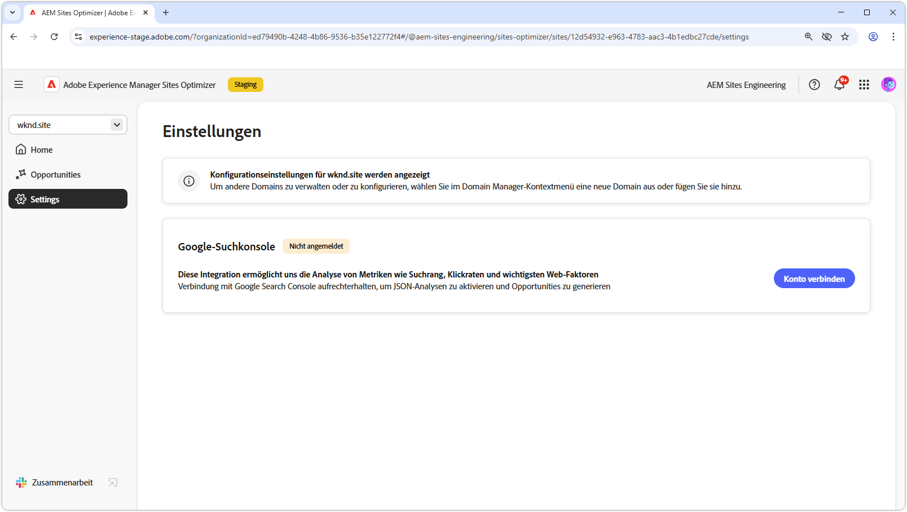

# Sites Optimizer-Einstellungen

{align="center"}

Site Optimizer-Einstellungen sind der zentrale Hub für die Konfiguration Ihres Sites Optimizer-Erlebnisses.

## Google Search Console

{align="center"}

Der Google Search Console-Einstellungen-Connector in AEM Sites Optimizer ermöglicht die Analyse von wichtigen SEO-Metriken wie Such-Ranking, Clickthrough-Raten und Core Web Vitals. Wenn Sie die Google Search Console verbinden, können Sie die JSON-Analyse nutzen, um Optimierungsmöglichkeiten zu entdecken und die Site-Performance zu verbessern.

Um diesen Connector einzurichten, benötigen Sie Anmeldeinformationen mit Administratorzugriff auf die Google-Suchkonsole für die Domain.
