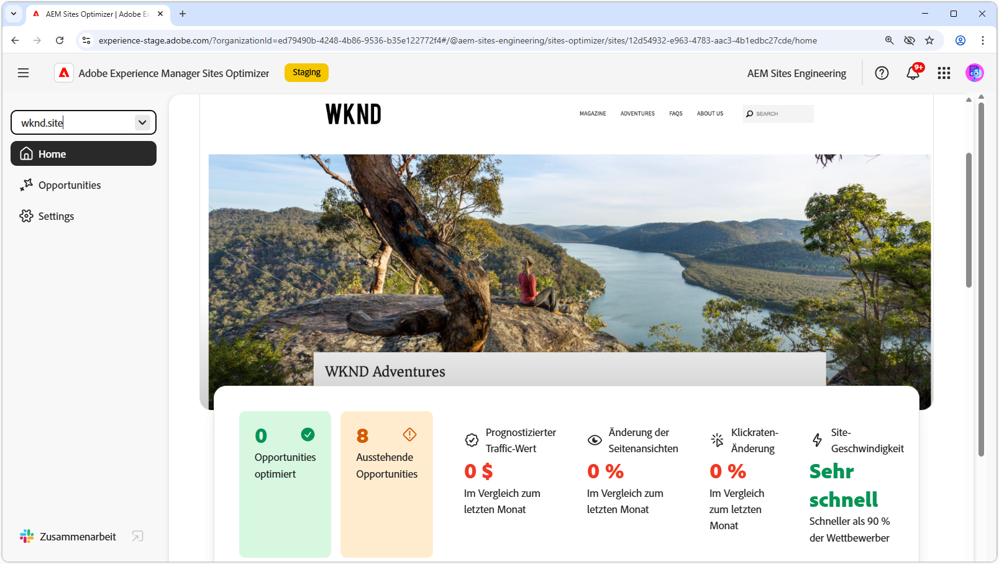

# AEM Sites Optimizer

{align="center"}

Adobe Experience Manager (AEM) Sites Optimizer ist ein Cloud-basierter Service, der die Leistung von Websites analysiert und verbessert, die auf AEM basieren. Es identifiziert Bereiche, in denen das Laden von Seiten, die Verwendung von Komponenten und die Bereitstellung von Inhalten verbessert werden können, wodurch Sie die Leistung Ihrer Website verbessern und die Wartungs- und Aktualisierungskosten senken können. Durch die Verwendung von Sites Optimizer können Sie ein reibungsloses und zuverlässiges Online-Erlebnis gewährleisten, was für die Aufrechterhaltung von Interaktionen und Konversionen wichtig ist.

## Erste Schritte mit Sites Optimizer

<!-- CARDS 

* ./opportunity-types/overview.md
   {title=Opportunity types}
   {description = Learn about the available Site Optimizer opportunities and how to use them to improve your site's performance.}
* ./documentation/overview.md
  * {title=Documentation}
  * {description=Explore the Sites Optimizer documentation to learn about all its capabilities.}

-->
<!-- START CARDS HTML - DO NOT MODIFY BY HAND -->

    

        

            

                <figure class="image x-is-16by9">
                    
                </figure>
            

            

                

                    

                        <a href="./opportunity-types/overview.md" target="_blank" rel="referrer" title="Opportunity-Typen">Opportunity-Typen</a>
                    

                    
Erfahren Sie mehr über die verfügbaren Site Optimizer-Möglichkeiten und wie Sie diese verwenden können, um die Leistung Ihrer Site zu verbessern.

                

                <a href="./opportunity-types/overview.md" target="_blank" rel="referrer" class="spectrum-Button spectrum-Button--outline spectrum-Button--primary spectrum-Button--sizeM" style="align-self: flex-start; margin-top: 1rem;">
                    Mehr erfahren
                </a>
            

        

    

    

        

            

                <figure class="image x-is-16by9">
                    
                </figure>
            

            

                

                    

                        <a href="./documentation/overview.md" target="_blank" rel="referrer" title="Dokumentation">Dokumentation</a>
                    

                    
In der Sites Optimizer-Dokumentation erfahren Sie mehr über alle zugehörigen Funktionen.

                

                <a href="./documentation/overview.md" target="_blank" rel="referrer" class="spectrum-Button spectrum-Button--outline spectrum-Button--primary spectrum-Button--sizeM" style="align-self: flex-start; margin-top: 1rem;">
                    Mehr erfahren
                </a>
            

        

    

<!-- END CARDS HTML - DO NOT MODIFY BY HAND -->
