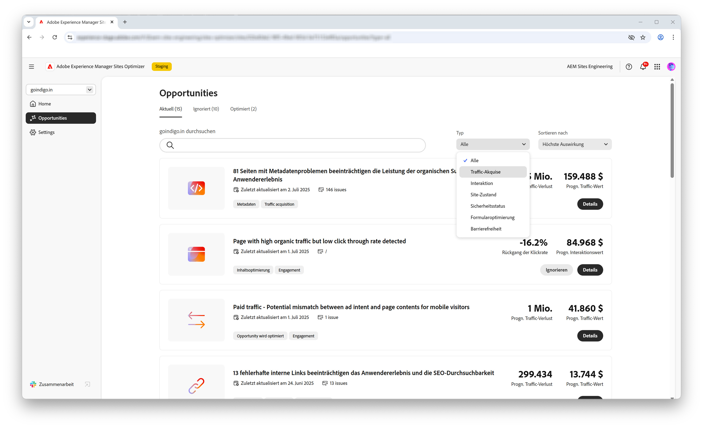
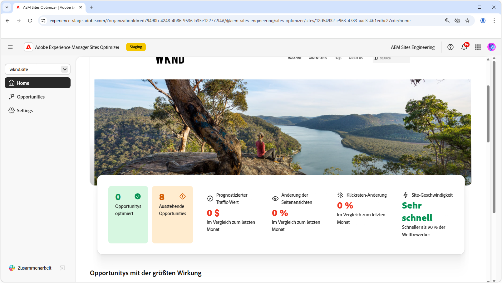

# AEM Sites Optimizer

>[!VIDEO](https://video.tv.adobe.com/v/3455094/?learn=on&enablevpops&captions=ger)

Adobe Experience Manager (AEM) Sites Optimizer ist ein Cloud-basierter Dienst, der die Leistung von auf AEM basierenden Websites analysiert und verbessert. Es werden Verbesserungsmöglichkeiten für das Laden von Seiten, die Verwendung von Komponenten und die Bereitstellung von Inhalten identifiziert. Diese Funktion trägt dazu bei, die Leistung Ihrer Website zu erhöhen und gleichzeitig die Kosten für Wartung und Aktualisierungen zu senken. Durch die Verwendung von Sites Optimizer können Sie ein reibungsloses und zuverlässiges Online-Erlebnis gewährleisten – ein wichtiger Faktor für die Aufrechterhaltung von Interaktionen und Konversionen.

## Erste Schritte mit Sites Optimizer

<!-- CARDS 

* ./opportunity-types/overview.md
   {title=Opportunity types}
   {description = Learn about the available Site Optimizer opportunities and how to use them to improve your site's performance.}
* ./documentation/overview.md
  * {title=Documentation}
  * {description=Explore the Sites Optimizer documentation to learn about all its capabilities.}

-->
<!-- START CARDS HTML - DO NOT MODIFY BY HAND -->

    

        

            

                <figure class="image x-is-16by9">
                    
                </figure>
            

            

                

                    

                        <a href="./opportunity-types/overview.md" target="_blank" rel="referrer" title="Arten von Möglichkeiten">Arten von Möglichkeiten</a>
                    

                    
Erfahren Sie mehr über die verfügbaren Möglichkeiten in Sites Optimizer und darüber, wie Sie sie zur Verbesserung der Leistung Ihrer Site einsetzen können.

                

                <a href="./opportunity-types/overview.md" target="_blank" rel="referrer" class="spectrum-Button spectrum-Button--outline spectrum-Button--primary spectrum-Button--sizeM" style="align-self: flex-start; margin-top: 1rem;">
Mehr erfahren
</a>
            

        

    

    

        

            

                <figure class="image x-is-16by9">
                    
                </figure>
            

            

                

                    

                        <a href="./documentation/overview.md" target="_blank" rel="referrer" title="Dokumentation">Dokumentation</a>
                    

                    
Lesen Sie die Dokumentation zu Sites Optimizer, um mehr über alle darin enthaltenen Funktionen zu erfahren.

                

                <a href="./documentation/overview.md" target="_blank" rel="referrer" class="spectrum-Button spectrum-Button--outline spectrum-Button--primary spectrum-Button--sizeM" style="align-self: flex-start; margin-top: 1rem;">
Mehr erfahren
</a>
            

        

    

<!-- END CARDS HTML - DO NOT MODIFY BY HAND -->
