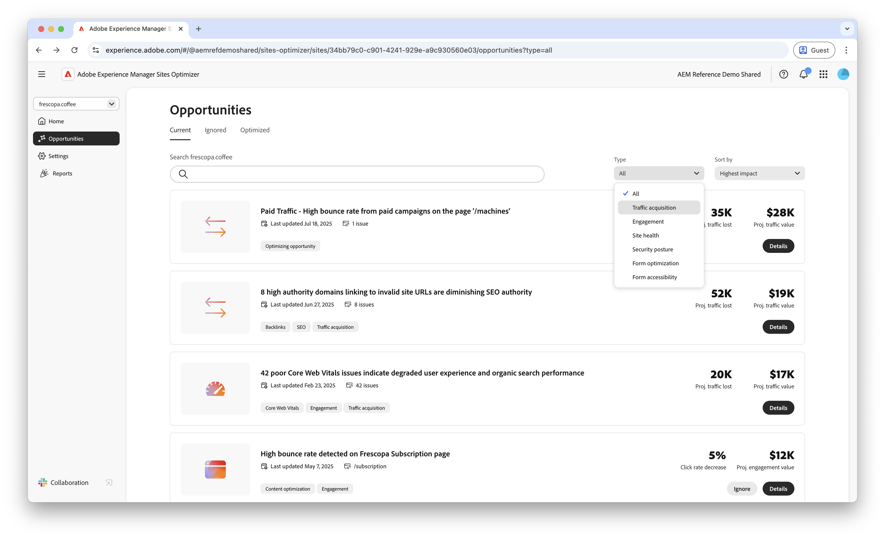
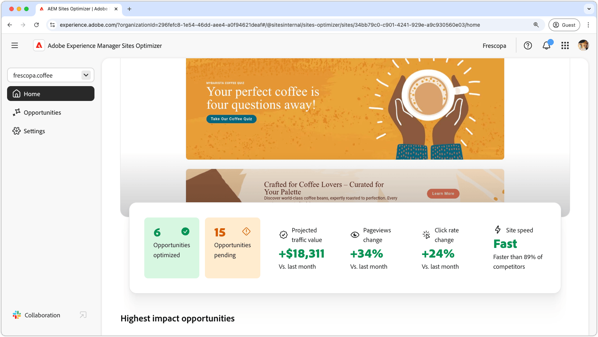

# AEM Sites Optimizer

>[!VIDEO](https://video.tv.adobe.com/v/3455094/?captions=ger&learn=on&enablevpops)

Adobe Experience Manager (AEM) Sites Optimizer ist ein Cloud-basierter Dienst, der die Leistung von auf AEM basierenden Websites analysiert und verbessert. Sites Optimizer identifiziert Verbesserungsmöglichkeiten für das Laden von Seiten, die Verwendung von Komponenten und die Bereitstellung von Inhalten. Diese Funktion trägt dazu bei, die Leistung Ihrer Website zu erhöhen und gleichzeitig die Kosten für Wartung und Aktualisierungen zu senken. Durch die Verwendung von Sites Optimizer können Sie ein reibungsloses und zuverlässiges Online-Erlebnis gewährleisten – ein wichtiger Faktor für die Aufrechterhaltung von Interaktionen und Konversionen.

## Erste Schritte mit Sites Optimizer

<!-- CARDS 

* ./opportunity-types/overview.md
    * {title=Opportunity types}
    * {description = Learn about the available Site Optimizer opportunities and how to use them to improve your site's performance.}
* ./documentation/preflight/overview.md
  * {title=Preflight documentation}
  * {description = Learn about the Preflight in Sites Optimizer and how to optimize your web pages before they're published.}
* ./documentation/overview.md
  * {title=Sites Optimizer documentation}
  * {description=Explore the Sites Optimizer documentation to learn about all its capabilities.}

-->
<!-- START CARDS HTML - DO NOT MODIFY BY HAND -->

    

        

            

                <figure class="image x-is-16by9">
                    
                </figure>
            

            

                

                    

                        <a href="./opportunity-types/overview.md" target="_blank" rel="referrer" title="Arten von Möglichkeiten">Arten von Möglichkeiten</a>
                    

                    
Erfahren Sie mehr über die verfügbaren Möglichkeiten in Sites Optimizer und darüber, wie Sie sie zur Verbesserung der Leistung Ihrer Site einsetzen können.

                

                <a href="./opportunity-types/overview.md" target="_blank" rel="referrer" class="spectrum-Button spectrum-Button--outline spectrum-Button--primary spectrum-Button--sizeM" style="align-self: flex-start; margin-top: 1rem;">
Mehr erfahren
</a>
            

        

    

    

        

            

                <figure class="image x-is-16by9">
                    
                </figure>
            

            

                

                    

                        <a href="./documentation/preflight/overview.md" target="_blank" rel="referrer" title="Dokumentation zu Preflight">Preflight-Dokumentation</a>
                    

                    
Erfahren Sie mehr über den Preflight in Sites Optimizer und wie Sie Ihre Web-Seiten optimieren können, bevor sie veröffentlicht werden.

                

                <a href="./documentation/preflight/overview.md" target="_blank" rel="referrer" class="spectrum-Button spectrum-Button--outline spectrum-Button--primary spectrum-Button--sizeM" style="align-self: flex-start; margin-top: 1rem;">
                    Mehr erfahren
                </a>
            

        

    

    

        

            

                <figure class="image x-is-16by9">
                    
                </figure>
            

            

                

                    

                        <a href="./documentation/overview.md" target="_blank" rel="referrer" title="Dokumentation zu Sites Optimizer">Dokumentation zu Sites Optimizer</a>
                    

                    
Lesen Sie die Dokumentation zu Sites Optimizer, um mehr über alle darin enthaltenen Funktionen zu erfahren.

                

                <a href="./documentation/overview.md" target="_blank" rel="referrer" class="spectrum-Button spectrum-Button--outline spectrum-Button--primary spectrum-Button--sizeM" style="align-self: flex-start; margin-top: 1rem;">
Mehr erfahren
</a>
            

        

    

<!-- END CARDS HTML - DO NOT MODIFY BY HAND -->

## Weitere Informationen zu Sites Optimizer

<!--
CARDS 
* https://helpx.adobe.com/de/legal/product-descriptions/adobe-experience-manager-sites-optimizer.html
    {title=Packages and licensing}
    {description=Learn about AEM Sites Optimizer packages and licensing.}
    {image=./assets/home/licensing.png}
    {target=_blank}
    {cta=Learn more}
* https://business.adobe.com/de/products/experience-manager/sites/optimizer.html
    {title=Explore the capabilities of AEM Sites Optimizer}
    {description=Learn what AEM Site Optimizer can do for your company.}
    {image=./assets/home/business-adobe-com.png}
    {target=_blank}
    {cta=Learn more}
-->
