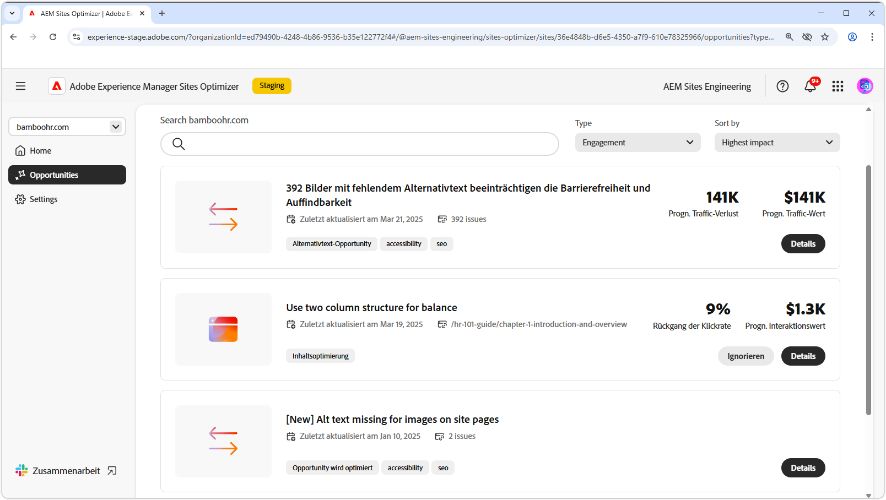

# Interaktion – Möglichkeiten

{align="center"}

OpMöglichkeitenportunitys vom Typ „Interaktion“ in AEM Sites Optimizer sind für die Verbesserung digitaler Erlebnisse von entscheidender Bedeutung, da sie praktische Erkenntnisse bezüglich der Interaktion von Benutzenden mit Web-Seiten bieten. Durch die Identifizierung von Bereichen, in denen Verbesserungen erforderlich sind – z. B. Probleme bezüglich der Barrierefreiheit, fehlerhafte interne Links, hohe Bounce-Raten und fehlender Alternativtext – können Marketing-Fachleute sowie Inhaltsautorinnen und -autoren ihre Sites optimieren, um die Leistung und Benutzerinteraktion zu verbessern. Mit diesen Möglichkeiten lässt sich sicherstellen, dass Inhalte effektiv, auffindbar und überzeugend sind, was letztendlich höhere Konversionen und eine reibungslosere Customer Journey fördert. Mithilfe der Empfehlungen von AEM Sites Optimizer können Teams ihre Digitalstrategie kontinuierlich verfeinern und skalierbare, wirkungsvolle Erlebnisse bereitstellen.

## Opportunitys

<!-- CARDS

* ../documentation/opportunities/accessibility-issues.md
  {title=Accessibility issues}
  {image=../assets/common/card-puzzle.png}
* ../documentation/opportunities//broken-internal-links.md
  {title=Broken internal links}
  {image=../assets/common/card-link.png}
* ../documentation/opportunities//high-bounce-rate.md
  {title=High bounce rate}
  {image=../assets/common/card-arrows.png}
* ../documentation/opportunities/missing-alt-text.md  
  {title=Missing alt text}
  {image=../assets/common/card-arrows.png}

-->
<!-- START CARDS HTML - DO NOT MODIFY BY HAND -->

    

        

            

                <figure class="image x-is-16by9">
                    
                </figure>
            

            

                

                    

                        <a href="../documentation/opportunities/accessibility-issues.md" target="_blank" rel="referrer" title="Probleme mit der Barrierefreiheit">Probleme mit der Barrierefreiheit</a>
                    

                    
Erfahren Sie mehr über die Möglichkeit „Probleme mit der Barrierefreiheit“ und finden Sie heraus, wie Sie damit die Sicherheit auf Ihrer Website erhöhen können.

                

                <a href="../documentation/opportunities/accessibility-issues.md" target="_blank" rel="referrer" class="spectrum-Button spectrum-Button--outline spectrum-Button--primary spectrum-Button--sizeM" style="align-self: flex-start; margin-top: 1rem;">
Mehr erfahren
</a>
            

        

    

    

        

            

                <figure class="image x-is-16by9">
                    
                </figure>
            

            

                

                    

                        <a href="../documentation/opportunities//broken-internal-links.md" target="_blank" rel="referrer" title="Fehlerhafte interne Links">Fehlerhafte interne Links</a>
                    

                    
Erfahren Sie mehr über die Möglichkeit „Fehlerhafte interne Links“ und darüber, wie Sie sie zur Verbesserung der Interaktion auf Ihrer Website verwenden können.

                

                <a href="../documentation/opportunities//broken-internal-links.md" target="_blank" rel="referrer" class="spectrum-Button spectrum-Button--outline spectrum-Button--primary spectrum-Button--sizeM" style="align-self: flex-start; margin-top: 1rem;">
Mehr erfahren
</a>
            

        

    

    

        

            

                <figure class="image x-is-16by9">
                    
                </figure>
            

            

                

                    

                        <a href="../documentation/opportunities//high-bounce-rate.md" target="_blank" rel="referrer" title="Hohe Bounce-Rate">Hohe Absprungrate</a>
                    

                    
Erfahren Sie mehr über die Möglichkeit „Wenig Ansichten“ und darüber, wie Sie sie zur Verbesserung der Interaktion auf Ihrer Website verwenden können.

                

                <a href="../documentation/opportunities//high-bounce-rate.md" target="_blank" rel="referrer" class="spectrum-Button spectrum-Button--outline spectrum-Button--primary spectrum-Button--sizeM" style="align-self: flex-start; margin-top: 1rem;">
Mehr erfahren
</a>
            

        

    

    

        

            

                <figure class="image x-is-16by9">
                    
                </figure>
            

            

                

                    

                        <a href="../documentation/opportunities/missing-alt-text.md" target="_blank" rel="referrer" title="Fehlender Alternativtext">Fehlender Alternativtext</a>
                    

                    
Erfahren Sie mehr über die Möglichkeit „Fehlender Alternativtext“ und darüber, wie Sie sie zur Verbesserung der Interaktion auf Ihrer Website verwenden können.

                

                <a href="../documentation/opportunities/missing-alt-text.md" target="_blank" rel="referrer" class="spectrum-Button spectrum-Button--outline spectrum-Button--primary spectrum-Button--sizeM" style="align-self: flex-start; margin-top: 1rem;">
Mehr erfahren
</a>
            

        

    

<!-- END CARDS HTML - DO NOT MODIFY BY HAND -->
