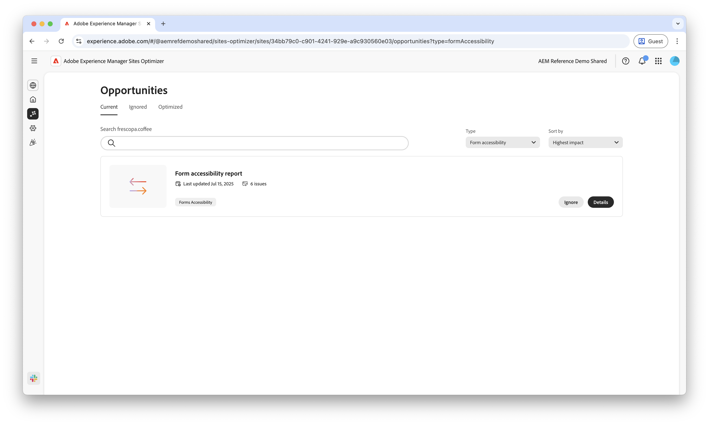

# Möglichkeiten zur Barrierefreiheit von Formularen

 Die Funktion „Formularoptimierung“ ist im Rahmen des Early-Adopter-Programms verfügbar. Sie können von Ihrer offiziellen E-Mail-ID aus an aem-forms-ea@adobe.com schreiben, um dem Early-Access-Programm beizutreten und den Zugriff auf diese Funktion anzufordern. 

{align="center"}

Die Möglichkeiten zur Barrierefreiheit von Formularen sind für die Verbesserung der Benutzerinteraktionen und Steigerung der Konversionen von entscheidender Bedeutung. Wenn Sie Ihre Formulare auf die Einhaltung der Web Content Accessibility Guidelines (WCAG) überprüfen, können Sie ein inklusives Erlebnis für Benutzende mit visuellen, auditiven, kognitiven und motorischen Beeinträchtigungen sicherstellen. Diese Funktion erfüllt nicht nur ethische und rechtliche Anforderungen, sondern verbessert auch die Formularabschlussraten und erweitert Ihre Zielgruppe, was zu einem besseren Benutzererlebnis und besseren Geschäftsergebnissen führt.

## Möglichkeiten

<!--
CARDS

 
* ../documentation/opportunities/low-views.md
  {title=Low views}
  {image=../assets/common/card-bag.png}
* ../documentation/opportunities/low-conversions.md
  {title=Low conversions}
  {image=../assets/common/card-bag.png}

-->
<!-- START CARDS HTML - DO NOT MODIFY BY HAND -->

    

        

            

                <figure class="image x-is-16by9">
                    
                </figure>
            

            

                

                    

                        <a href="../documentation/opportunities/forms-accessibility-issues.md" target="_blank" rel="referrer" title="Probleme mit der Barrierefreiheit von Formularen">Probleme mit der Barrierefreiheit von Formularen</a>
                    

                    
Erfahren Sie mehr über die Möglichkeit für Probleme mit der Barrierefreiheit von Formularen und darüber, wie Sie sie zur Verbesserung der Formularinteraktionen auf Ihrer Website verwenden können.

                

                <a href="../documentation/opportunities/forms-accessibility-issues.md" target="_blank" rel="referrer" class="spectrum-Button spectrum-Button--outline spectrum-Button--primary spectrum-Button--sizeM" style="align-self: flex-start; margin-top: 1rem;">
                    Weitere Informationen
                </a>
            

        

    

<!-- END CARDS HTML - DO NOT MODIFY BY HAND -->
