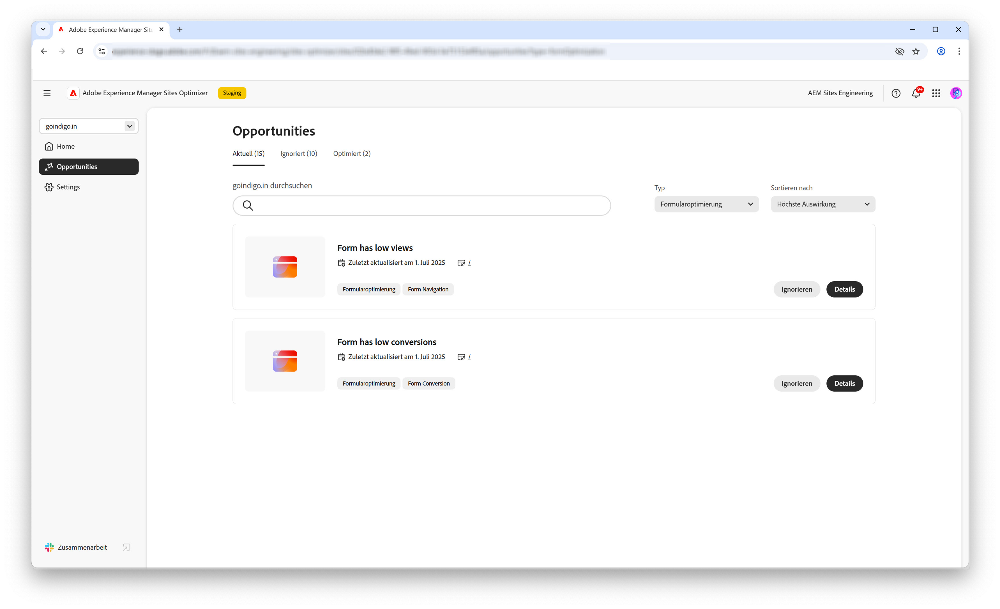

# Möglichkeiten zur Formularoptimierung

 Die Forms-Optimierungsfunktion ist im Rahmen eines Early-Access-Programms verfügbar. Sie können von Ihrer offiziellen E-Mail-ID aus an aem-forms-ea@adobe.com schreiben, um dem Early-Access-Programm beizutreten und den Zugriff auf diese Funktion anzufordern. 

<!-- [!VIDEO](https://video.tv.adobe.com/v/3469472/) -->

{align="center"}

Mit den Optimierungsmöglichkeiten von Forms können Unternehmen die Benutzerinteraktionen systematisch verbessern und die Formularkonversionen steigern. Durch die Erkennung von Problemen wie niedrige Ansichten, niedrige Konversionen und niedrige Navigationsraten können Teams datengesteuerte Anpassungen am Formularentwurf, an der Platzierung und an den Inhalten vornehmen. Diese Optimierungen tragen dazu bei, das Anwendererlebnis zu optimieren, sodass Besuchende Formulare einfacher ausfüllen und gewünschte Ergebnisse erzielen können. Die Verwendung der Erkenntnisse aus der Forms-Optimierung unterstützt die fortlaufende Identifizierung und Behebung von Leistungslücken, was zu effektiveren Formularen und verbesserten Geschäftsergebnissen führt.

## Möglichkeiten

<!-- CARDS
 
* ../documentation/opportunities/low-views.md
  {title=Low views}
  {image=../assets/common/card-bag.png}
* ../documentation/opportunities/low-conversions.md
  {title=Low conversions}
  {image=../assets/common/card-bag.png}

--->
<!-- START CARDS HTML - DO NOT MODIFY BY HAND -->

    

        

            

                <figure class="image x-is-16by9">
                    
                </figure>
            

            

                

                    

                        <a href="../documentation/opportunities/low-views.md" target="_blank" rel="referrer" title="Wenig Ansichten">Wenig Ansichten</a>
                    

                    
Erfahren Sie mehr über die Möglichkeit zu wenigen Aufrufen und darüber, wie Sie sie zur Verbesserung der Formularinteraktion auf Ihrer Website verwenden können.

                

                <a href="../documentation/opportunities/low-views.md" target="_blank" rel="referrer" class="spectrum-Button spectrum-Button--outline spectrum-Button--primary spectrum-Button--sizeM" style="align-self: flex-start; margin-top: 1rem;">
                    Weitere Informationen
                </a>
            

        

    

    

        

            

                <figure class="image x-is-16by9">
                    
                </figure>
            

            

                

                    

                        <a href="../documentation/opportunities/low-conversions.md" target="_blank" rel="referrer" title="Wenig Konversionen">Wenig Konversionen</a>
                    

                    
Erfahren Sie mehr über die Möglichkeit „Wenige Konversionen“ und darüber, wie Sie sie zur Verbesserung der Formularinteraktion auf Ihrer Website verwenden können.

                

                <a href="../documentation/opportunities/low-conversions.md" target="_blank" rel="referrer" class="spectrum-Button spectrum-Button--outline spectrum-Button--primary spectrum-Button--sizeM" style="align-self: flex-start; margin-top: 1rem;">
                    Weitere Informationen
                </a>
            

        

    

    

        

            

                <figure class="image x-is-16by9">
                    
                </figure>
            

            

                

                    

                        <a href="../documentation/opportunities/low-navigation.md" target="_blank" rel="referrer" title="Probleme mit der Barrierefreiheit">Wenig Navigation</a>
                    

                    
Erfahren Sie mehr über die Möglichkeit „Wenig Navigation“ und darüber, wie Sie sie zur Verbesserung der Formularinteraktion auf Ihrer Website verwenden können.

                

                <a href="../documentation/opportunities/low-navigation.md" target="_blank" rel="referrer" class="spectrum-Button spectrum-Button--outline spectrum-Button--primary spectrum-Button--sizeM" style="align-self: flex-start; margin-top: 1rem;">
                    Weitere Informationen
                </a>
            

        

    

<!-- END CARDS HTML - DO NOT MODIFY BY HAND -->
