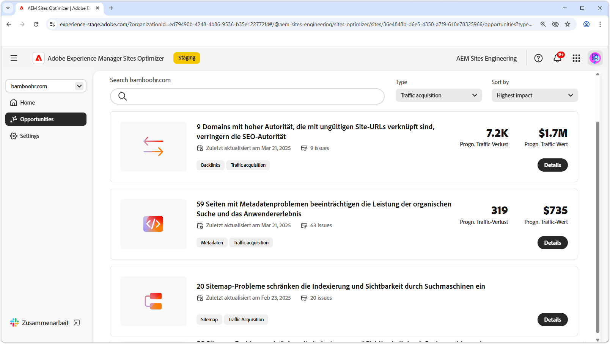

# Arten von Möglichkeiten

{align="center"}

AEM Sites Optimizer bietet wertvolle Erkenntnisse und Empfehlungen, mit denen Sie die Leistung, Benutzerfreundlichkeit und Sicherheit Ihrer Website verbessern können. Diese Erkenntnisse werden anhand der folgenden wichtigen Möglichkeitsbereiche gruppiert:

* Interaktion
* Traffic-Akquise
* Sicherheitsstatus
* Site-Zustand
* Preflight

Jede Kategorie zeigt einen anderen Weg zur Verbesserung Ihrer Site auf. Eine Kategorie kann zum Beispiel die Besucherinteraktion erhöhen. Eine andere kann die Auffindbarkeit verbessern. Weitere Kategorien konzentrieren sich auf die Stärkung der Sicherheit oder die Aufrechterhaltung der Site-Stabilität. Preflight hilft Ihnen bei der Analyse und Optimierung von Seiten, bevor sie veröffentlicht werden.

Durch das Nutzen dieser Möglichkeiten können Sie das Anwendererlebnis verbessern, die richtige Zielgruppe ansprechen und dafür sorgen, dass Ihre Site sicher und zuverlässig bleibt. Die Verbesserung der Interaktion und der Traffic-Akquise verbessert die Kundenbeziehung und Sichtbarkeit, während ein starker Sicherheitsstatus und ein guter Site-Zustand dazu beitragen, Vertrauen und Stabilität sicherzustellen. Die Preflight-Analyse stellt sicher, dass Ihre Inhalte vor der Live-Schaltung optimiert werden. Erkunden Sie die unten stehenden Links, um die nach Kategorie geordneten Möglichkeiten zu sehen, und entdecken Sie Wege zum Verbessern Ihrer Site.

## Arten von Möglichkeiten

<!-- CARDS 

* ./engagement.md
   { title = Engagement }
* ./security-posture.md
   { title = Security posture }
* ./site-health.md
   { title = Site health }
* ./traffic-acquisition.md
   { title = Traffic acquisition }
* ./form-optimization.md
   { title = Forms Optimization }
* ./preflight.md
   { title = Preflight }

-->
<!-- START CARDS HTML - DO NOT MODIFY BY HAND -->

    

        

            

                <figure class="image x-is-16by9">
                    
                </figure>
            

            

                

                    

                        <a href="./engagement.md" target="_blank" rel="referrer" title="Interaktion">Interaktion</a>
                    

                    
Erfahren Sie, wie Sie mit Sites Optimizer die Interaktion verbessern können.

                

                <a href="./engagement.md" target="_blank" rel="referrer" class="spectrum-Button spectrum-Button--outline spectrum-Button--primary spectrum-Button--sizeM" style="align-self: flex-start; margin-top: 1rem;">
Mehr erfahren
</a>
            

        

    

    

        

            

                <figure class="image x-is-16by9">
                    
                </figure>
            

            

                

                    

                        <a href="./security-posture.md" target="_blank" rel="referrer" title="Sicherheitsstatus">Sicherheitsstatus</a>
                    

                    
Erfahren Sie, wie Sie die Sicherheit Ihrer Site mit Sites Optimizer verbessern können.

                

                <a href="./security-posture.md" target="_blank" rel="referrer" class="spectrum-Button spectrum-Button--outline spectrum-Button--primary spectrum-Button--sizeM" style="align-self: flex-start; margin-top: 1rem;">
Mehr erfahren
</a>
            

        

    

    

        

            

                <figure class="image x-is-16by9">
                    
                </figure>
            

            

                

                    

                        <a href="./site-health.md" target="_blank" rel="referrer" title="Site-Zustand">Site-Zustand</a>
                    

                    
Erfahren Sie, wie Sie mit Sites Optimizer den Zustand Ihrer Site verbessern können.

                

                <a href="./site-health.md" target="_blank" rel="referrer" class="spectrum-Button spectrum-Button--outline spectrum-Button--primary spectrum-Button--sizeM" style="align-self: flex-start; margin-top: 1rem;">
Mehr erfahren
</a>
            

        

    

    

        

            

                <figure class="image x-is-16by9">
                    
                </figure>
            

            

                

                    

                        <a href="./traffic-acquisition.md" target="_blank" rel="referrer" title="Traffic-Akquise">Traffic-Akquise</a>
                    

                    
Erfahren Sie, wie Sie mit Sites Optimizer die Traffic-Akquise steigern können.

                

                <a href="./traffic-acquisition.md" target="_blank" rel="referrer" class="spectrum-Button spectrum-Button--outline spectrum-Button--primary spectrum-Button--sizeM" style="align-self: flex-start; margin-top: 1rem;">
Mehr erfahren
</a>
            

        

    

    

        

            

                <figure class="image x-is-16by9">
                    
                </figure>
            

            

                

                    

                        <a href="./form-optimization.md" target="_blank" rel="referrer" title="Formularoptimierung">Formularoptimierung</a>
                    

                    
Erfahren Sie, wie Sie mit der Formularoptimierung Ihre Formularkonversionen verbessern können.

                

                <a href="./form-optimization.md" target="_blank" rel="referrer" class="spectrum-Button spectrum-Button--outline spectrum-Button--primary spectrum-Button--sizeM" style="align-self: flex-start; margin-top: 1rem;">
                    Weitere Informationen
                </a>
            

        

    

    

        

            

                <figure class="image x-is-16by9">
                    
                </figure>
            

            

                

                    

                        <a href="./form-optimization.md" target="_blank" rel="referrer" title="Barrierefreiheit von Formularen">Barrierefreiheit von Formularen</a>
                    

                    
Erfahren Sie, wie Sie mit der Formularoptimierung die Barrierefreiheit Ihrer Formulare verbessern können.

                

                <a href="./form-optimization.md" target="_blank" rel="referrer" class="spectrum-Button spectrum-Button--outline spectrum-Button--primary spectrum-Button--sizeM" style="align-self: flex-start; margin-top: 1rem;">
                    Weitere Informationen
                </a>
            

        

    

    

        

            

                <figure class="image x-is-16by9">
                    
                </figure>
            

            

                

                    

                        <a href="./preflight.md" target="_blank" rel="referrer" title="Preflight">Preflight</a>
                    

                    
Erfahren Sie mehr über die Preflight-Analyse und das Einrichten von Preflight-Möglichkeiten in Sites Optimizer.

                

                <a href="./preflight.md" target="_blank" rel="referrer" class="spectrum-Button spectrum-Button--outline spectrum-Button--primary spectrum-Button--sizeM" style="align-self: flex-start; margin-top: 1rem;">
                    Weitere Informationen
                </a>
            

        

    

     

<!-- END CARDS HTML - DO NOT MODIFY BY HAND -->

 Die Funktionen Forms-Optimierung und Forms-Barrierefreiheit sind im Early-Access-Programm verfügbar. Sie können von Ihrer offiziellen E-Mail-ID aus an aem-forms-ea@adobe.com schreiben, um dem Early-Access-Programm beizutreten und den Zugriff auf diese Funktion anzufordern. 
