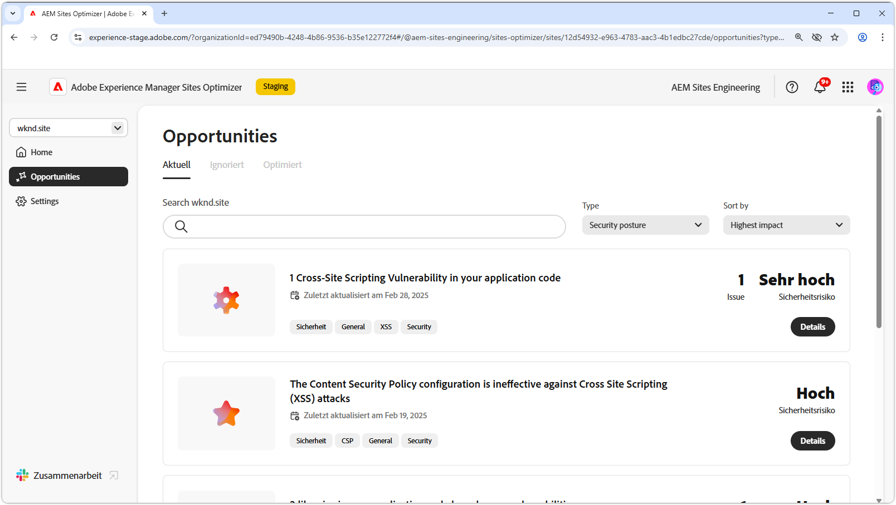
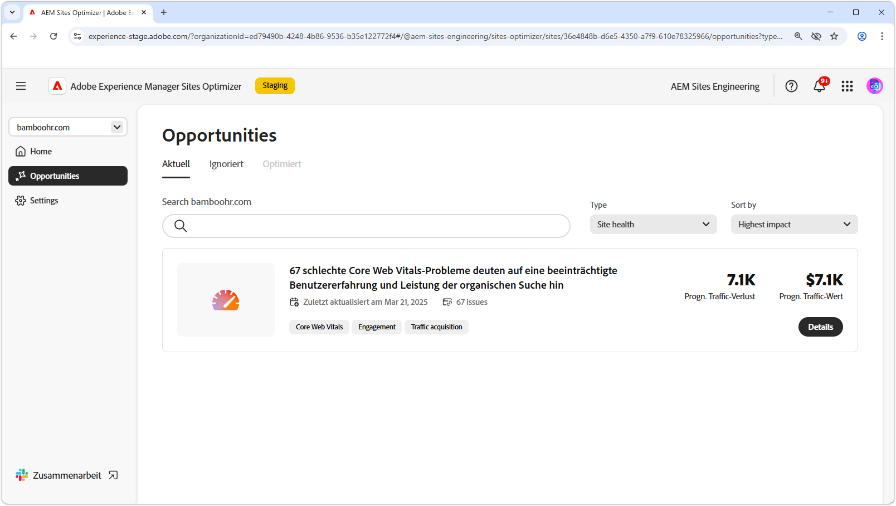

# Arten von Möglichkeiten

{align="center"}

AEM Sites Optimizer bietet wertvolle Erkenntnisse und Empfehlungen, mit denen Sie die Leistung, Benutzerfreundlichkeit und Sicherheit Ihrer Website verbessern können. Diese Einblicke sind in die folgenden wichtigen Opportunity-Bereiche gruppiert:

* Interaktion
* Traffic-Akquise
* Sicherheitslage
* Site-Status

Jede Kategorie zeigt eine andere Möglichkeit, Ihre Site zu verbessern. Eine Kategorie kann die Besucherinteraktion erhöhen. Eine andere kann die Auffindbarkeit verbessern. Andere konzentrieren sich auf die Stärkung der Sicherheit oder die Aufrechterhaltung der Standortstabilität.

Die Nutzung dieser Möglichkeiten verbessert das Benutzererlebnis, zieht die richtige Zielgruppe an und sorgt für Sicherheit und Zuverlässigkeit Ihrer Site. Die Verbesserung der Interaktion und der Traffic-Akquise fördert die Interaktion und Sichtbarkeit, während eine starke Sicherheitslage und der Zustand der Website dazu beitragen, Vertrauen und Stabilität zu gewährleisten.  Erkunden Sie die unten stehenden Links, um die nach Kategorie geordneten Möglichkeiten zu sehen, und entdecken Sie Wege zum Verbessern Ihrer Site.

## Arten von Möglichkeiten

<!-- CARDS 

* ./engagement.md
   { title = Engagement }
* ./security-posture.md
   { title = Security posture }
* ./site-health.md
   { title = Site health }
* ./traffic-acquisition.md
   { title = Traffic acquisition }

-->
<!-- START CARDS HTML - DO NOT MODIFY BY HAND -->

    

        

            

                <figure class="image x-is-16by9">
                    
                </figure>
            

            

                

                    

                        <a href="./engagement.md" target="_blank" rel="referrer" title="Interaktion">Interaktion</a>
                    

                    
Erfahren Sie, wie Sie mit Sites Optimizer die Interaktion verbessern können.

                

                <a href="./engagement.md" target="_blank" rel="referrer" class="spectrum-Button spectrum-Button--outline spectrum-Button--primary spectrum-Button--sizeM" style="align-self: flex-start; margin-top: 1rem;">
Mehr erfahren
</a>
            

        

    

    

        

            

                <figure class="image x-is-16by9">
                    
                </figure>
            

            

                

                    

                        <a href="./security-posture.md" target="_blank" rel="referrer" title="Sicherheitsstatus">Sicherheitsstatus</a>
                    

                    
Erfahren Sie, wie Sie die Sicherheit Ihrer Site mit Sites Optimizer verbessern können.

                

                <a href="./security-posture.md" target="_blank" rel="referrer" class="spectrum-Button spectrum-Button--outline spectrum-Button--primary spectrum-Button--sizeM" style="align-self: flex-start; margin-top: 1rem;">
Mehr erfahren
</a>
            

        

    

    

        

            

                <figure class="image x-is-16by9">
                    
                </figure>
            

            

                

                    

                        <a href="./site-health.md" target="_blank" rel="referrer" title="Site-Zustand">Site-Zustand</a>
                    

                    
Erfahren Sie, wie Sie mit Sites Optimizer den Zustand Ihrer Site verbessern können.

                

                <a href="./site-health.md" target="_blank" rel="referrer" class="spectrum-Button spectrum-Button--outline spectrum-Button--primary spectrum-Button--sizeM" style="align-self: flex-start; margin-top: 1rem;">
Mehr erfahren
</a>
            

        

    

    

        

            

                <figure class="image x-is-16by9">
                    
                </figure>
            

            

                

                    

                        <a href="./traffic-acquisition.md" target="_blank" rel="referrer" title="Traffic-Akquise">Traffic-Akquise</a>
                    

                    
Erfahren Sie, wie Sie mit Sites Optimizer die Traffic-Akquise steigern können.

                

                <a href="./traffic-acquisition.md" target="_blank" rel="referrer" class="spectrum-Button spectrum-Button--outline spectrum-Button--primary spectrum-Button--sizeM" style="align-self: flex-start; margin-top: 1rem;">
Mehr erfahren
</a>
            

        

    

<!-- END CARDS HTML - DO NOT MODIFY BY HAND -->
