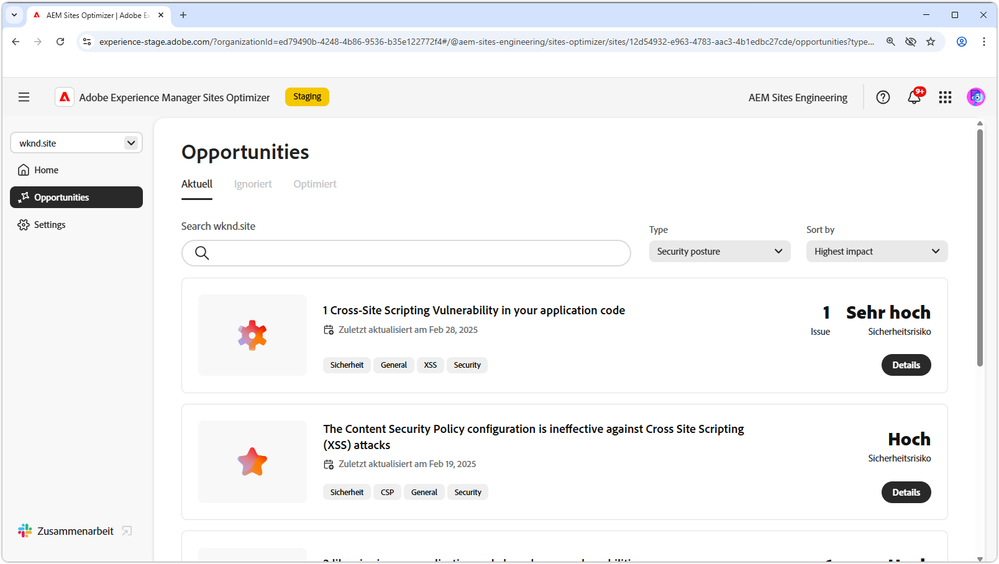

# Sicherheitsstatus – Opportunitys

{align="center"}

Ein solider Sicherheitsstatus in AEM Sites Optimizer ist für den Schutz digitaler Erlebnisse und Benutzerdaten von entscheidender Bedeutung. Durch Ermittlung von Verbesserungsmöglichkeiten – Opportunitys – wie CORS-Konfiguration, Cross-Site-Scripting, Website-Berechtigungen und Website-Schwachstellen können Teams proaktiv auf potenzielle Sicherheitsrisiken eingehen und die Einhaltung von Best Practices sicherstellen. Im Zuge besserer Sicherheitsmaßnahmen werden nicht nur sensible Informationen geschützt, sondern auch das Vertrauen der Benutzenden und die Zuverlässigkeit der Website gestärkt. Organisationen können anhand der von AEM Sites Optimizer bereitgestellten Erkenntnisse ihren Sicherheitsstatus kontinuierlich überwachen und verbessern, Risiken reduzieren und für eine sichere digitale Umgebung sorgen.

## Opportunitys

<!-- CARDS

* ../documentation/opportunities/cors-configuration.md
  {title=CORS configuration}
  {image=../assets/common/card-code.png}
* ../documentation/opportunities/cross-site-scripting.md
  {title=Cross-site scripting}
  {image=../assets/common/card-gear.png}
* ../documentation/opportunities/website-permissions.md  
  {title=Website permissions}
  {image=../assets/common/card-people.png}
* ../documentation/opportunities//website-vulnerabilities.md
  {title=Website vulnerabilities}
  {image=../assets/common/card-puzzle.png}

-->
<!-- START CARDS HTML - DO NOT MODIFY BY HAND -->

    

        

            

                <figure class="image x-is-16by9">
                    
                </figure>
            

            

                

                    

                        <a href="../documentation/opportunities/cors-configuration.md" target="_blank" rel="referrer" title="CORS-Konfiguration">CORS-Konfiguration</a>
                    

                    
Erfahren Sie mehr über die Opportunity „CORS-Konfiguration“ und finden Sie heraus, wie Sie Sicherheitsschwachstellen auf der Site identifizieren und beheben.

                

                <a href="../documentation/opportunities/cors-configuration.md" target="_blank" rel="referrer" class="spectrum-Button spectrum-Button--outline spectrum-Button--primary spectrum-Button--sizeM" style="align-self: flex-start; margin-top: 1rem;">
Mehr erfahren
</a>
            

        

    

    

        

            

                <figure class="image x-is-16by9">
                    
                </figure>
            

            

                

                    

                        <a href="../documentation/opportunities/cross-site-scripting.md" target="_blank" rel="referrer" title="Cross-Site-Scripting">Cross-Site-Scripting</a>
                    

                    
Informieren Sie sich über die Möglichkeit von Cross-Site-Scripting und über das Erkennen und Beheben von Sicherheitsschwachstellen auf Websites.

                

                <a href="../documentation/opportunities/cross-site-scripting.md" target="_blank" rel="referrer" class="spectrum-Button spectrum-Button--outline spectrum-Button--primary spectrum-Button--sizeM" style="align-self: flex-start; margin-top: 1rem;">
Mehr erfahren
</a>
            

        

    

    

        

            

                <figure class="image x-is-16by9">
                    
                </figure>
            

            

                

                    

                        <a href="../documentation/opportunities/website-permissions.md" target="_blank" rel="referrer" title="Website-Berechtigungen">Website-Berechtigungen</a>
                    

                    
Erfahren Sie mehr über die Opportunity „Website-Berechtigungen“ und finden Sie heraus, wie Sie damit die Sicherheit auf Ihrer Website erhöhen können.

                

                <a href="../documentation/opportunities/website-permissions.md" target="_blank" rel="referrer" class="spectrum-Button spectrum-Button--outline spectrum-Button--primary spectrum-Button--sizeM" style="align-self: flex-start; margin-top: 1rem;">
Mehr erfahren
</a>
            

        

    

    

        

            

                <figure class="image x-is-16by9">
                    
                </figure>
            

            

                

                    

                        <a href="../documentation/opportunities//website-vulnerabilities.md" target="_blank" rel="referrer" title="Website-Schwachstellen">Website-Schwachstellen</a>
                    

                    
Erfahren Sie mehr über die Opportunity „Website-Schwachstellen“ und finden Sie heraus, wie Sie damit die Sicherheit auf Ihrer Website erhöhen können.

                

                <a href="../documentation/opportunities//website-vulnerabilities.md" target="_blank" rel="referrer" class="spectrum-Button spectrum-Button--outline spectrum-Button--primary spectrum-Button--sizeM" style="align-self: flex-start; margin-top: 1rem;">
Mehr erfahren
</a>
            

        

    

<!-- END CARDS HTML - DO NOT MODIFY BY HAND -->

