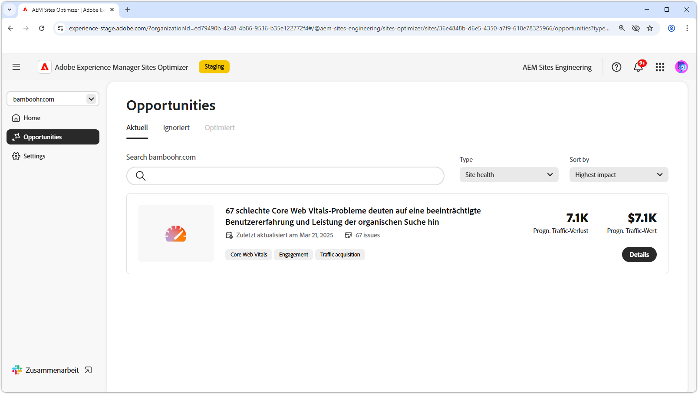

# Gesundheitsmöglichkeiten auf der Website

{align="center"}

Die Aufrechterhaltung der Integrität von Websites in AEM Sites Optimizer ist für die Bereitstellung schneller, zuverlässiger und leistungsstarker digitaler Erlebnisse von entscheidender Bedeutung. Durch die Identifizierung von Verbesserungsmöglichkeiten - wie z. B. Core Web Vitals - können Teams die Seitengeschwindigkeit, Interaktivität und visuelle Stabilität optimieren, um das Benutzererlebnis und das Suchmaschinen-Ranking zu verbessern. Eine gut gepflegte Website sorgt für eine reibungslosere Navigation, bessere Interaktion und eine verbesserte Gesamtleistung. Die Nutzung der Erkenntnisse von AEM Sites Optimizer ermöglicht eine kontinuierliche Überwachung und Verfeinerung, um sicherzustellen, dass die Site im Laufe der Zeit effizient und effektiv bleibt.

## Opportunitys

<!-- CARDS

* ../documentation/opportunities/core-web-vitals.md
  {title=Core web vitals}
  {image=../assets/common/card-performance.png}

-->
<!-- START CARDS HTML - DO NOT MODIFY BY HAND -->

    

        

            

                <figure class="image x-is-16by9">
                    
                </figure>
            

            

                

                    

                        <a href="../documentation/opportunities/core-web-vitals.md" target="_blank" rel="referrer" title="Wichtige Web-Komponenten">Wichtige Web-</a>
                    

                    
Erfahren Sie mehr über die wichtigsten Opportunities im Web und wie Sie sie zur Verbesserung der Traffic-Akquise nutzen können.

                

                <a href="../documentation/opportunities/core-web-vitals.md" target="_blank" rel="referrer" class="spectrum-Button spectrum-Button--outline spectrum-Button--primary spectrum-Button--sizeM" style="align-self: flex-start; margin-top: 1rem;">
                    Mehr erfahren
                </a>
            

        

    

<!-- END CARDS HTML - DO NOT MODIFY BY HAND -->

