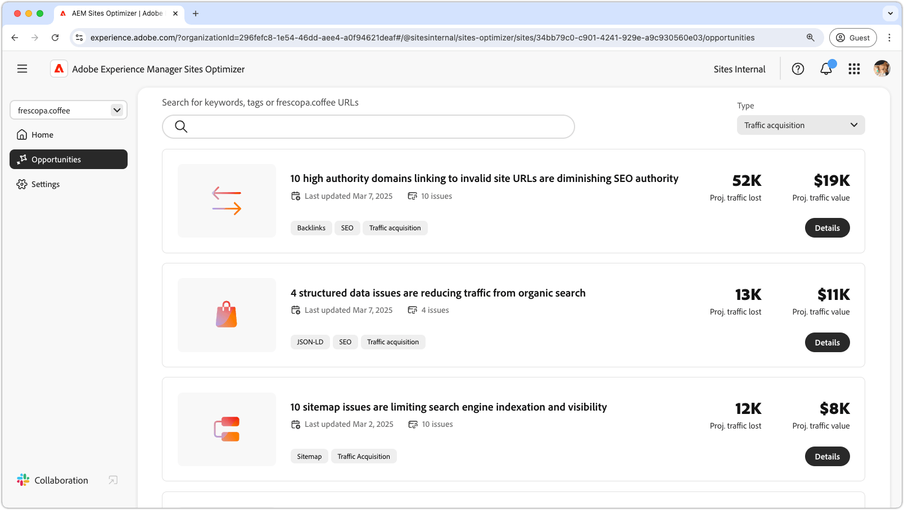

# Traffic-Akquise – Möglichkeiten

{align="center"}

Traffic-Akquise leitet potenzielle Kundschaft auf Ihre Website und schafft Vertriebs- oder Lead-Möglichkeiten. Durch die Nutzung von Strategien wie Suchmaschinenoptimierung (SEO) können Unternehmen die Sichtbarkeit der Suche verbessern und Benutzerinnen und Benutzern das Auffinden ihrer Inhalte erleichtern. Ein stetiger Strom an Besucherinnen und Besuchern erhöht die Markenwahrnehmung und schafft Vertrauen. Zudem lassen sich wertvolle Erkenntnisse zum Benutzerverhalten gewinnen. Diese Erkenntnisse helfen Teams, ihre Angebote zu verfeinern und das Gesamterlebnis zu verbessern. Die Erkenntnisse von AEM Sites Optimizer ermöglichen eine kontinuierliche Optimierung. So lassen sich im Zeitverlauf ein nachhaltiges Wachstum und verbesserte Konversionsraten erzielen.

## Opportunitys

<!--
CARDS

 
* ../documentation/opportunities/broken-backlinks.md
  {title=Broken backlinks}
  {image=../assets/common/card-arrows.png}
* ../documentation/opportunities/invalid-or-missing-metadata.md
  {title=Invalid or missing metadata}
  {image=../assets/common/card-code.png}
* ../documentation/opportunities/missing-invalid-structured-data.md
  {title=Missing or invalid structured data}
  {image=../assets/common/card-bag.png}
* ../documentation/opportunities/sitemap-issues.md
  {title=Sitemap issues}
  {image=../assets/common/card-relationship.png}

-->
<!-- START CARDS HTML - DO NOT MODIFY BY HAND -->

    

        

            

                <figure class="image x-is-16by9">
                    
                </figure>
            

            

                

                    

                        <a href="../documentation/opportunities/broken-backlinks.md" target="_blank" rel="referrer" title="Fehlerhafte Backlinks">Fehlerhafte Backlinks</a>
                    

                    
Erfahren Sie mehr über die Möglichkeit für fehlerhafte Backlinks und darüber, wie Sie sie zur Verbesserung der Traffic-Akquise nutzen können.

                

                <a href="../documentation/opportunities/broken-backlinks.md" target="_blank" rel="referrer" class="spectrum-Button spectrum-Button--outline spectrum-Button--primary spectrum-Button--sizeM" style="align-self: flex-start; margin-top: 1rem;">
Mehr erfahren
</a>
            

        

    

    

        

            

                <figure class="image x-is-16by9">
                    
                </figure>
            

            

                

                    

                        <a href="../documentation/opportunities/invalid-or-missing-metadata.md" target="_blank" rel="referrer" title="Ungültige oder fehlende Metadaten">Ungültige oder fehlende Metadaten</a>
                    

                    
Erfahren Sie mehr über die Möglichkeit für ungültige oder fehlende Metadaten und darüber, wie Sie sie zur Verbesserung der Traffic-Akquise verwenden können.

                

                <a href="../documentation/opportunities/invalid-or-missing-metadata.md" target="_blank" rel="referrer" class="spectrum-Button spectrum-Button--outline spectrum-Button--primary spectrum-Button--sizeM" style="align-self: flex-start; margin-top: 1rem;">
Mehr erfahren
</a>
            

        

    

    

        

            

                <figure class="image x-is-16by9">
                    
                </figure>
            

            

                

                    

                        <a href="../documentation/opportunities/missing-invalid-structured-data.md" target="_blank" rel="referrer" title="Fehlende oder ungültige strukturierte Daten">Fehlende oder ungültige strukturierte Daten</a>
                    

                    
Erfahren Sie mehr über die Möglichkeit für fehlende oder ungültige strukturierte Daten und darüber, wie Sie sie zur Verbesserung der Traffic-Akquise verwenden können.

                

                <a href="../documentation/opportunities/missing-invalid-structured-data.md" target="_blank" rel="referrer" class="spectrum-Button spectrum-Button--outline spectrum-Button--primary spectrum-Button--sizeM" style="align-self: flex-start; margin-top: 1rem;">
Mehr erfahren
</a>
            

        

    

    

        

            

                <figure class="image x-is-16by9">
                    
                </figure>
            

            

                

                    

                        <a href="../documentation/opportunities/sitemap-issues.md" target="_blank" rel="referrer" title="Sitemap-Probleme">Sitemap-Probleme</a>
                    

                    
Erfahren Sie mehr über die Möglichkeit für Sitemap-Probleme und darüber, wie Sie sie zur Verbesserung der Traffic-Akquise nutzen können.

                

                <a href="../documentation/opportunities/sitemap-issues.md" target="_blank" rel="referrer" class="spectrum-Button spectrum-Button--outline spectrum-Button--primary spectrum-Button--sizeM" style="align-self: flex-start; margin-top: 1rem;">
Mehr erfahren
</a>
            

        

    

<!-- END CARDS HTML - DO NOT MODIFY BY HAND -->
